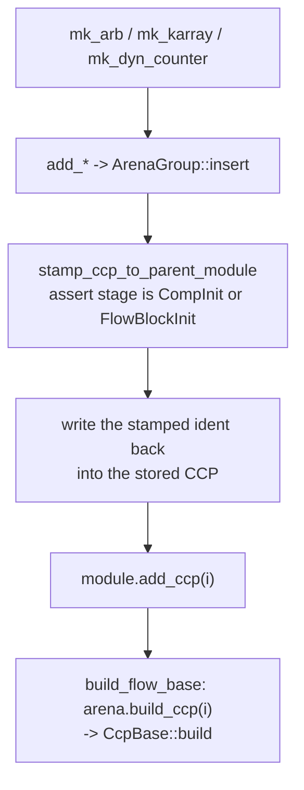
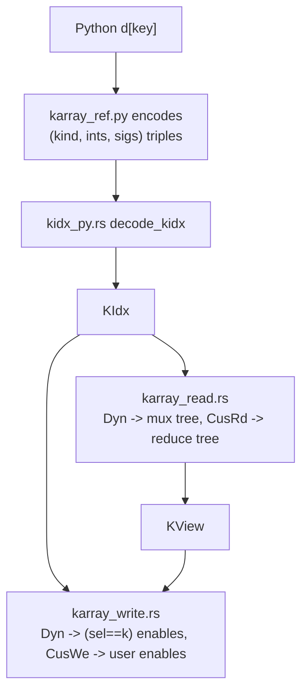

A **complex component property** (CCP) is a self-contained hardware gadget that
owns its own wires and expressions. Like an [HCP](/devbook/model/hw-components/)
it is stamped into a module and stored in a typed arena group; unlike an
[NCP](/devbook/model/flow-blocks/) it is **not** part of the flow graph. There
are three today:

| `CcpType` | Prefix | Owns |
|-----------|--------|------|
| `Arb` | `ARB` | a priority arbiter: leaves with req/ack wire pairs, master ack, hold, reset |
| `Karray` | `KARRAY` | one backing HCP per (element, field), plus the read/write engines that resolve a selection to them |
| `DynCounter` | `DCNT` | one clocked register plus a combinational add chain |

They live under `src/model/complex_hardware/`: `arb/`, `karray/`,
`dyn_counter/`, and a shared `common/`.

## CcpIdent and CcpBase

`CcpIdent` (`common/ccp_ident.rs`) is the usual `Copy` handle — an `IdentBase`
plus the `CcpType` discriminant and the owning `ModuleIdent`:

```rust
pub struct CcpIdent {
    ident_base     : IdentBase,
    ccp_type       : CcpType,          // Arb | Karray | DynCounter
    master_module_i: ModuleIdent,
}
```

`CcpBase` (`common/ccp_base.rs`) is deliberately tiny — three methods, mirroring
`FlowBlock` and `HcpBase`:

```rust
pub trait CcpBase {
    /// Wire the CCP's internal hardware graph; called once, after configuration.
    fn build(&mut self, arena: &mut ModelArena);
    /// Overwrite the stored ident (after module stamping re-stamps it).
    fn set_ccp_ident(&mut self, ident: CcpIdent);
    /// Put this CCP back into its own typed slot — zero match for callers.
    fn replace_back_into_arena(self: Box<Self>, arena: &mut ModelArena);
}
```

Dispatch follows the [single-match rule](/devbook/core/dispatch/) exactly:
`take_ccp` in `arena_impl_ccp.rs` holds the ONE match over `CcpType`, and
`replace_back_ccp` needs none.

```rust
pub fn take_ccp(&mut self, i: CcpIdent) -> Box<dyn CcpBase> {
    match i.get_ccp_type() {
        CcpType::Arb        => Box::new(self.take_arb(i)),
        CcpType::Karray     => Box::new(self.take_karray(i)),
        CcpType::DynCounter => Box::new(self.take_dyn_counter(i)),
    }
}
pub fn replace_back_ccp(&mut self, ccp: Box<dyn CcpBase>) { ccp.replace_back_into_arena(self); }
```

## Stamping and build

`stamp_ccp_to_parent_module` mirrors `stamp_hw_to_parent_module` with one extra
rule: a CCP may only be **created** during the construction phases.

```rust
let (module_i, stage) = self.peek_module_trace_stack();
assert!(matches!(stage, ModuleInitStage::CompInit | ModuleInitStage::FlowBlockInit),
        "stamp_ccp_to_parent_module: CCPs cannot be created during {stage:?}");
```

The build pass only *wires* existing CCPs, never makes new ones — so there is no
`hcp_pending_buffer` equivalent for CCPs. The stamped ident is written back into
the stored object, then pushed onto the module's `ccps_i` list; the owning
module calls `arena.build_ccp(i)` for each of them inside `build_flow_base`
(see [Module System](/devbook/model/module-system/)).



## Arb

`arb/arb.rs` is the smallest of the three and the only one whose `build` does
real graph work. Each leaf owns a 1-bit req/ack wire pair — unless a channel is
hard-tied to constant 1 (`ArbLockedChannel::Req` / `::Ack`), which is what
`pip(auto_req=True)` and `zync(auto_ack=True)` add at the ends of a pipeline
chain.

`build` synthesises the combinational grant graph: a leaf is granted when it
requests, the master ack (if bound) is high, and no higher-priority leaf is
requesting. Ties at equal priority are resolved by `ArbSamePriPolicy`, and the
policy shows up directly in the peer term:

```rust
ArbSamePriPolicy::AckAll => false,      // never block an equal peer
ArbSamePriPolicy::AckOne => j < idx,    // an earlier peer wins the tie
ArbSamePriPolicy::NotAck => j != idx,   // any other peer cancels the grant
```

`PipCon` is a Python-side subclass of `Arb` with no extra state; it exists only
so `pip`/`zync` can *require* it and guarantee the locked-leaf contract. The
user-facing surface is on the [Arbiters](/userbook/pipelines/arbiters/) page.

## Karray

Karray is the largest CCP and the one with a real internal architecture. The
struct itself (`karray/karray.rs`) is deliberately dumb — shape, element record,
backing, and a flat `backing_hcps` vector indexed
`flat * field_count + field_idx` — and its `build` is a **no-op**: the backing
HCPs are plain registered components whose reset/default events the module build
pass already handles, and there is no internal graph to wire.

All the work lives in two engines plus the pieces they share:

| File | Role |
|------|------|
| `kidx.rs` | `KIdx` — the ONE unified index type, and `check_kidx` validation |
| `karray_meta.rs` | the element record types + the index-width helper |
| `karray_env.rs` | `KReadEnv` (scoped arena + reduce-select callback), `DirectKEnv` |
| `karray_view.rs` | `KView` — the shaped read result the write engine consumes |
| `karray_read.rs` | the read engine |
| `karray_write.rs` | the write engine |
| `karray_hw_build.rs` | shared wiring primitives (muxes, write-enables, join) |
| `arena_impl_ccp_karray.rs` | the `ModelArena` proxies and layout queries |

There is deliberately **no third engine for karray-to-karray**: k2k is the read
engine composed with the write engine, arranged by the proxies.

### Call-site fields and `Karray.reset`

Two Karray features exist purely on the Python side, with no new Rust-core
mechanism:

- **Call-site field settlement** — a `kaf()` descriptor in a `Karray`
  subclass's body is only the *default*. An int keyword at instantiation
  (`Entry(REG, (4,), "e", data=16, spectag=kaf(8))`) overrides a declared
  field's width, or appends a field that only that particular array carries.
  The Rust core needed no change for this: a `Karray` already accepted an
  arbitrary `Vec<KarrayField>`. `resolve_karray_field_specs`
  (`py/kathryn/complex_hardware/karray_field.py`) is the sole decision point —
  it computes the per-instantiation field list and passes it across the
  boundary already resolved; the class's own field list is never mutated.
- **`Karray.reset(**fields)`** — a whole-array reset. It is implemented via a
  new layout-query proxy, `karray_element_hcp(karray_i, coord, field_idx)`
  (`arena_impl_ccp_karray.rs`), which is a pure static-coordinate lookup: for
  each element it resolves the backing `HcpIdent` and the DSL calls that
  register's own `.reset(value)`. There is no Karray-level reset concept —
  priority and clock behavior stay exactly the backing register's, and the
  call is rejected on a wire-backed array (see
  [Backings](/userbook/karray/backings/)) because a wire has no `.reset()` to
  call.

### KIdx — one index, four variants

Every access selects each dimension with a `KIdx`, and every kind collapses its
dimension to exactly one element:

```rust
pub enum KIdx {
    Static(usize),          // a[i]     pin one element at compile time
    Dyn   (HcpIdent),       // a[sig]   runtime binary-encoded address
    CusWe (Vec<HcpIdent>),  // a[fn] write: one 1-bit enable per index of the dim
    CusRd,                  // a[fn] read : reduce fold, select fn via KReadEnv
}
```

The DSL's single "custom fn" kind splits by **direction** at encode time, in
`karray_ref.py`: on a write the fn is called once per index and the
pre-evaluated bits arrive as `CusWe`; on a read it cannot be pre-evaluated (it
is a pair-select called while the tree builds), so `CusRd` just marks the
dimension and the callback rides in through the env.

`check_kidx` validates a whole selection against the shape: rank both ways,
static bounds, and one enable bit per index for a `CusWe`. Adding an index kind
touches exactly one variant here, one arm in `check_kidx`, and one arm in each
engine.



### The read engine

`read_one_field` / `read_view` resolve a selection to one HCP per requested
field. A static-only selection returns the backing HCPs directly — **zero extra
hardware**. Each runtime dimension folds its fan-out with a balanced 2:1 tree:

- **`Dyn`** — a mux tree with one shared select bit per level (`~sig[layer]`
  picks the left child).
- **`CusRd`** — a reduce tree: the user's select fn is called per pair through
  `KReadEnv::reduce_select`, with each side's carried fields plus the dimension
  indices it covers, and may return extras that are layered onto the merged node
  for the next level.

All carried fields ride the **same** tree (one wire per field per node), so a
multi-field read shares the select logic. When a reduce dim is present the tree
carries *every* field, since the select fn may compare any of them.

### KReadEnv — why the arena is never held

A reduce select fn is user Python that **re-enters the arena** to build its
select expression. The engine therefore never holds a long-lived borrow: every
arena touch goes through a scoped `with_arena`, and `reduce_select` is called
with no borrow held.

```rust
pub trait KReadEnv {
    type Err: From<KarrayErr>;
    fn with_arena<R>(&mut self, f: impl FnOnce(&mut ModelArena) -> R) -> R;
    fn reduce_select(&mut self, dim: usize,
                     a_fields: &[(String, HcpIdent)], a_covered: &[usize],
                     b_fields: &[(String, HcpIdent)], b_covered: &[usize],
                     level: u32) -> Result<(HcpIdent, Vec<(String, HcpIdent)>), Self::Err>;
}
```

This is what keeps the engine PyO3-free: the Python connector implements the
trait over the arena pyclass with scoped `borrow_mut`s, while the Rust-native
`DirectKEnv` wraps a plain `&mut ModelArena` and errors on `reduce_select` —
there is no Rust-side select fn, so a reduce read is only drivable from Python.

### The write engine and field pairing

`karray_write.rs::write` owns all statement policy: the operator guard
(`|=` needs a reg backing, `*=` a wire), the runtime-write guard (a
runtime-collapsed write needs a reg — a wire cannot hold the non-selected
elements), field pairing, and the join of every emitted meta into **one** basic
node.

Pairing is chosen by the policy the source `KView` stamped on itself:

| `KViewPairing` | Built by | Rule |
|----------------|----------|------|
| `Exact` | `read_view` (k2k) | pair by exact name **and** width; an unmatched destination field is skipped and reported |
| `Named` | scalar / map sources | names are already canonical for this array, so pair by name; widths auto-resize in `gen_asm_meta` |

The skipped-field list travels back to the Python connector, which turns it into
a `warnings.warn` — that is where the "skipped fields" warning on a k2k copy
comes from. If nothing pairs at all, the write is a `KarrayErr::Value`.

### Errors that cross the boundary

`KarrayErr` carries the *kind* so the connector can pick the right Python
exception, rather than flattening everything to one type:

```rust
pub enum KarrayErr {
    Type (String),   // operator/backing mismatch (|= vs *=, dynamic write on wire)
    Value(String),   // rank / bounds / field errors
}
```

`kidx_py.rs` maps `Type` onto `TypeError` and `Value` onto `ValueError`, which
is why the user-facing rules in the
[Karray chapter](/userbook/karray/basics/) split cleanly along those lines.

## DynCounter

`dyn_counter/dyn_counter.rs` wraps one clocked register plus a combinational add
chain grown statement by statement:

```rust
pub struct DynCounter {
    ident     : CcpIdent,
    width     : i32,
    cnt_reg_i : HcpIdent,          // the committed value (clocked)
    pending_i : Option<HcpIdent>,  // head of the uncommitted add chain
    stage_cnt : u32,               // stages created so far — naming only
}
```

- `add(k, Some(en))` builds a 2:1 comb mux (`en ? prev + k : prev`) via the
  shared `ccp_hw_build::mux_into_wire`; `add(k, None)` is a plain adder with no
  mux.
- `prev` is the previous stage — the register itself for the first add — so
  simultaneously-enabled adds **accumulate** within one cycle.
- `update()` commits the chain head into the register as one basic node attached
  to the current scope (the enclosing build wires its clock), and **consumes**
  the chain: the next `add` starts again from the register.

The user-facing surface is on the [Counter](/userbook/lib/counter/) page.

## Adding a CCP type

1. A `CcpType` variant (+ its `as_str` prefix).
2. An `ArenaGroup` field on `ModelArena`, in **both** `new` and `reset`.
3. The typed `add_/take_/replace_back_` triad in `arena_impl_ccp.rs`, plus one
   arm in `take_ccp`.
4. A `make_*`/`mk_*` factory in `arena_factory_ccp.rs` that ends in
   `stamp_ccp_to_parent_module`.
5. `impl CcpBase` for the new type.
6. A PyO3 mirror under `src/applications/py/model/complex_hardware/<name>/`
   and a Python handle class in `py/kathryn/complex_hardware/`.

Nothing in the module build, the routing pass, or the Verilog backend changes —
a CCP's hardware is ordinary HCPs by the time either of those runs.
