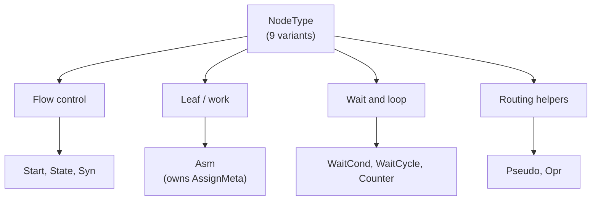
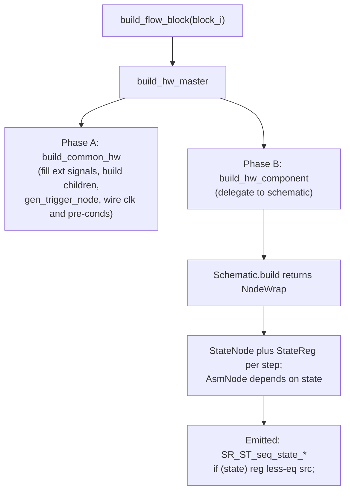

Flow blocks are Kathryn2's control-flow layer: they describe *when* assignments
fire, and their build pass lowers that description into a graph of nodes backed
by state registers. This page walks the pieces bottom-up — nodes, `AssignMeta`,
the block types and join policies, then the build pipeline.

## Node types

The control-flow graph is built from nine node types
(`NodeType` in `src/model/nodes/ncp_ident.rs`), each stored in its own arena
group and referenced by `NcpIdent` (which carries the `NodeType` for
dispatch):

| Node | File | Role |
|------|------|------|
| `Start` | `start_node.rs` | Entry point of a module's flow graph; created once by the top-module build and forwarded to all sub-modules. |
| `State` | `state_node.rs` | One clock-cycle step; owns a `StateReg`. Slaved `AsmNode`s fire while its state is active. |
| `Asm` | `asm_node.rs` | Leaf node owning one or more `AssignMeta`s — the actual register/wire writes. |
| `Syn` | `syn_node.rs` | Parallel join barrier; waits for all predecessor branches. |
| `WaitCond` | `wait_node.rs` | Stalls until a condition signal is true (backed by `CondWaitStateReg`). |
| `WaitCycle` | `wait_node.rs` | Stalls for exactly N cycles (backed by `CycleWaitStateReg`). |
| `Counter` | `cnt_node.rs` | Drives a `CntReg` and checks its terminal condition for counted loops. |
| `Pseudo` | `logic_node.rs` | Routing-only helper with no hardware effect. |
| `Opr` | `logic_node.rs` | Carries a computed signal (e.g. an OR of hold signals) so it can act as a trigger source. |

The nine `NodeType`s split into flow-driving, leaf, wait/loop, and routing-only
roles within the Hybrid Design Flow (HDF) graph:



Every node embeds a `NodeTrigger` (`src/model/nodes/node_trigger.rs`): the
per-node copy of the enclosing block's control context —
`hold_node_i`, `int_reset_node_i`, `int_start_node_i`, `mrst_node_i`,
`clk_node_i` (all `Option<NcpIdent>` pointing at `Opr` nodes) plus a list of
`depend_nodes: Vec<(NcpIdent, Option<HcpIdent>)>` (predecessor, optional guard
condition). `NodeTrigger::fill_ext_node(src, with_int_start)` is how a block
pushes its context down onto its nodes.

## AssignMeta

`AssignMeta` (`src/model/hw_component/common/assign_meta.rs`) is the descriptor
for one pending register/wire update. It is a `Copy` value, not arena-stored:

```rust
pub struct AssignMeta {
    target_hwc      : HcpIdent,
    clk_mode        : ClockMode,
    input_event_i   : Option<UpdateEventIdent>, // the underlying UeBasic (None for complex assigns)
    pre_update_event: UpdateEventIdent,         // current head of the wrapping chain
    pending_pre_cond: Option<HcpIdent>,         // deferred write-enable, folded in at build time
}
```

The life of a meta:

1. `HcpAssignable::gen_asm_meta` creates it around a fresh `UeBasic` — note the
   event exists in the arena immediately, but it is **not yet** in the target's
   `UpdatePool`.
2. Conditions are layered on via `add_specific_pre_condition(cond, arena)`,
   which wraps `pre_update_event` in a `UeCond` (`make_ue_add_dis`). The
   deferred variant `set_pending_pre_cond` exists because a clocked target's
   `clk_src` is still `None` at construction time; the pending condition is
   folded in only after clock wiring (`apply_pending_pre_cond`).
3. `try_set_clk_src(clk_src, arena)` stamps the clock source onto the inner
   `UeBasic` for edge-clocked metas.
4. `final_update(arena)` pushes `pre_update_event` into the target HCP's
   `UpdatePool` — the point of no return.

`AsmNode::assign_from_state_node` shows the full gating recipe: the combined
gate is `condition & ~hold & ~reset & parent_state_op`, each term ANDed in only
when present, applied as a pre-condition on every meta before `final_update`.

When several metas target the same HCP, `AssignMetaGrpPool`
(`src/model/hw_component/common/asm_meta_helper/`) merges them —
`FlowBlockBase::gen_unified_asm_meta_flat` uses it to collapse a block's basic
nodes and `BasicNodeFlow` children into one meta list in declaration order.

## Block types and join policy

`FlowBlockIdent` (`src/model/flow_block/flow_block_ident.rs`) carries the
block's type, its join policy, and a `chain_master` flag:

```rust
pub struct FlowBlockIdent {
    ident_base  : IdentBase,
    block_type  : FlowBlockType,
    join_policy : FlowBlockJoinPolicy,
    chain_master: bool,   // heads an elif/else continuation chain
}
```

`FlowBlockType` now has **16 variants**: `Sequential`, `Parallel`, `CondIf`,
`CondElif`, `ZeroCondIf`, `ZeroCondElif`, `ZeroSwitch`, `ZeroSwitchCase`,
`WhileLoop`, `DoWhile`, `CounterLoop`, `Wait`, `Pipeline`, `Zync`, `Pick`,
`PickIf`. They live in `seq/`, `par/`, `cond/` (all conditional, switch, and
pick blocks), `loops/`, `wait/`, `pipeline/`, and `zync/` under
`src/model/flow_block/`.

`FlowBlockJoinPolicy` decides how a block joins its parent:

- **`SubFlow`** — a regular nested child; exposes a full `NodeWrap`
  (entrances + exit) via `summarize_as_block`.
- **`ConFlow`** — a continuation branch of a conditional chain (elif / else /
  zelif / zelse); attached with `add_con_flow_block` instead of
  `add_sub_flow_block`.
- **`BasicNodeFlow`** — the block is lowered to a *single* `AsmNode`
  (`summarize_as_node`), so parents can inline it like a plain assignment while
  it still enters the flow like a `SubFlow` block.

During construction, blocks sit on `ModelArena.flow_block_init_stack` with a
`BlockTrackStatus` (`OpenForSubBlock` / `LazyClosed` / `FullyClosed`).
`initialize_flow_block` pushes; `finalize_flow_block` pops, asserts identity,
and attaches to the new stack top (or to the module if the stack empties). A
*chain master* (the `if` heading an elif/else chain) is not finalized
immediately — it lingers as `LazyClosed` so a following continuation branch can
still attach; `try_clean_lazy_closed_in_flow_block_stack` retires it once a
non-continuation sibling arrives. All of this lives in
`src/model/arena_impl.rs`.

Flow-block dispatch follows the single-match rule: `take_flow_block` in
`src/model/flow_block/arena_impl_flow_block.rs` holds the ONE 16-arm match;
`replace_back_flow_block` is zero-match via
`FlowBlock::replace_back_into_arena` (see
[Dispatch](/devbook/core/dispatch/)).

## FlowBlockBase and the FlowBlock trait

Every concrete block embeds a `FlowBlockBase`
(`src/model/flow_block/flow_block_base.rs`):

```rust
pub struct FlowBlockBase {
    ident             : FlowBlockIdent,
    sub_blocks_i      : Vec<FlowBlockIdent>,   con_blocks_i : Vec<FlowBlockIdent>,
    sub_block_orders  : Vec<usize>,            con_block_orders : Vec<usize>,
    basic_nodes_i     : Vec<NcpIdent>,         basic_node_orders: Vec<usize>,
    next_input_order  : usize,                 // shared insertion counter
    sys_nodes         : Vec<NcpIdent>,         // nodes the build itself creates
    ext_signals       : [Vec<HcpIdent>; ExtSigType::COUNT], // Hold/Reset/Start/MReset/Clk
    ext_trigger_node  : NodeTrigger,
}
```

The `*_orders` vectors share one counter so the original interleaving of nodes
and sub-blocks can be reconstructed (used by seq wiring and by
`gen_unified_asm_meta_flat`). `ext_signals` collects raw control signals per
`ExtSigType`; `gen_trigger_node` later OR-reduces each list into a single `Opr`
node in `ext_trigger_node` (Clk excepted — exactly one source, asserted by
`gen_clk_node`).

The `FlowBlock` trait ties it together; the standard build is the single
source of truth:

```rust
pub trait FlowBlock: Identifiable {
    fn get_base(&self) -> &FlowBlockBase;
    fn get_base_mut(&mut self) -> &mut FlowBlockBase;
    fn replace_back_into_arena(self: Box<Self>, arena: &mut ModelArena);
    fn add_element_in_flow_block(&mut self, node: NcpIdent);
    fn add_sub_flow_block(&mut self, block: FlowBlockIdent);
    fn summarize_as_block(&self) -> NodeWrap { panic!(...) }
    fn summarize_as_node (&self) -> NcpIdent { panic!(...) }
    fn check_prefinalize(&self) -> Result<(), String> { Ok(()) }  // recoverable errors for Python
    fn build_hw_component(&mut self, arena: &mut ModelArena);

    fn build_hw_master_base(&mut self, arena: &mut ModelArena) {
        self.get_base_mut().build_common_hw(arena);  // shared phase
        self.build_hw_component(arena);              // block-specific phase
    }
}
```

## The build pipeline

`arena.build_flow_block(block_i)` (called per top block by the module build,
and recursively for children) runs `build_hw_master`, which is two phases:

**Phase A — `FlowBlockBase::build_common_hw`** (shared by every block type):

1. `fill_ext_signal_to_child` — forward Reset / Hold / MReset / Clk signals to
   every sub- and con-block (so nested blocks inherit the module clock and
   resets).
2. `build_sub_hw_component` — recursively `build_flow_block` every child.
3. `gen_trigger_node` — OR-reduce each `ext_signals` slot into the block's
   `ext_trigger_node` (`flow_hold_*`, `flow_rst_*`, `flow_start_*`,
   `flow_mrst_*`, `flow_clk_*` Opr nodes).
4. `init_node_trigger_for_basic_node` → `set_clk_src_for_basic_node` →
   `apply_pending_pre_cond_for_basic_node` — push the trigger context onto
   every basic `AsmNode`, wire clock sources into their metas, then fold in any
   deferred write-enables (ordering matters: the clk-consistency assert in
   `add_specific_pre_condition` requires the clock first).

**Phase B — `build_hw_component`** (block-specific): each block delegates to
its **schematic** and stores the returned `NodeWrap`.

Schematics (`src/model/flow_block/common/`) are reusable node-wiring helpers.
They are *not* arena-stored — they live by value inside the block struct — and
each exposes `build(&mut base, arena) -> NodeWrap`:

| Schematic | Mode enum | Drives |
|-----------|-----------|--------|
| `SeqSchematic` | — | linear chain of `SequenceEle` (Basic asm node or SubBlock) |
| `ParSchematic` | `ParSyncMode` (`AutoSync`/`NoSync`) | parallel fan-out / fan-in via `SynNode` |
| `CondSchematic` + `CondChain` | `CondMode` | conditional / switch branch wiring, elif-chain bookkeeping |
| `PickSchematic` | — | pick / pick-if selection |
| `WhileSchematic`, `DoWhileSchematic` | `LoopMode` | loop topologies (do-while runs the body at least once) |
| `CounterLoopSchematic` | — | fixed-count loop around a `CounterNode` |
| `WaitSchematic` | `WaitMode` | cond-wait (`scwait`) vs cycle-wait (`sywait`) |
| `PipSchematic` | — | arbiter-gated pipeline stage |
| `ZyncSchematic` | `ZyncSyncMode` | arbiter-channel synchronised firing |

The `SeqSchematic` shows the canonical lowering: for each `Basic` element it
creates a fresh `StateNode` (`seq_state_<blockid>_<idx>`), copies the block's
`ext_trigger_node` onto it, and makes the `AsmNode` depend on that state node —
which is exactly the `SR_ST_seq_state_*` registers and
`if (state) reg <= src;` blocks you see in emitted Verilog. Sub-block elements
are summarized to `NodeWrap`s and chained exit → entrance.

The two-phase build lowers a flow block down to state registers and emitted
Verilog:



**`NodeWrap`** (`src/model/flow_block/node_wrap.rs`) is the by-value summary a
built block hands to its parent: `entrance_nodes_i`, one `exit_node`, and a
`cycle_used` count (`IN_CONSIST_CYCLE_USED` when unpredictable, e.g. waits).
Entrance nodes must **not** be assigned by the schematic that builds them — the
parent wires dependencies into them (`add_dep_to_entrances`) and assigns them
(`assign_entrance_nodes`). `NodeWrapCycleDet` combines child cycle counts
vertically (sum) or horizontally (max / must-be-equal) for latency tracking.

## How structures map to hardware

- **seq** — one `StateNode`/`StateReg` per step; each step's asm node fires
  under its state.
- **par** — all children start together; `AutoSync` inserts a `SynNode` backed
  by `SyncReg`s to join.
- **cond / zero-cond / zero-switch** — `CondSchematic` wires branch guards;
  the `Zero*` variants are combinational (no cycle consumed, lowered toward
  `UeCond` / `UeSwitch` events instead of extra states). Conditional bodies
  must contain sub-blocks, not bare nodes (a model constraint).
- **while / do-while / counter loop** — loop back-edges through wait or
  counter nodes; `CounterLoop` pairs a `CounterNode` with a `CntReg`.
- **pipeline (`FlowBlockPip`)** — one body sub-block gated by an `Arb` CCP:
  the body runs while the arbiter grants and stalls (wait4syn) otherwise; the
  arb's user hold/reset feed the block's `ext_signals`, and `auto_restart`
  additionally routes the arb reset into `Start`.
- **zync (`FlowBlockZync`)** — contends on one or more arbiter channels
  (`ZyncArbBind`); all of its work nodes fire together on the cycle the grant
  arrives. It accepts only direct asm nodes or `BasicNodeFlow` sub-blocks.
- **wait (`FlowBlockWait`)** — a leaf block; the cond/cycle choice lives only
  in `WaitSchematic`, mirroring how `FlowBlockPar` unifies its sync modes in
  one struct.

:::tip
Adding a new block type touches exactly four places: a `FlowBlockType`
variant, a new `ArenaGroup` + typed CRUD pair in `arena_impl_flow_block.rs`,
one arm in the single `take_flow_block` match, and the `impl FlowBlock`.
Reuse an existing schematic if the topology matches.
:::
