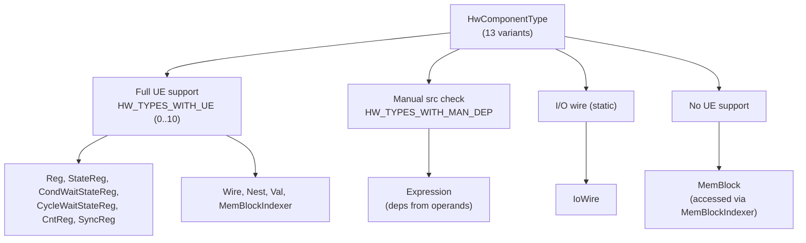
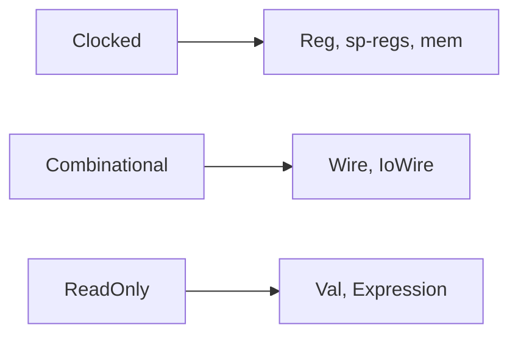

Hardware components (**HCPs**) are the atoms of a Kathryn2 model: registers,
wires, constants, memories, expressions, and the special-purpose registers the
flow-block builder synthesises. Every HCP lives in a typed `ArenaGroup` on
`ModelArena` and is referenced only through a `Copy` handle, `HcpIdent`
(see [ModelArena](/devbook/core/model-arena/) and the
[Ident pattern](/devbook/core/ident-pattern/)).

## The HwComponentType taxonomy

`HwComponentType` (`src/model/hw_component/common/hcp_ident.rs`) enumerates all
13 concrete component types, ordered so that group membership is encoded in the
discriminant:

```rust
#[repr(usize)]
pub enum HwComponentType {
    // hw components that UE fully support
    Reg = 0, StateReg = 1, CondWaitStateReg = 2, CycleWaitStateReg = 3,
    CntReg = 4, SyncReg = 5, Wire = 6, Nest = 7, Val = 8, MemBlockIndexer = 9,
    // hw component that requires manual src check
    Expression = 10,
    // io wire (static)
    IoWire = 11,
    // no UE support (MemBlockIndexer is its accessor / agent)
    MemBlock = 12,
}
```

| Type | Prefix | Role |
|------|--------|------|
| `Reg` | `REG` | General-purpose clocked register; the most common HCP. |
| `StateReg` | `SR_ST` | 1-bit FSM state register; spawns its own `_SET`/`_UNSET` constant `Val`s. |
| `CondWaitStateReg` | `SR_CDWT` | Stalls a flow until a condition signal is true. |
| `CycleWaitStateReg` | `SR_CYWT` | Stalls a flow for a fixed number of cycles. |
| `CntReg` | `CNT_REG` | Counter register driving counted loops. |
| `SyncReg` | `SR_SY` | Synchronisation register for parallel joins. |
| `Wire` | `WIRE` | Combinational signal (always `ClkFree`). |
| `Nest` | `NEST` | Reserved for nested-module use; not yet ported (panics in the Verilog backend). |
| `Val` | `VAL` | Compile-time constant. |
| `MemBlockIndexer` | `MEM_BLOCK_INDEXER` | Indexed read/write accessor into a `MemBlock`. |
| `Expression` | `EXPR` | Combinational logic expression; dependencies gathered manually from its operands. |
| `IoWire` | `IO_WIRE` | Module boundary port — see [I/O Routing](/devbook/backend/io-routing/). |
| `MemBlock` | `MEM_BLOCK` | Memory array; all UE traffic goes through `MemBlockIndexer`. |

The prefixes come from `HwComponentType::global_prefix()` and are the canonical
short names used in generated unique names — do not invent new ones.

The discriminant order groups the 13 types into the four dependency-gathering
bands the `const` lists carve out:



### Compile-enforced group lists

Membership lists are `const` arrays whose lengths are tied to group-count
constants, so forgetting to update a list is a **compile error**, not a silent
runtime omission:

```rust
// src/model/hw_component/common/hcp_ident.rs
pub const UE_BOUNDARY   : usize = 10; // bump when inserting a UE-capable type
pub const MAN_DEP_COUNT : usize = 1;
pub const IO_WIRE_COUNT : usize = 1;
pub const MEM_BLK_COUNT : usize = 1;
// Derived — never edit directly; bump the group count above instead.
pub const COUNT : usize = Self::UE_BOUNDARY + Self::MAN_DEP_COUNT
                        + Self::IO_WIRE_COUNT + Self::MEM_BLK_COUNT;

pub const HW_TYPES_WITH_UE      : [HwComponentType; HwComponentType::UE_BOUNDARY]   = [ /* ... */ ];
pub const HW_TYPES_WITH_MAN_DEP : [HwComponentType; HwComponentType::MAN_DEP_COUNT] = [ Expression ];
pub const ALL_HW_TYPES          : [HwComponentType; HwComponentType::COUNT]         = [ /* ... */ ];
```

`Module` iterates `HW_TYPES_WITH_UE`/`ALL_HW_TYPES` (never a hand-written type
list) for dependency gathering, pool sorting, and emission, so a new variant
automatically flows through every pass once these arrays are updated.

## HcpIdent and its type metadata

`HcpIdent` is the `Copy` handle callers hold. Beyond the shared `IdentBase`
(global id, name, arena handle) it carries three pieces of type metadata:

```rust
// src/model/hw_component/common/hcp_ident.rs
pub struct HcpIdent {
    ident_base     : IdentBase,
    hw_type        : HwComponentType,   // dispatch discriminant
    sensitive_type : HcpSensitiveType,  // Clocked / Combinational / ReadOnly
    master_module_i: ModuleIdent,       // owning module — needed by IO routing
}
```

- `hw_type` selects the arena field in every `dispatch_*!`/`take_*` match.
- `master_module_i` is what the routing pass compares to detect cross-module
  references.
- `sensitive_type` says how the component is *driven* and therefore how it may
  be assigned. It is **not** derived by a central `match hw_type { … }`: each
  component constructor declares its own value at its `HcpIdent::new(...)` call
  site (`Reg`/sp-regs/mem → `Clocked`, `Wire`/`IoWire` → `Combinational`,
  `Val`/`Expression` → `ReadOnly`). A central switch is a maintenance trap — a
  new type would silently land in the wrong arm. Python reads this as
  `PyHcpIdent.clocked` / `PyHcpIdent.sensitive_type`, with
  `HcpSensitiveType::is_clocked()` as the single source of the boolean.

Each constructor declares its own `sensitive_type`, which decides how the
component may be assigned:



`HcpIdent` hashes by `global_id` only, so it works as a `HashMap`/`HashSet` key
in the routing remap tables.

## HcpBase and HcpAssignable

Two traits give every component its cross-cutting behaviour.

**`HcpBase`** (`src/model/hw_component/common/hcp_base.rs`) is the dependency
surface used by the backend routing pass:

```rust
pub trait HcpBase: HcpAssignable + HcpIdentifiable {
    // Each concrete type routes itself back to its typed arena slot — zero match.
    fn replace_back_into_arena(self: Box<Self>, arena: &mut ModelArena);

    /// Default walks the UpdateEvent pool; Expression overrides to read its operands.
    fn gather_dep_hcps(&self, arena: &mut ModelArena, out: &mut HashSet<HcpIdent>) { ... }
    /// Default remaps through the pool; Expression overrides to remap its operands.
    fn remap_dep_hcps(&mut self, map: &HashMap<HcpIdent, HcpIdent>, arena: &mut ModelArena) { ... }
}
```

**`HcpAssignable`** (`src/model/hw_component/common/hcp_assign.rs`) is the
assignment surface. Each component stores an `HcpAssign` (its `UpdatePool` plus
an optional `HcpIoMark`) and answers four per-type questions:

```rust
pub trait HcpAssignable: HcpIdentifiable {
    fn get_hcp_assign    (&self)     -> &HcpAssign;
    fn get_hcp_assign_mut(&mut self) -> &mut HcpAssign;

    fn retrieve_clk_mode(&self) -> ClockMode;  // Reg → global clk mode; Wire → ClkFree
    fn get_des_slice    (&self) -> Slice;      // full width: Slice::new(0, bit_width)
    fn get_priority     (&self) -> i32;        // usually get_asm_pri_val()
    fn do_asm(&self, srci: HcpIdent, des_slice: Option<Slice>, src_slice: Slice,
              arena: &mut ModelArena) -> NcpIdent;
}
```

The provided methods build the assignment machinery in layers:
`gen_update_event` makes a `UeBasic` in the arena; `gen_asm_meta` wraps it in
an `AssignMeta`; `gen_asm_node` wraps the meta in an `AsmNode`. `bind_src` is
the low-level "drive this HCP from that signal" helper used by internal wiring
(IoWires, wire defaults); it defaults to `DEFAULT_UE_PRI_INTERNAL_MIN` and
panics if an edge-clocked binding has no `clk_src`.

`mark_as_io(is_input, io_name)` stamps an `HcpIoMark` onto the component; the
global routing pass later threads every marked component up to the top module
and names the top-level port after `io_name` (see
[I/O Routing](/devbook/backend/io-routing/)).

## The UpdatePool

Every UE-capable component owns an `UpdatePool`
(`src/model/hw_component/common/update_pool.rs`): a `Vec<UpdateEventIdent>`
recording everything that ever drives this component. Key operations:

- `add_update_event(ident)` — append (order preserved until sorted).
- `sort_events(arena)` — sort by `(priority, sub_priority)` ascending; run once
  per module by the backend's init phase.
- `get_clock_mode` / `get_clk_src_i` plus the `is_*_consistent` checks — a pool
  is expected to be single-clock-domain; the Verilog emitter reads the first
  event's mode/source for the sensitivity list.
- `gather_dep_hcps` / `remap_dep_hcps` — recurse through the whole
  UpdateEvent tree (containers included) for the routing pass.

The update-event types themselves and how priority resolves multiple writers
are covered in
[Update Events & Priority](/devbook/model/update-events-and-priority/).

## Component notes

**Reg** (`src/model/hw_component/reg.rs`) — carries an optional
`reset_val: Option<HcpIdent>`. `set_reset_val` records it;
`try_build_reset(clk_src, mreset_i, arena)` (called by the module build after
all HCPs are registered) builds a
`make_ue_full(None, Some(mreset_i), reset_val, …, DEFAULT_UE_PRI_RST, …)` event
so the master reset wins over every other write.

**Wire** (`src/model/hw_component/wire.rs`) — always combinational
(`retrieve_clk_mode() == ClkFree`). Every wire gets a fallback event via
`try_build_default`: an explicit `default_val` binds at
`DEFAULT_UE_PRI_FALLBACK` (1), otherwise an implicit zero `Val` binds at
`DEFAULT_UE_PRI_MIN` (0) so an undriven wire reads 0. Both sit **below**
`DEFAULT_UE_PRI_USER` (10) on purpose: events are emitted in ascending priority
order and the last write wins, so a fallback in the internal band (50+) would
override the very assignments it exists to back up. `disable_default()` opts
out entirely — used for externally driven wires such as the top-level
`clk`/`mrst` inputs, and `set_default_val` panics on a wire that opted out.

**IoWire** (`src/model/hw_component/io_wire.rs`) — a boundary port storing
`is_input`, `actual_src_signal_i` (the origin signal, the reuse anchor) and
`agent_src_signal_i` (the immediate driver at this hierarchy level). Its
`do_asm` panics: IoWires are wired by the routing pass, never user-assigned.

**Val / Expression** — read-only sources. `Expression`
(`src/model/hw_component/expression.rs`) computes `op(operand_a, operand_b)`
with per-operand slices (or a constant `operand_c`); comparison/logical ops
have result width 1, others inherit `operand_a`'s width. It is the one
`HW_TYPES_WITH_MAN_DEP` member: dependencies come from its operands, not from
an UpdatePool.

**Special registers** (`src/model/hw_component/sp_reg/`) — `StateReg`,
`SyncReg`, `CntReg`, `CondWaitStateReg`, `CycleWaitStateReg`. These are the
building blocks the flow-block schematics instantiate; each builds its own
update events from a `TriggerSig` group. `StateReg` defines a local priority
ladder on top of `DEFAULT_UE_PRI_INTERNAL_MIN` (unset, then hold, set,
soft-reset, interrupt, with master reset at `DEFAULT_UE_PRI_RST`) so the
strongest write is emitted last in the always block and wins.

**MemBlk / MemEle** — `MemBlock` is the storage array; `MemBlockIndexer`
(`mem_ele.rs`) is the UE-capable accessor that reads/writes it.

## Clock policy

The source of truth is the comment block at the top of
`src/model/controller/clock_mode.rs`. `ClockMode` is
`PosEdge / NegEdge / ClkFree / ClkUnused`, with a process-wide default
(`get_global_clk_mode()`, default `PosEdge`; `set_global_clk_mode` asserts an
edge mode).

How a concrete clock source gets onto an update event:

1. **`ClkFree` events need no wiring** — `clk_src_i` stays `None` and the
   Verilog backend emits `always @(*)`.
2. **User-level assignments** (an `AssignMeta` plus its UE) are built with
   `clk_src = None`. The source is filled in during the enclosing flow block's
   build phase: `FlowBlockBase::build_common_hw` runs
   `init_node_trigger_for_basic_node` → `set_clk_src_for_basic_node`, drawing
   the signal from the block's `ext_trigger_node.clk_node_i`.
3. **Flow-block internal registers** (UE only, no `AssignMeta`) get their clock
   when the owning node asks the register to build its update event, again from
   that node's `NodeTrigger::clk_node_i`.

`ExtSigType::Clk` is single-source by design: `FlowBlockBase::gen_clk_node`
asserts exactly one clk signal per block (no OR fan-in, unlike hold/reset), so
every block has one unambiguous clock net. The backend enforces the same rule
at emission time — `sensitivity_list` panics on an edge-mode event with no
resolved clock name rather than guessing a default `clk`.

:::note
`Nest` exists in the enum but is not implemented end-to-end
(`take_hcp_vb` panics on it), and `MemBlk`/`MemEle`/`Val` emission began life
as stubs — check the current `*_vb.rs` files before relying on them.
:::
