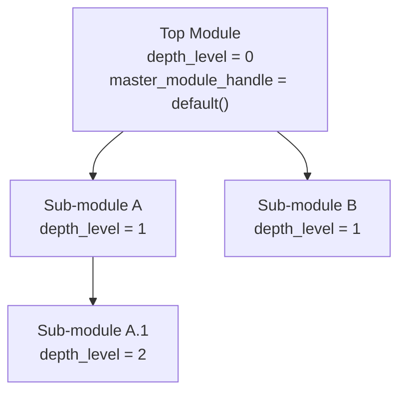
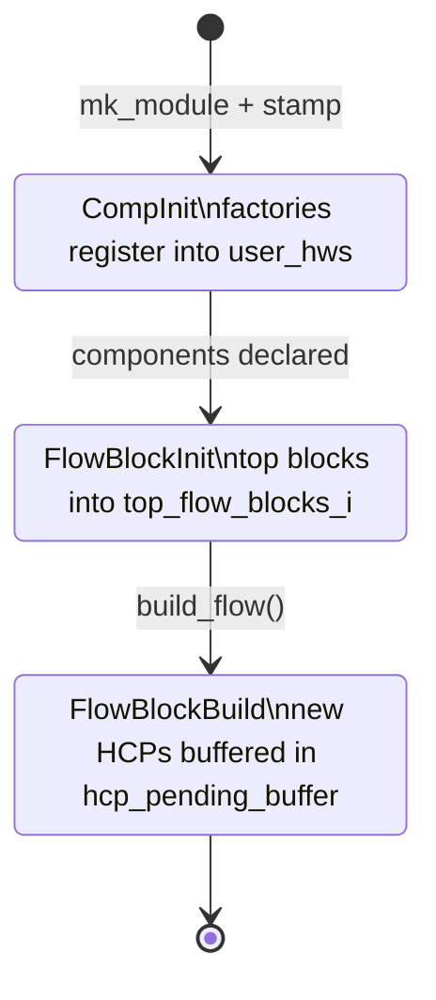

A `Module` is the unit of hierarchy in Kathryn2: it owns hardware components,
flow blocks, and sub-modules, and it eventually becomes one emitted Verilog
`module … endmodule` block. This page covers the container itself, its ident,
and the construction lifecycle driven by the *module trace stack*.

## The Module type

`Module` (`src/model/module/module.rs`) is stored in `ModelArena.modules` and
referenced through `ModuleIdent`:

```rust
#[derive(Default)]
pub struct Module {
    ident                : ModuleIdent,
    is_top_module        : bool,
    start_node_i         : Option<NcpIdent>,
    // implicit HCPs built by the design flow; indexed by HwComponentType
    internal_hws         : [Vec<HcpIdent>; HwComponentType::COUNT],
    // user-declared HCPs; indexed by HwComponentType
    user_hws             : [Vec<HcpIdent>; HwComponentType::COUNT],
    user_sub_modules     : Vec<ModuleIdent>,
    ccps_i               : Vec<CcpIdent>,        // complex components (Arb, Karray)
    top_flow_blocks_i    : Vec<FlowBlockIdent>,
    basic_nodes_i        : Vec<NcpIdent>,        // module-level bare AsmNodes
}
```

Two conventions to note:

- **Grouped index arrays.** Instead of one field per HW type, both HCP lists
  are `[Vec<HcpIdent>; HwComponentType::COUNT]` indexed by the enum
  discriminant. `add_user_hws` / `add_internal_hw` read the type off the ident
  (`i.get_hw_type() as usize`), so a single adder serves all 13 types and
  passes like routing can iterate any type with one index lookup.
- **User vs internal.** `user_hws` holds what the user declared (`mk_*`
  factories); `internal_hws` holds what the build flow synthesised (state
  registers, trigger expressions, routed IoWires — `make_*` factories). Every
  whole-module pass iterates both chains.

The module also carries the dependency plumbing used by the backend
(`gather_dep_hcps`, `remap_dep_hcps`, `gather_io_marked_hcps`,
`sort_update_event_pool`) — each takes `&mut ModelArena` and requires the
module itself to be taken out of the arena first, per the
[take/replace_back rule](/devbook/core/factories-and-crud/).

## ModuleIdent — hierarchy in the handle

`ModuleIdent` (`src/model/module/module_ident.rs`) extends the standard
`IdentBase` with two hierarchy fields:

```rust
pub struct ModuleIdent {
    ident_base           : IdentBase,
    // ArenaHandle of the parent module; default() means "no parent" (top module).
    master_module_handle : ArenaHandle,
    // Nesting depth: 0 = top module, +1 per level of sub-module.
    depth_level          : u32,
}
```

`ArenaHandle::default()` carries `generation = u32::MAX`, which can never
match a live slot — so "no parent" is a safe sentinel that panics loudly if
dereferenced (the backend's `get_parent_module_ident` asserts against it
explicitly).

`depth_level` exists for the backend: the LCA path finder in
`src/backends/common/graph.rs` uses it to balance the two walk-up paths without
extra arena reads.

The two fields encode the module tree directly in each handle:



Both fields are stamped by `stamp_module_to_parent_module`
(`src/model/module/arena_factory_module.rs`), which runs inside `mk_module`:

```rust
fn stamp_module_to_parent_module(&mut self, mut i: ModuleIdent) -> ModuleIdent {
    if let Some((parent_i, _stage)) = self.try_peek_module_trace_stack() {
        i.set_master_module_i(parent_i);
        // Stack size == parent depth + 1, so it directly equals the child's depth.
        i.set_depth_level(self.module_trace_stack.len() as u32);
    }
    // Write the updated ident back into the Module stored in the arena.
    let mut m = self.take_module(i);
    m.set_ident(i);
    self.replace_back_module(i, m);
    i
}
```

The write-back matters: the ident copy embedded in the arena-stored `Module`
must match the stamped one, or `module.get_ident()` would return a handle with
no parent/depth information.

## The module trace stack

`ModelArena.module_trace_stack: Vec<(ModuleIdent, ModuleInitStage)>` records
*which module is currently under construction and in which stage*. Every HCP
factory and every flow-block finalize consults the top of this stack to decide
where the new object registers. The stage enum
(`src/model/model_arena.rs`):

```rust
pub enum ModuleInitStage {
    CompInit,        // hardware components are being declared
    FlowBlockInit,   // flow blocks are being assembled / nested
    FlowBlockBuild,  // the build pass is running; new HCPs are buffered
}
```

Stack manipulation lives in `src/model/arena_impl.rs`
(`push_module_trace_stack`, `pop_module_trace_stack`,
`peek_module_trace_stack`, `try_peek_module_trace_stack`). Pushing is always
explicit — whoever opens a module scope is responsible for popping it.

How each stage behaves:

- **CompInit** — component declaration. A factory such as `mk_reg` registers
  the new ident directly into the top-of-stack module's `user_hws`. The
  backend's IO helpers reuse this stage too: `build_io_wire`
  (`src/backends/common/io_op.rs`) pushes the target module at `CompInit`,
  makes the IoWire, and pops — so routed wires land in the right module even
  though routing runs long after construction.
- **FlowBlockInit** — flow-block assembly. `finalize_flow_block`
  (`src/model/arena_impl.rs`) asserts this stage when attaching a finished
  top-level block to the module:

  ```rust
  let (module_i, stage) = self.peek_module_trace_stack();
  assert_eq!(stage, ModuleInitStage::FlowBlockInit, ...);
  ```

- **FlowBlockBuild** — the hardware build pass. The module being built is
  *taken out of the arena* while its blocks build, so newly created HCPs cannot
  be registered on it directly. They are appended to
  `ModelArena.hcp_pending_buffer: Vec<(HcpIdent, bool)>` instead (the bool is
  `is_user_hw`); after the pass, `Module::register_pending_hcps` drains the
  buffer and files each ident into `user_hws` or `internal_hws`.

## Init stages end to end

The trace-stack stage drives where each new object registers over a module's life:



From the module system's perspective the full lifecycle of one module is:

1. **Create + stamp.** `mk_module(name)` inserts the `Module`, then
   `stamp_module_to_parent_module` wires the parent handle and depth from the
   current trace stack. The top module is additionally registered via
   `set_top_module(i)` (asserts it is set only once and flags
   `is_top_module`).
2. **CompInit pass.** The module is pushed at `CompInit`; the user declares
   regs/wires/vals/sub-modules. Each factory registers into `user_hws` of the
   stack top.
3. **FlowBlockInit pass.** Pushed at `FlowBlockInit`; flow blocks are
   initialized/finalized against the flow-block init stack (see
   [Flow Blocks](/devbook/model/flow-blocks/)); each finished top-level block
   lands in `top_flow_blocks_i`.
4. **FlowBlockBuild pass.** Driven once for the whole tree by
   `ModelArena::build_flow()`:

   ```rust
   pub fn build_flow(&mut self) {
       let top_i = self.top_module.expect("build_flow: no top module set");
       let mut top = self.take_module(top_i);
       top.build_flow_as_top_module(self);
       self.replace_back_module(top_i, top);
   }
   ```

   `build_flow_as_top_module` asserts the start node is unset (the build is
   **not re-runnable**), creates the primitive `clk` / `mrst` input wires
   (IO-marked, defaults disabled) and the start node inside a
   `FlowBlockBuild` scope, then calls `build_flow_base`, which for every
   module:

   - forwards `clk` / `mrst` into each top flow block's `ext_signals` and
     calls `build_flow_block`;
   - joins the result by policy — `BasicNodeFlow` blocks are collapsed to one
     AsmNode and dry-assigned, `SubFlow` blocks expose a `NodeWrap` whose
     entrances are wired to the start node;
   - dry-assigns bare `basic_nodes_i` and builds registered CCPs;
   - drains `hcp_pending_buffer` into the module lists;
   - builds reg reset events and wire default events
     (`build_reset_and_default_events`) now that the module clock is known;
   - recurses into `user_sub_modules` via `build_flow_as_sub_module`,
     forwarding the *same* `start_node_i`, `clk_i`, and `mreset_i` — sub-modules
     do not own their own clock or start node.

## Nesting and the Python lifecycle

Sub-module nesting is two separate acts, and both are required:

- `mk_module` stamps the parent handle onto the child's ident (hierarchy for
  routing/depth), but
- only `Module::add_user_sub_module(child_i)` puts the child into the parent's
  `user_sub_modules` list — which is what `build_flow_base` and
  `DfsModuleIter` actually traverse.

The Python connector (`src/applications/py/model/module/arena_impl_module_py.rs`)
exposes the stack as `track_module_at_com_init` / `track_module_at_flow_init`
and their `untrack_*` counterparts; whoever opens a scope **must** also call
`add_user_sub_module` for a child, otherwise the build DFS silently never
descends into the sub-module — a known host-side gotcha.

The pure-Python `Module` class drives both stages itself: `__init__` runs every
`@init` method eagerly inside a `track_module_at_com_init` /
`untrack_module_at_com_init` scope, and registers each `@flow` method into the
process-wide pool. One top-level `gen_flow()` then re-opens each module with
`track_module_at_flow_init`, runs its flow methods, and calls
`finalize_flow_procedure`. So the CompInit / FlowBlockInit split **is** used by
the Python layer — what remains unported is the C++-era *controller* that used
to orchestrate the stages (see
[Python Layer](/devbook/bindings/python-layer/)).

:::note
The C++-era controller (`on_module_init_components`, per-stage callbacks) is
not ported; only `clock_mode` and the asm-priority state exist under
`src/model/controller/`. The stage split is therefore enforced by asserts and
convention, not by a controller object.
:::
