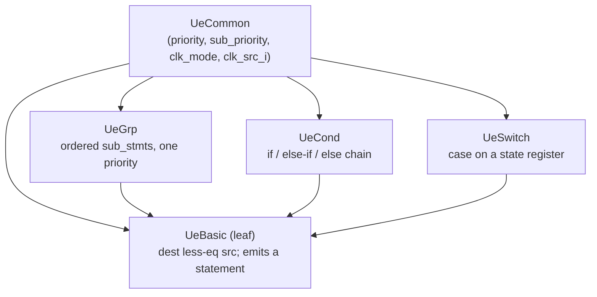
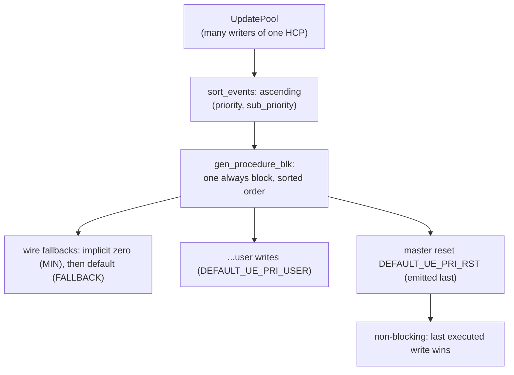

An **update event** (UE) is one entry in a hardware component's `UpdatePool`:
"this component is driven by that source, possibly under conditions". Multiple
writers to the same component are legal by design — conflicts are resolved by
**priority**, which controls the order the events are emitted inside the
component's single Verilog always block.

## UE types and UeCommon

All UE machinery lives in `src/model/hw_component/common/update_event.rs`.
There are four concrete types plus a sentinel:

```rust
pub enum UeType { Basic = 0, Grp = 1, Cond = 2, Switch = 3, Untype = 4 }
```

Every UE embeds a `UeCommon` carrying the metadata the pool and backend need
without touching the payload:

```rust
pub struct UeCommon {
    ue_type      : UeType,
    priority     : i32,        // primary sort key
    sub_priority : u64,        // tie-breaker (default DEFAULT_UE_SUB_PRIORITY_USER = 0)
    clk_mode     : ClockMode,  // PosEdge / NegEdge / ClkFree / ClkUnused
    clk_src_i    : Option<HcpIdent>, // concrete clock net for edge modes
}
```

| Type | Payload | Semantics |
|------|---------|-----------|
| `UeBasic` | `srci: HcpIdent`, `des_slice`, `src_slice` | Leaf assignment `dest[des_slice] <= src[src_slice]`; the only type that emits an actual statement. |
| `UeGrp` | `sub_stmts: Vec<UpdateEventIdent>` | Ordered group sharing one priority/clock; emitted back-to-back. |
| `UeCond` | parallel `conditions: Vec<Option<HcpIdent>>` and `sub_stmts: Vec<Option<UpdateEventIdent>>` | if / else-if / else chain; a `None` condition is the terminal `else` (guarded by `is_last_occure`). |
| `UeSwitch` | `state_iden: HcpIdent`, per-case `(match_val: i32, sub_stmt)` | Verilog `case` on a state register. |

The four UE types share `UeCommon`; `UeBasic` is the only leaf that emits a
statement, the other three are containers that nest sub-statements:



Container types adopt their metadata from the **first** sub-statement added
(`UeCommon::init_meta` inside `add_sub_stmt`), so a container is always
joinable with its own children. `UpdatingEvent::is_joinable` compares
`(priority, clk_mode, clk_src_i)` — the criteria for merging events into one
group. All three containers implement `gather_dep_hcps` / `remap_dep_hcps`
recursively (taking each child out of the arena, recursing, putting it back),
which is what lets the IO-routing pass rewrite a signal at any nesting depth.

UEs follow the standard arena rules: typed `take_ue_* / replace_back_ue_*`
pairs plus a polymorphic `take_ue(ident) -> Box<dyn UpdatingEvent>` with ONE
match and a zero-match `replace_back_ue` in
`src/model/hw_component/common/arena_impl_ue.rs`. A `dispatch_ue_common!`
macro backs the borrow-only `get_ue_common(&ident)` accessor used for sorting.

## Building events

The factories in `src/model/hw_component/common/arena_factory_ue.rs` are the
only constructors used in practice:

- `make_ue_basic(srci, des_slice, src_slice, priority, cm, auto_priority, clk_src)`
  — the leaf. With `auto_priority = true` the priority is read from the
  thread-local asm-priority state (`get_asm_pri_val()`).
- `make_ue_add_dis(cond_i, state_i, ueb_i)` — wraps an existing event in a
  one-armed `UeCond` guarded by `cond & state` (either side optional). The
  wrapper *inherits* priority/clk_mode/clk_src from the wrapped event so it
  stays joinable with its siblings. This is how `AssignMeta` pre-conditions and
  state gating are layered.
- `make_ue_full(cond, state, value, …)` — `make_ue_basic` plus an optional
  `make_ue_add_dis` in one call; used e.g. by `Reg::try_build_reset`.
- `make_ue_mux(left, right, select_left)` — a two-armed `UeCond`
  (if select → left else right); both operands must be `ClkUnused` and share a
  priority.

`assert_clk_src_consistent(cm, clk_src, lazy_edge_clk)` guards every factory:
`ClkFree` must not carry a clock source, and an edge mode must have one —
except during construction (`lazy_edge_clk = true`), because user-level events
receive their clock later from the flow-block build (see the clock policy in
[Hardware Components](/devbook/model/hw-components/)).

## Priority-driven write resolution

The resolution mechanism is deliberately simple:

1. Each `UpdatePool` is sorted **ascending** by `(priority, sub_priority)` —
   `UpdatePool::sort_events` (`update_pool.rs`), run for every HCP by the
   backend's init phase (`Module::init_module_vb`).
2. The Verilog emitter writes the events of one pool, in sorted order, into
   **one** `always` block (`gen_procedure_blk` in
   `src/backends/verilog/hw_component/util_vb.rs`).
3. Verilog's non-blocking assignment semantics make the **last executed write
   win** — so the highest-priority event, emitted last, overrides everything
   before it whenever its guard is true.

This realizes Decentralized Update: each component resolves its own writers
independently by sorting its pool, so the last-emitted write wins.



The constants form bands (`update_event.rs`, defined by the
`define_asm_priority_consts!` macro):

| Constant | Value | Meaning |
|----------|-------|---------|
| `DEFAULT_UE_PRI_MIN` | `0` | Absolute floor — the implicit zero fallback on wires; emitted first, loses to everything. |
| `DEFAULT_UE_PRI_FALLBACK` | `1` | An explicit `wire.default(v)` — above the implicit zero, below every user assignment. |
| `DEFAULT_UE_PRI_USER` | `10` | Default for user assignments (auto mode). |
| `DEFAULT_UE_PRI_INTERNAL_MIN` | `50` | Floor of the internal band — sp-reg base events, IoWire bindings. |
| `DEFAULT_UE_PRI_INTERNAL_MAX` | `100` | Ceiling of the internal band. |
| `DEFAULT_UE_PRI_RST` | `i32::MAX` | Master reset — always emitted last, always wins. |
| `DEFAULT_UE_SUB_PRIORITY_USER` | `0` | Default sub-priority tie-breaker. |

`StateReg` (`src/model/hw_component/sp_reg/state_reg.rs`) stacks a local ladder
on the internal band — unset (`+0`), hold (`+1`), set (`+2`), soft reset
(`+3`), interrupt (`+4`), master reset at `DEFAULT_UE_PRI_RST` — which produces
the characteristic emitted shape: an unconditional clear first, the set
condition next, `mrst` last:

```verilog
always @(posedge WIRE_clk_12) begin
    SR_ST_start_ST_16 <= VAL_start_ST_UNSET_15;  // lowest priority
    if (EXPR_startExpr_18) begin
        SR_ST_start_ST_16 <= VAL_start_ST_SET_14;
    end
    if (WIRE_mrst_13) begin                                 // DEFAULT_UE_PRI_RST
        SR_ST_start_ST_16 <= VAL_start_ST_UNSET_15;
    end
end
```

Two same-destination user writes are resolved the same way:
`test/model/tc25_pip_zync_multi_assign_priority.py` gives the *first-declared*
write the higher priority and asserts it wins over the later-declared one —
proving priority, not declaration order, decides (with equal priorities,
`sub_priority`/insertion order makes the last declaration win, as in tc24).

### The user-facing priority state

The priority applied to a user assignment is read at event-build time from a
process-wide thread-local (`src/model/controller/asm_mode.rs`):

```rust
pub enum AsmNodePriorityMode { Auto, Manual }
pub fn get_asm_pri_val() -> i32;           // Auto → DEFAULT_UE_PRI_USER
pub fn set_asm_pri_to_manual(priority: i32);
pub fn set_asm_pri_to_auto();
```

`HcpAssignable::get_priority()` on `Reg`/`Wire`/`IoWire` returns
`get_asm_pri_val()`, so *set the priority before the assignment it should
govern*.

## Publishing the constants to Python

The constants exist in exactly one place. The `define_asm_priority_consts!`
macro in `update_event.rs` both declares each `pub const` **and** generates a
`(name, value)` table:

```rust
pub fn asm_priority_consts() -> &'static [(&'static str, i64)] { ... }
```

The PyO3 layer
(`src/applications/py/model/controller/asm_mode_py.rs::add_asm_priority_consts`)
walks that table at module init, registers every constant as a module attribute
on `_kathryn`, and publishes the authoritative name list as
`_ASM_PRIORITY_CONST_NAMES`. The pure-Python side (`py/kathryn/priority.py`)
then mirrors them without hardcoding a single name:

```python
PRIORITY_CONST_NAMES = list(_kathryn._ASM_PRIORITY_CONST_NAMES)
globals().update({n: getattr(_kathryn, n) for n in PRIORITY_CONST_NAMES})
```

Adding a row to the Rust macro therefore auto-propagates to
`from kathryn import DEFAULT_UE_PRI_...` with zero duplicated lists — the same
single-source pattern used for `LogicOp` and `FlowBlockType` enums.

`priority.py` also exposes the runtime state — `set_priority(p)`,
`set_priority_auto()`, `get_priority()`, `get_priority_mode()` — routed through
`PyModelArena` methods (`set_asm_pri_to_manual` etc.), plus a scoped context
manager that restores the previous mode on exit:

```python
with priority(DEFAULT_UE_PRI_USER + 3):
    a |= a + v          # only this assignment gets the raised priority
```

:::note
Priority ordering *within* one component's always block is fully defined; the
relative ordering of separate always blocks is not (each component resolves its
own pool independently). Also note `DEFAULT_UE_PRI_USER` (10) sits *below* the
internal band (50–100): internal events targeting the same component are
emitted after user ones, which is relied on by the sp-reg ladders — keep this
in mind before assigning manual priorities above 50.
:::
