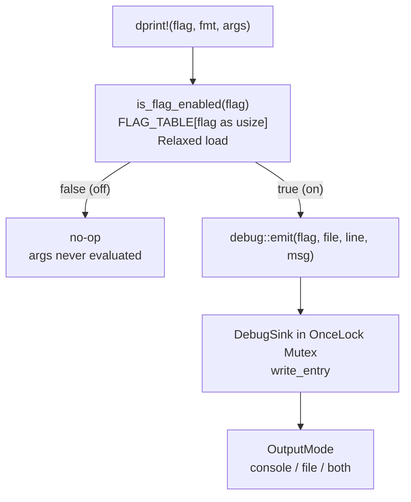

Kathryn2 ships a small in-crate tracing system under `src/debug/` (`mod.rs`,
`flags.rs`, `config.rs`). Its defining property:

> **Zero-cost when off.** Every `dprint!` call compiles to a single
> array-index + atomic load when the flag is disabled. No heap allocation, no
> hash, no lock. Format strings are never evaluated unless the flag is on.

## Quick start

```rust
// main.rs — initialise once before anything else
debug::init()
    .flags(&[DebugFlag::ArenaImpl, DebugFlag::BackendVerilog])
    .to_console()
    .build();
```

```rust
// anywhere in the codebase
dprint!(DebugFlag::ArenaImpl, "Inserted reg {} at handle {:?}", name, handle);
```

Output on stdout:

```
[ARENA_IMPL     ]  src/model/arena_impl.rs:42  |  Inserted reg foo at handle 5:1
```

That's it. The rest of this page covers all the options.

## Initialising the debug session

Call `debug::init()` **exactly once**, at the very top of `main()`, before
any model work begins. It returns a `DebugBuilder` that you configure with a
fluent chain and finish with `.build()`:

```rust
use crate::debug::{self, DebugFlag};

fn main() {
    debug::init()
        .flags(&[DebugFlag::ArenaImpl, DebugFlag::ModelModule])
        .to_console()
        .build();

    // ... rest of main
}
```

:::note
`.build()` panics if called a second time — there is exactly one debug
session per process run. If you never call `debug::init().build()`, the
system is simply silent: every `dprint!` is a no-op. That is the correct
state for production runs.
:::

## Debug flags — categories

Each flag represents a logical area of the codebase. You enable only the
categories you care about; all others produce no output and cost nothing.
The authoritative list is the enum in `src/debug/flags.rs`:

```rust
// src/debug/flags.rs
#[repr(usize)]
#[derive(Debug, Clone, Copy, PartialEq, Eq)]
pub enum DebugFlag {
    ArenaFactory   = 0,   // make_* / mk_* factory calls
    ArenaImpl      = 1,   // arena insert / take / replace operations
    ModelHwc       = 2,   // hardware component construction and mutation
    ModelModule    = 3,   // module creation and trace-stack management
    ModelFlowBlock = 4,   // flow-block build and node wiring
    ModelNode      = 5,   // node construction and linking
    BackendBase    = 6,   // shared backend utilities (routing, IO wires, graph)
    BackendVerilog = 7,   // Verilog emit pipeline
    Miscellaneous  = 8,   // one-off diagnostics that don't fit elsewhere
}
```

| Flag | Output tag | Area covered |
| --- | --- | --- |
| `DebugFlag::ArenaFactory` | `ARENA_FACTORY` | `make_*` / `mk_*` factory calls |
| `DebugFlag::ArenaImpl` | `ARENA_IMPL` | Arena insert / take / replace operations |
| `DebugFlag::ModelHwc` | `MODEL_HWC` | Hardware component construction and mutation |
| `DebugFlag::ModelModule` | `MODEL_MODULE` | Module creation and trace-stack management |
| `DebugFlag::ModelFlowBlock` | `MODEL_FLOWBLOCK` | Flow-block build and node wiring |
| `DebugFlag::ModelNode` | `MODEL_NODE` | Node construction and linking |
| `DebugFlag::BackendBase` | `BACKEND_BASE` | Shared backend utilities (routing, IO wires, graph) |
| `DebugFlag::BackendVerilog` | `BACKEND_VERILOG` | Verilog emit pipeline |
| `DebugFlag::Miscellaneous` | `MISC` | One-off diagnostics that fit nowhere else |

### Enabling flags

```rust
// Enable one flag
debug::init()
    .flag(DebugFlag::ArenaImpl)
    .build();

// Enable several flags at once
debug::init()
    .flags(&[DebugFlag::ArenaImpl, DebugFlag::BackendVerilog, DebugFlag::BackendBase])
    .build();

// Enable every flag (useful when hunting an unknown bug)
debug::init()
    .all_flags()
    .build();
```

Flags not listed are disabled — their `dprint!` calls vanish at zero cost.

## Writing debug messages

### Basic usage

```rust
dprint!(DebugFlag::ModelModule,    "Created module {} at depth {}", name, depth);
dprint!(DebugFlag::BackendVerilog, "Emitting wire {} width {}", wire_name, width);
dprint!(DebugFlag::BackendBase,    "Routing {} from {} to {}", sig, src_mod, dst_mod);
dprint!(DebugFlag::ModelFlowBlock, "Built seq block with {} nodes", count);
```

The macro signature mirrors `println!` — a flag, a format string, then any
number of arguments. Any type that implements `Display` or `Debug` works in
the format string.

### Output line format

Each line is formatted by `DebugSink::write_entry`
(`src/debug/config.rs`) as `[{flag}]  {file}:{line}  |  {msg}`:

```
[ARENA_IMPL     ]  src/model/arena_impl.rs:42  |  Created module top at depth 0
[BACKEND_VERILOG]  src/backends/verilog/hw_component/reg_vb.rs:88  |  Emitting wire clk width 1
[BACKEND_BASE   ]  src/backends/common/internal_routing.rs:112  |  Routing clk: top → sub_a
```

- **Flag tag** — fixed-width uppercase (15 characters), so columns stay aligned.
- **Source location** — file path and line number, auto-filled by the macro
  via `file!()` / `line!()`.
- **Your message** — the formatted string you provided.

### Zero-cost when disabled

The macro guards all formatting behind the flag check, so when a flag is
off the format arguments are **never evaluated**:

```rust
// src/debug/mod.rs
#[macro_export]
macro_rules! dprint {
    ($flag:expr, $($arg:tt)*) => {{
        if $crate::debug::is_flag_enabled($flag) {
            $crate::debug::emit($flag, file!(), line!(), format!($($arg)*));
        }
    }};
}
```

```rust
// When DebugFlag::BackendBase is disabled, this compiles to a single check:
dprint!(DebugFlag::BackendBase, "expensive {}", compute_something_heavy());
//                                              ^^^^^^^^^^^^^^^^^^^^^^^^^^
//                                              never called if flag is off
```

## Output modes

Configure where debug lines are written during `init()`.

### Console (default)

```rust
debug::init()
    .flags(&[DebugFlag::ArenaImpl])
    .to_console()   // writes to stdout
    .build();
```

### File only

```rust
debug::init()
    .flags(&[DebugFlag::ArenaImpl])
    .to_file("logs/kathryn_debug.log")
    .build();
```

The file is created when `.build()` is called (via the crate's buffered
`FileWriter`); `.build()` panics with `"debug: cannot create log file"` if it
cannot be created, so parent directories must already exist.

### Both — console and file simultaneously

```rust
debug::init()
    .all_flags()
    .to_both("logs/kathryn_debug.log")
    .build();
```

Every debug line appears on stdout **and** is written to the file.

### Choosing a mode at a glance

| Scenario | Recommended mode |
| --- | --- |
| Interactive development, watching output live | `.to_console()` |
| Long runs, post-mortem analysis | `.to_file("logs/run.log")` |
| CI / automated tests where both are useful | `.to_both("logs/ci.log")` |
| Production — no debugging needed | *(don't call `debug::init()`)* |

## How it works inside

The hot path is deliberately minimal. Flag state lives in a static table of
one `AtomicBool` per variant — no heap, no hash, no lock:

```rust
// src/debug/mod.rs
const ATOMIC_FALSE: AtomicBool = AtomicBool::new(false);
pub(crate) static FLAG_TABLE: [AtomicBool; DebugFlag::COUNT] = [ATOMIC_FALSE; DebugFlag::COUNT];

/// Hot-path flag check — single array index + Relaxed load, no allocation.
#[inline(always)]
pub fn is_flag_enabled(flag: DebugFlag) -> bool {
    FLAG_TABLE[flag as usize].load(Ordering::Relaxed)
}
```

The output sink (`DebugSink` in `config.rs`) lives in a
`OnceLock<Mutex<DebugSink>>` and is only locked when a line is actually
written — i.e. after the flag check has already passed. `DebugBuilder::build`
flips the `AtomicBool` for each enabled flag, then installs the sink; the
`OnceLock` is what makes a second `.build()` panic.



## The embedded-constant pattern

In files that contain many `dprint!` calls, repeating the full flag path on
every line is noisy. Declare a module-level constant once at the top of the
file, then use the short name throughout:

```rust
// ---- at the top of arena_impl.rs ----
use crate::debug::DebugFlag;
const DBG: DebugFlag = DebugFlag::ArenaImpl;   // one line, then forget about it

// ---- scattered throughout the file ----
pub fn add_reg(&mut self, reg: Reg) -> HcpIdent {
    dprint!(DBG, "add_reg: name={}", reg.get_name());
    // ...
    dprint!(DBG, "add_reg: done, handle={:?}", ident.get_arena_handle());
    ident
}
```

This is purely a readability convenience — both styles compile to identical
code. The constant is evaluated at compile time; `DBG` carries no runtime
overhead.

:::tip
`DBG` is the project convention for a single-flag file. If a file
legitimately emits to two categories, name the constants after the flags:
`DBG_ARENA`, `DBG_ROUTING`, etc.
:::

## Adding a new flag category

When you need to trace a new area (e.g. `Sim`, `Controller`, `Codegen`), only
`src/debug/flags.rs` changes.

**Step 1 — append a variant and bump `COUNT` (plus the `ALL` array):**

```rust
pub enum DebugFlag {
    // ... existing variants 0..=8 ...
    Miscellaneous  = 8,
    Sim            = 9,   // ← new
}

impl DebugFlag {
    pub const COUNT: usize = 10;   // ← was 9, now 10

    pub const ALL: [DebugFlag; Self::COUNT] = [
        // ... existing variants in order ...
        DebugFlag::Miscellaneous,
        DebugFlag::Sim,   // ← add here too
    ];
}
```

**Step 2 — add a `Display` arm:**

```rust
impl fmt::Display for DebugFlag {
    fn fmt(&self, f: &mut fmt::Formatter<'_>) -> fmt::Result {
        let tag = match self {
            // ... existing arms ...
            DebugFlag::Sim => "SIM            ",   // ← pad to match the others
        };
        write!(f, "{}", tag)
    }
}
```

**Step 3 — use it:**

```rust
dprint!(DebugFlag::Sim, "Tick {} — state machine entered {:?}", tick, state);
```

Nothing else in the codebase needs to change. `FLAG_TABLE` grows
automatically because its size is `DebugFlag::COUNT`.

:::note
Keep all `Display` tags the same fixed width (pad with spaces on the right,
matching the existing 15-character tags) so the source-location column stays
aligned across all output lines.
:::

## Reference — full API

### `debug::init()` → `DebugBuilder`

Returns a fresh builder. Must be followed by `.build()`.

### `DebugBuilder` methods

| Method | Description |
| --- | --- |
| `.flag(f: DebugFlag)` | Enable one flag |
| `.flags(fs: &[DebugFlag])` | Enable a slice of flags |
| `.all_flags()` | Enable every defined `DebugFlag` (via `DebugFlag::ALL`) |
| `.to_console()` | Route output to stdout *(default)* |
| `.to_file(path)` | Route output to a file; `path` is any `Into<String>` |
| `.to_both(path)` | Route output to stdout and a file |
| `.build()` | Install the session; panics on double-call |

### `dprint!(flag, fmt, args…)`

| Parameter | Type | Description |
| --- | --- | --- |
| `flag` | `DebugFlag` (any expr) | The category to check — inline path or file-level const |
| `fmt` | string literal | Format string, same syntax as `println!` |
| `args…` | any `Display`/`Debug` | Format arguments |

Defined with `#[macro_export]` — available everywhere in the crate with no
`use` import needed.

### `DebugFlag` constants

| Constant | Value |
| --- | --- |
| `DebugFlag::COUNT` | Total number of variants (keep = last discriminant + 1) |
| `DebugFlag::ALL` | `[DebugFlag; COUNT]` array of every variant, in order |

### `debug::is_flag_enabled(flag) -> bool`

Low-level check used inside `dprint!`. Call it directly when you need
conditional logic more complex than a single format string:

```rust
if debug::is_flag_enabled(DebugFlag::BackendBase) {
    let summary = build_expensive_routing_summary(&arena);
    debug::emit(DebugFlag::BackendBase, file!(), line!(), summary);
}
```

### `debug::emit(flag, file, line, msg)`

Low-level write to the installed sink. Normally called only by `dprint!`,
but available for the deferred-format pattern above.

---

*Module source: `src/debug/` — `mod.rs` (macro, flag table, public API),
`flags.rs` (the `DebugFlag` enum), `config.rs` (`DebugBuilder`, `DebugSink`,
`OutputMode`).*
