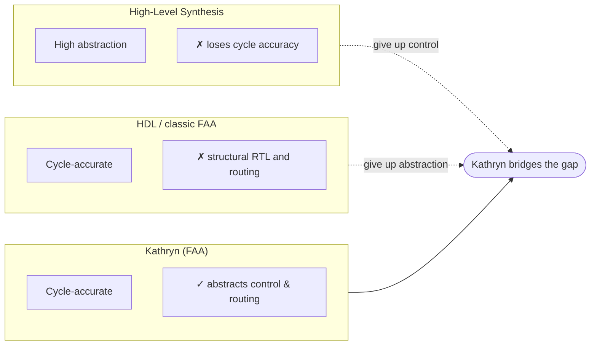

import { Card, CardGrid, LinkCard } from '@astrojs/starlight/components';

## The trade-off Kathryn refuses

Hardware modeling tools trade off two things: how much they abstract **control
flow** and **resources**, and how much **cycle-accurate control** they leave you.
Traditional HDLs (Verilog, VHDL) and framework-assisted approaches (Chisel) give
you cycle accuracy but leave you writing **structural RTL** — every state
machine and wire by hand.
High-level synthesis abstracts the control away — and takes cycle accuracy with
it.

**Kathryn is a Framework-Assisted Approach (FAA) that refuses that trade-off.**
You construct the register-transfer-level model directly in Python — every
register, wire, and control step is something you wrote — while three
abstractions (below) remove the manual control-flow and routing burden. The
Rust-powered compiler emits exactly that model as synthesizable Verilog. It is
**not** high-level synthesis: it never guesses micro-architecture from
algorithmic code.



## Three abstractions

All three abstractions exist in **both implementations** — the current Python
DSL and the legacy C++ core; only the surface syntax differs.

<CardGrid>
  <Card title="Hybrid Design Flow (HDF)" icon="list-format">
    An abstract model for hardware control flow. Sequential, parallel, and
    conditional blocks — `seq`, `par`, `cif`, `sif`, `zif` — and pipeline halves
    `pip` / `zync` are plain Python context managers that compile to explicit,
    cycle-accurate state machines. Comparable control to HDL, without the manual
    FSM bookkeeping. The legacy C++ core provides the same blocks as C++ macros.
  </Card>
  <Card title="Decentralized Update" icon="approve-check">
    Relax centralized control logic. Any block may update a hardware resource's
    value; multiple writers to one register are legal and deterministic, because
    every assignment carries a priority and conflicts resolve exactly as
    declared — no hand-routed valid/select trees.
  </Card>
  <Card title="Hardware Aggregator" icon="setting">
    The Table &amp; Slot abstraction bundles many hardware components into one
    entity: multi-dimensional arrays with named fields, static and dynamic
    indexing (binary or one-hot), spread writes, and hardware reduce trees —
    the machinery behind structures like a reservation station. Exposed as
    `karray` in Python, and as **Table &amp; Slot** in the legacy C++ core.
  </Card>
</CardGrid>

## Hardware as code — not high-level synthesis

<div class="kat-code-pair">
<div>

**You write Python**

```python
from kathryn import *

class counter_demo(Module):
    @init
    def declare(self):
        self.x          = reg(8, "x")
        self.y          = reg(8, "y")
        self.simple_val = val(8, 48, "simple_val")
        self.x.mark_output("my_x")
        self.y.mark_output("my_y")

    @flow
    def my_flow(self):
        with seq():          # one step per cycle
            self.x |= self.simple_val
            self.y |= self.x

reset()
build_model(counter_demo())
emit_verilog("out/")
```

</div>
<div>

**Kathryn emits Verilog** *(excerpt)*

```verilog
module MODULE_counter_demo0_0(
    output reg  [7:0] my_x,
    output reg  [7:0] my_y,
    input wire [0:0] clk,
    input wire [0:0] mrst
);

always @(posedge WIRE_clk_12) begin
    if (SR_ST_seq_state_4_0_ST_36) begin
        REG_x_1[7:0] <= VAL_simple_val_3[7:0];
    end
end

always @(posedge WIRE_clk_12) begin
    if (SR_ST_seq_state_4_1_ST_40) begin
        REG_y_2[7:0] <= REG_x_1[7:0];
    end
end
```

</div>
</div>

The same model is written the same way in the **legacy C++ implementation**,
where Kathryn began as a C++-embedded HDL — the
[Kathryn C++ book](/cppbook/getting-started/introduction/) documents it in
full:

```cpp
class ExampleModule: public Module{
public:
    mWire(i, 32);
    mReg(a, 32);mReg(b, 32);
    mReg(c, 32);mReg(d, 32);

    ExampleModule(int x): Module(){ i.asInputGlob(); d.asOutputGlob();}

    void flow() override{
        seq{ /// all sub element run [seq]uentialy
            a <<= i;
            par{ /// all sub element run parallelly
                cdowhile(a < 8){ /// do loop
                    a <<= a + 1;
                    c <<= c + 1;
                }
                cdowhile(b < 8){ /// do loop
                    b <<= b + 1;
                    d <<= d + 1;
                }
            }
            d <<= c + d;
        }
    }
};
```

## The rest of the toolbox

<CardGrid>
  <Card title="Structured pipelines" icon="rocket">
    Build pipelines from `pip` and `zync` halves with stall, bubble, and flush
    behavior driven by a shared arbiter — no hand-rolled valid/ready wiring.
  </Card>
  <Card title="Plain-Python modules" icon="seti:python">
    Hierarchy is ordinary Python classes with `@init` and `@flow` methods —
    nest, inherit, and parameterize with the full language.
  </Card>
  <Card title="Rust core" icon="seti:rust">
    A generational-arena model store in Rust: memory-safe, fast, and reachable
    from Python through lightweight copy-by-value handles.
  </Card>
  <Card title="Clean Verilog out" icon="document">
    Deterministic elaboration, cross-module IO routing, and a backend that only
    reads the model — never redesigns it — so the emitted Verilog mirrors what
    you wrote.
  </Card>
  <Card title="Legacy C++ core" icon="seti:cpp">
    The original C++-embedded implementation ships its own toolbox: a
    cycle-accurate Hybrid Simulator with VCD waveforms and the ZEP cycle
    profiler, plus a synthesizable-Verilog generator — all documented in the
    Kathryn C++ book.
  </Card>
  <Card title="Built on Kathryn: Carolyne (work in progress)" icon="puzzle">
    Direction: a universal microarchitecture generator with a user-defined
    ISA. Today it's one engine — an out-of-order core written against a µop
    contract, adapting itself at elaboration time to whatever ISA description
    it's handed. Unpublished and actively changing — see
    [the Carolyne page](/carolyne/).
  </Card>
</CardGrid>

## Three books

:::note[Implementation status]
The **C++ core is the legacy version** of Kathryn — the implementation
evaluated in the Kathryn paper, verified cycle-accurate against RIDECORE and
synthesized on a Kria KV260; it is documented in the **Kathryn C++ book**. The
**Userbook** and **Devbook** cover the current Rust + Python rewrite, which is
under active development: not yet feature-complete, and not yet verified to
the same standard.
:::

<CardGrid>
  <LinkCard
    title="Userbook"
    description="Learn to build hardware with Kathryn: installation, signals, flow control, pipelines, Karray and its element records, the combinational helpers, and a gallery of 39 worked examples."
    href="/userbook/getting-started/introduction/"
  />
  <LinkCard
    title="Devbook"
    description="How the compiler works inside: the model arena, ident handles, flow-block build pipeline, update events, the complex-hardware layer, and the Verilog backend."
    href="/devbook/architecture/overview/"
  />
  <LinkCard
    title="Kathryn C++ (Legacy)"
    description="The legacy C++ implementation — the version evaluated in the Kathryn paper. A User Guide (Hybrid Design Blocks, decentralized update, hardware aggregators, the backends, and the Kride out-of-order CPU case study) plus a Developer Guide on the compiler internals."
    href="/cppbook/getting-started/introduction/"
  />
</CardGrid>

## Publication

The Kathryn paper describes the framework and its evaluation:

> **KATHRYN: A Cycle-Accurate Control Flow and Resource Abstraction HDL
> Framework: A Case Study of a RISC-V Out-of-Order Superscalar CPU**
>
> Under review at *IEEE Transactions on Computer-Aided Design of Integrated
> Circuits and Systems* (TCAD) — submitted 6 March 2026; the revised
> manuscript is currently under review.

<LinkCard
  title="Read the paper (PDF)"
  description="Preprint of the manuscript under review — not the final published version."
  href="/papers/Kathryn.pdf"
/>

## Community &amp; contact

Kathryn is an academic research project on cycle-accurate, control-flow and
resource-abstraction hardware design. Come build with us, or explore the
original C++ edition.

<CardGrid>
  <LinkCard
    title="GitHub"
    description="Source, issues, and contributions."
    href="https://github.com/Tanawin1701d/Kathryn"
  />
  <LinkCard
    title="Kathryn C++ book (Legacy)"
    description="The legacy C++ implementation — the version evaluated in the Kathryn paper."
    href="/cppbook/getting-started/introduction/"
  />
  <LinkCard
    title="Carolyne (work in progress)"
    description="A universal microarchitecture generator with a user-defined ISA, built on Kathryn — the idea, the ISA/microarchitecture contract, and where the project stands."
    href="/carolyne/"
  />
</CardGrid>

## AI usage

AI tools assisted in drafting this documentation site. The maintainers have
reviewed all of it and verified the content against the Kathryn source code.
