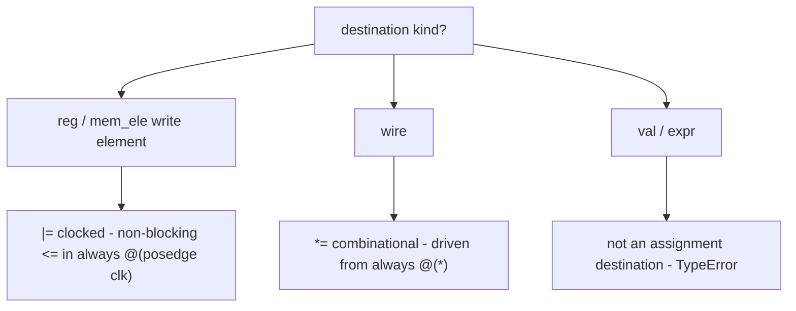

Kathryn has two assignment operators, and the choice between them is the
choice between a flip-flop update and same-cycle logic:

- **`dest |= src`** — **clocked** assignment. On the clock edge (when the
  enclosing flow step is active), `dest` latches `src`. This is Verilog's
  non-blocking `<=` inside an `always @(posedge clk)` block.
- **`dest *= src`** — **combinational** assignment. `dest` follows `src`
  within the same cycle. This is driven from an `always @(*)` block.

```python
class example(Module):
    @flow
    def f(self):
        a, b, c = reg(8), wire(8), reg(8)
        with seq():
            c |= a + b        # reg  <- expr   (clocked:      c latches on the edge)
            b *= a            # wire <- reg    (combinational: b follows a)
```

Assignments are made inside flow blocks (here `with seq():`) in `@flow`
methods; each one becomes a node of the enclosing block, which supplies the
enable condition — in a `seq`, "this step is active". See
[Seq & Par](/userbook/flow/seq-and-par/).

:::note
`|=` and `*=` are Python's augmented-assignment operators, overloaded to
build assignment hardware. Executing one records an assignment in the model;
it does not move any data at Python run time.
:::

## Which operator for which signal

The operator encodes intent, and Kathryn checks it against the destination's
kind:

| Destination | `\|=` (clocked) | `*=` (combinational) |
| --- | --- | --- |
| `reg` | yes | **TypeError** |
| `mem_ele` (write element) | yes | **TypeError** |
| `wire` | **TypeError** | yes |
| `val` | **TypeError** | **TypeError** |
| `expr` (operator result) | **TypeError** | **TypeError** |

How the destination's kind picks the operator and the emitted timing:



Using the wrong operator raises a `TypeError` **in Python, before anything
touches the model**:

```python
r, w = reg(8), wire(8)

w |= r      # TypeError: `|=` (clocked assign) requires a reg / mem_blk / mem_ele destination
r *= w      # TypeError: `*=` (combinational assign) requires a wire destination
```

This guard is derived from the destination component itself (registers and
memory are clocked; wires are combinational; constants and expression results
are not assignment destinations at all), so the check can never drift out of
sync with the hardware kind.

:::tip
Read `|=` as "latch into" and `*=` as "drive with". A design review can spot a
timing mistake just from the operator: a `*=` into something that should hold
state, or a `|=` where you expected same-cycle propagation.
:::

## Integer sources

The right-hand side can be a plain Python int; it is auto-wrapped into a
constant sized to the destination:

```python
r = reg(12)
with seq():
    r |= 5        # emitted constant is 12 bits wide: 12'h5
    r |= -1       # two's-complement wrap: 12'hfff
```

Details (including >64-bit literals) are in
[Expressions](/userbook/core/expressions/#integer-literals-auto-wrap).

## Sliced assignment

Both operators work on [inclusive slices](/userbook/core/expressions/#inclusive-bit-slicing)
of the destination, the source, or both:

```python
a, b = reg(16), wire(16)
with seq():
    a[7, 0]  |= b[7, 0]      # clocked write to the low byte of a
    b[15, 8] *= a[15, 8]     # combinational drive of the high byte of b
```

A slice inherits the clocked/combinational nature of the signal it comes
from, so the same operator rules apply: slices of a `reg` take `|=`, slices
of a `wire` take `*=`.

An explicit `=` on a **sliced** destination is also an assignment (the
direction is resolved from the destination's kind):

```python
a[3, 0] = b[3, 0]     # sliced write; clocked because a is a reg
```

## What `=` on a whole signal means (caution)

```python
a = reg(8)
a = b        # NOT a hardware assignment!
```

Plain `=` on a *whole* signal is ordinary Python name binding: it makes the
name `a` refer to the object `b`, and builds no hardware. Only `|=`, `*=`,
and the sliced `dest[hi, lo] = src` form create assignments. This is the one
place Python syntax cannot be overloaded, so keep an eye on it.

## Width mismatches

If the source region is narrower than the destination region, it is
zero-extended (unsigned) to fit; if it is wider, the high bits are dropped
and the low bits are kept. To be explicit, slice the source or use
`.extend(width)` yourself.

## Multiple writes to one destination

Several assignments may target the same register — from different steps,
branches, or parallel blocks. When more than one can fire in the same cycle,
their ordering is governed by the write-priority system: higher-priority
writes are emitted later in the register's always block and therefore win.
See [Write Priority](/userbook/priority/write-priority/).

Two built-in fallbacks ride on this same mechanism: register **reset values**
(maximum priority) and wire **defaults** (minimum priority) — covered next in
[Reset & Defaults](/userbook/core/reset-and-defaults/).

## The emitted Verilog

From the [Quickstart](/userbook/getting-started/quickstart/) example, one
clocked assignment `self.x |= self.simple_val` inside a `seq` becomes:

```verilog
always @(posedge WIRE_clk_12) begin
    if (SR_ST_seq_state_4_0_ST_36) begin
        REG_x_1[7:0] <= VAL_simple_val_3[7:0];
    end
end
```

— a non-blocking write, guarded by the enable of the flow step that contains
it. A combinational `*=` emits the same shape under `always @(*)` with no
clock or guard state.
