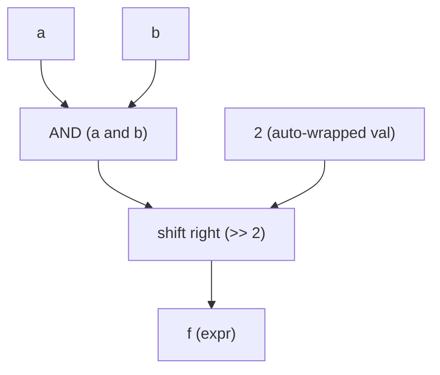

Combinational logic in Kathryn is built with ordinary Python operators.
Applying an operator to signals does not compute a value — it constructs an
**expression component** in the hardware model and returns a handle to it:

```python
class alu(Module):
    @init
    def declare(self):
        a, b = reg(8, "a"), wire(8, "b")

        e = a + b               # builds an adder; e is an `expr`
        f = (a & b) >> 2        # chaining builds a tree: AND feeding a shifter
        g = a == b              # builds a comparator (NOT a Python bool!)

        e.hw_type               # -> "EXPR"
```

Every intermediate result is an `expr` — a read-only signal handle. You can
slice it, feed it into further operators, or use it as an assignment source;
you cannot assign *to* it. In the emitted Verilog each expression becomes a
wire with a continuous assignment:

```verilog
wire  EXPR_startExpr_18;
assign EXPR_startExpr_18 = SR_ST_start_ST_16 == VAL_upState_17;
```

Internally each operator maps to a `LogicOp` variant in the Rust core; the
Python operator table below is the full user-facing surface.

Chaining operators builds a tree of `expr` components — for example
`f = (a & b) >> 2`:



## Operator reference

### Arithmetic

| Python | Hardware operation |
| --- | --- |
| `a + b` | addition |
| `a - b` | subtraction |
| `a * b` | multiplication |
| `a / b` | **integer** division |
| `a % b` | remainder |

Note that `/` on signals is integer division — there is no fractional
hardware type. Results wrap at the hardware width, exactly as the emitted
Verilog does.

### Bitwise

| Python | Hardware operation |
| --- | --- |
| `a & b` | bitwise AND |
| `a \| b` | bitwise OR |
| `a ^ b` | bitwise XOR |
| `a << b` | shift left |
| `a >> b` | shift right |
| `~a` | bitwise invert (unary) |

### Relational

| Python | Hardware operation |
| --- | --- |
| `a == b` | equal |
| `a != b` | not equal |
| `a < b`, `a <= b` | unsigned less / less-or-equal |
| `a > b`, `a >= b` | unsigned greater / greater-or-equal |

Relational operators produce a 1-bit true/false result, and the plain
operators compare **unsigned**. For signed comparison use the named methods
below.

### Named methods

Some operations have no Python operator to overload:

```python
a.land(b)        # logical AND  (&&)
a.lor(b)         # logical OR   (||)
a.lnot()         # logical NOT  (!)
a.slt(b)         # signed less-than     ($signed(a) <  $signed(b))
a.sgt(b)         # signed greater-than  ($signed(a) >  $signed(b))
a.extend(16)     # widen a to 16 bits (zero-filled by default)
```

`extend(width)` pads the signal up to `width` bits; in Verilog it emits a
concatenation with a fill bit that defaults to `1'b0` (zero extension).

## `==` builds hardware — two consequences

Because `a == b` returns an `expr` (a comparator) instead of a Python bool:

1. **Don't use signal equality in Python control flow.** `if a == b:` would
   test the truthiness of an expression handle, not compare values. Use
   Kathryn's [conditional flow blocks](/userbook/flow/conditionals/) — e.g.
   `with sif(a == b):` — where the comparator expression is exactly what you
   want.
2. **Signals are unhashable.** Since `==` no longer means Python equality,
   `SignalRef` disables hashing; you cannot use signals as `dict` keys or in
   `set`s. Compare handles with `is` or via `global_id`.

## Inclusive bit-slicing

Kathryn uses an **inclusive, comma-separated** slice syntax modeled on
Verilog's `[hi:lo]`, not Python's half-open `[start:stop]`:

```python
a = reg(16, "a")

a[7, 0]      # bits 7..0 inclusive  (8 bits — like Verilog a[7:0])
a[15, 8]     # the high byte
a[3]         # single bit 3 (1 bit wide)

a[7:0]       # TypeError! Python colon slices are rejected
```

Both endpoints are included: `a[8, 0]` is nine bits, covering bit 8 down to
bit 0. Single-integer indexing selects one bit. The Python colon form
`a[hi:lo]` is rejected with a `TypeError` telling you to use the comma form —
this avoids any ambiguity between Verilog's inclusive convention and Python's
exclusive one.

A slice is itself a signal handle sharing the parent's storage, so it can be
used anywhere a signal can:

```python
nibble_sum = a[7, 4] + a[3, 0]      # slices as operands
b[7, 0] *= a[15, 8]                 # slices as assignment source/destination
```

(Slice *assignment* rules are covered in
[Assignment](/userbook/core/assignment/).)

## Integer literals (auto-wrap)

Plain Python ints can be used directly as operands and assignment sources. The
int is automatically wrapped into a constant (`val`) **sized to the signal
operand's width** — no manual `val(...)` needed:

```python
a = reg(8, "a")

a + 5            # int on the right
5 + a            # int on the left (reflected)
100 - a          # order is preserved: this is 100 - a, NOT a - 100
a & 0x0C         # bitwise with a literal mask
a << 2           # shift by a constant
a == 10          # compare against a constant
20 > a           # auto-reflected: built as a < 20
```

Reflected operators keep the written operand order, which matters for the
non-commutative ones: `100 - a` builds a subtractor with 100 on the left, and
`240 >> b` shifts the constant 240 right by `b`.

The same auto-wrap applies to assignment sources; the constant is sized to
the **destination**:

```python
r = reg(12, "r")
with seq():
    r |= 5           # emits a 12-bit constant: 12'h5
```

### Negative literals — two's-complement wrap

A negative int wraps two's-complement at the target width:

```python
r = reg(8, "r")
with seq():
    r |= -1          # -> 8'hff
```

### Wide literals — beyond 64 bits

Integer operands cross into the Rust core as arbitrary-precision values, so
literals of any width work without ceremony:

```python
r = reg(256, "r")
with seq():
    r |= (1 << 200) | 0xABCDEF     # emitted as a sized 256'h... literal
```

The full bit pattern survives intact into the emitted Verilog as a sized hex
constant (e.g. `256'h100...0abcdef`).

### At least one signal required

An expression must involve at least one signal — `2 + 3` is just Python
integer arithmetic (it folds before Kathryn ever sees it), and the model
rejects an expression whose operands are both constants with no signal.

## Width adaptation

When an expression or signal is assigned somewhere narrower or wider than
itself, Kathryn adapts the source to the destination automatically:

- a **narrower** source is zero-extended (unsigned) up to the destination
  width;
- a **wider** source has its high bits dropped, keeping the low bits.

If you want explicit control, slice the source yourself or use
`.extend(width)`.

## Where next

- [Assignment](/userbook/core/assignment/) — moving expression results into
  registers and wires.
- [Conditionals](/userbook/flow/conditionals/) — using relational expressions
  to steer flow blocks.
- [Signals](/userbook/core/signals/) — the components expressions are built
  from.
