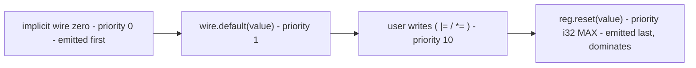

Two fallback mechanisms give signals a well-defined value when nothing else
is writing them:

- **`reg.reset(value)`** — a *clocked* reset value for a register, bound at
  the **maximum** write priority so it dominates every other write.
- **`wire.default(value)`** — a *combinational* fallback for a wire, bound at
  `DEFAULT_UE_PRI_FALLBACK` (1) — above the implicit zero every wire already
  carries, below every real assignment.

Both accept either a signal or a plain Python int (of any width — the int is
wrapped into a constant sized to the destination), and both return the signal
so they chain with declaration.

## Register reset: `reg.reset(value)`

```python
self.x = reg(8, "x")
self.x.reset(7)          # x resets to 7
```

`reset` records a reset value for the register; the actual reset hardware is
built during the model build. In the emitted Verilog, the reset appears as a
write inside the register's clocked always block, **guarded by the module's
master reset input `mrst`** and placed *last* in the block:

```verilog
always @(posedge WIRE_clk_1890) begin
    if (WIRE_mrst_1891) begin
        REG_x_1883[7:0] <= VAL_val0_1884[7:0];    // VAL_val0 = 8'h7
    end
end
```

While `mrst` is asserted the register loads its reset value; registers with
no `reset(...)` simply start uninitialized (`X` in simulation) until their
first real write.

`reset(...)` is only valid on a `reg` — calling it on anything else raises a
`TypeError`.

### Reset dominates user writes

The reset write is bound at the maximum priority (`DEFAULT_UE_PRI_RST`), so
when a user assignment and the reset both apply in the same cycle, the reset
wins. Concretely, in Verilog terms: within one always block, the last
non-blocking write to a register wins, and the reset write is always emitted
last.

```python
class worker(Module):
    @flow
    def f(self):
        r = reg(8)
        d = wire(8)
        r.reset(0)
        with seq():
            r |= d          # ordinary user write
```

emits (schematically):

```verilog
always @(posedge clk) begin
    if (<step enable>) begin
        REG_r <= WIRE_d;       // user write — emitted first (lower priority)
    end
    if (mrst) begin
        REG_r <= VAL_0;        // reset — emitted last (max priority, dominates)
    end
end
```

The priority spectrum the fallbacks sit at, relative to user writes:



This ordering is one instance of the general
[write-priority system](/userbook/priority/write-priority/).

### Wide reset values

Reset values are ordinary Python ints of any magnitude — they cross into the
Rust core as arbitrary-precision values, so no manual wrapping is needed
beyond 64 bits:

```python
self.big = reg(128, "big")
self.big.reset((1 << 100) | 0xABCDEF)    # emitted as 128'h10000000000abcdef
```

Negative values wrap two's-complement at the register width, exactly like
[integer literals in expressions](/userbook/core/expressions/#integer-literals-auto-wrap).

## Wire defaults: `wire.default(value)`

Every wire starts with an **implicit zero fallback**. `Wire::try_build_default`
binds a zero constant at `DEFAULT_UE_PRI_MIN` (0) — the absolute floor — so a
wire that nothing drives on a given cycle reads 0 instead of `X`. You will see
it in the emitted Verilog as the first line of the wire's `always @(*)` block:

```verilog
always @(*) begin
    WIRE_wen_6115 <= VAL_WIRE_wen_6115_DEFAULT_ZERO_6163;   // implicit zero
    WIRE_wen_6115 <= wen_in;                                 // real driver wins
end
```

`default(value)` replaces that implicit zero with a fallback of your own:

```python
self.w = wire(8, "w")
self.w.default(self.src)     # w falls back to src when nothing drives it
```

`default` gives a wire a combinational fallback: the wire takes this value
whenever no real assignment drives it. It is bound at
`DEFAULT_UE_PRI_FALLBACK` (1) — above the implicit zero, below the user
priority (10) — so **any** actual `*=` assignment overrides it. The
source can be a signal or a raw int (`self.w.default(5)` works and emits an
8-bit `8'h5` constant for an 8-bit wire).

`default(...)` is only valid on a `wire`; anything else raises `TypeError`.

:::caution
A wire default sourced from a *constant* emits a combinational block whose
only input is that constant (`always @(*) w <= CONST;`). The Verilog is
correct, but event-driven simulators such as Icarus never trigger a block
with an empty effective sensitivity list, so the wire reads `X` in
simulation. If you need to *observe* a defaulted wire in simulation, source
the default from a register (as the worked example below does).
:::

## Worked example: tc15

The repository test case `tc17_reset_default` exercises all of the above in
one module — an 8-bit reset, a 72-bit reset (crossing the 64-bit boundary),
and a wire default sourced from a reset register:

```python
from kathryn import *

WIDE_VAL = (1 << 71) | (1 << 64) | 0xABCDEF

class tc17_reset_default(Module):
    @init
    def com_declare(self):
        # 8-bit reg whose reset value is the literal 7.
        self.x = reg(8, "x")
        self.x.reset(7)
        self.x.mark_output("my_x")

        # 72-bit reg reset from a >64-bit literal.
        self.big = reg(72, "big")
        self.big.reset(WIDE_VAL)
        self.big.mark_output("my_big")

        # A clocked source (reset to 9), and a wire defaulting to it.
        self.src = reg(8, "src")
        self.src.reset(9)

        self.w = wire(8, "w")
        self.w.default(self.src)
        self.w.mark_output("my_w")


def build(output_folder: str) -> None:
    reset()
    module = tc17_reset_default()
    build_model(module)
    emit_verilog(output_folder)
```

Note there is no `@flow` method at all — resets and defaults alone are enough
to give this module behavior. The emitted `top.v` (abbreviated):

```verilog
    // ---- REG declarations ----
reg  [7:0]  REG_x_1883;
reg  [71:0]  REG_big_1885;
reg  [7:0]  REG_src_1887;
    // ---- WIRE declarations ----
reg  [7:0]  WIRE_w_1889;
    // ---- VAL declarations ----
wire [7:0]  VAL_val0_1884 = 8'h7;
wire [71:0]  VAL_val1_1886 = 72'h810000000000abcdef;
wire [7:0]  VAL_val2_1888 = 8'h9;

always @(posedge WIRE_clk_1890) begin
    if (WIRE_mrst_1891) begin
        REG_x_1883[7:0] <= VAL_val0_1884[7:0];        // x <= 7 under reset
    end
end

always @(posedge WIRE_clk_1890) begin
    if (WIRE_mrst_1891) begin
        REG_big_1885[71:0] <= VAL_val1_1886[71:0];    // big <= wide literal
    end
end

always @(*) begin
    WIRE_w_1889[7:0] <= REG_src_1887[7:0];            // wire default: w follows src
end
```

What to notice:

- Each `reset(int)` produced a **width-sized constant**: `8'h7` for the 8-bit
  register, and the full 72-bit pattern `72'h810000000000abcdef` — bit 71,
  bit 64, and the low `0xABCDEF` all intact across the 64-bit boundary.
- Each reset is a clocked write guarded by `mrst`, in its register's own
  always block.
- The wire default is a plain combinational block: since nothing else drives
  `w`, the default is its only driver, and `my_w` tracks `src` (which itself
  resets to 9).

In the repository, the accompanying cocotb testbench asserts `mrst`, checks
`my_x == 7` and `my_big == WIDE_VAL` after the first clock edge, then releases
`mrst` and confirms the values hold.

## Where next

- [Write Priority](/userbook/priority/write-priority/) — the general
  mechanism behind "reset last, default first".
- [Assignment](/userbook/core/assignment/) — the ordinary writes these
  fallbacks interact with.
- [Signals](/userbook/core/signals/) — declaring the registers and wires
  themselves.
