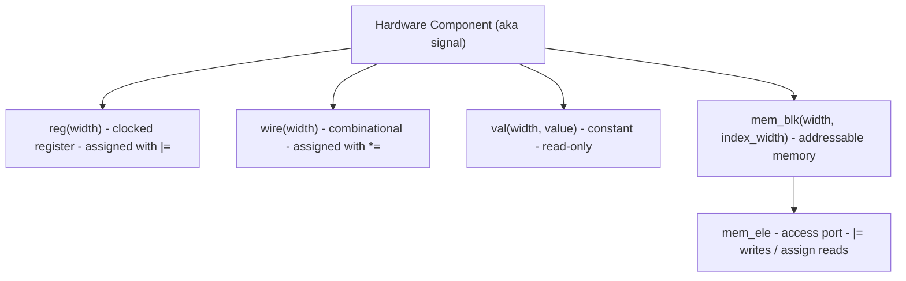

Every value you touch in Kathryn — a register, a wire, a constant, a memory
port — is a **hardware component**: a real piece of hardware registered in
Kathryn's model, not a software variable that happens to carry a bit width.
The userbook calls this user-facing surface a *signal*; internally, and in the
[Devbook](/devbook/model/hw-components/), the same object is an **HCP**
(hardware component). Every one you construct appears in the emitted Verilog.
There are five user-constructible kinds:

| Factory | Hardware | Assignment | Emitted as |
| --- | --- | --- | --- |
| `reg(width)` | clocked register | `\|=` | Verilog `reg`, written in `always @(posedge clk)` |
| `wire(width)` | combinational signal | `*=` | Verilog `reg`, driven from `always @(*)` |
| `val(width, value)` | constant | read-only | `wire ... = <sized literal>;` |
| `mem_blk(width, index_width)` | addressable memory | via `mem_ele` | `reg [W-1:0] name [0:depth];` |
| `mem_ele(blk, index, width, is_read)` | memory access port | `\|=` (writes) | `assign` (reads) / clocked write |

The five kinds and their assignment operators at a glance:



All factories share two conventions:

- **Width comes first** and is a plain bit count: `reg(8)` is an 8-bit
  register.
- **The name is optional and last.** If you omit it, Kathryn auto-generates
  one per kind (`reg0`, `reg1`, `wire0`, …), and the Rust core additionally
  appends a globally unique id to every emitted name — so name collisions are
  impossible either way. Explicit names exist purely to make the Verilog
  readable.

:::caution
Hardware must be declared **inside a module scope** — that is, inside a
`Module` subclass's `@init` (or `@flow`) method. A bare `reg(8)` at the top
level of a script has no module to attach to and is an error. See
[Modules](/userbook/modules/modules/).
:::

## `reg` — clocked registers

```python
class counter(Module):
    @init
    def declare(self):
        self.count = reg(8, "count")   # 8-bit register named "count"
        self.tmp   = reg(16)           # auto-named ("reg0")
```

A `reg` is a flip-flop-based register: it holds its value across clock cycles
and only changes on a clock edge, when a clocked assignment (`|=`) to it
fires. In the emitted Verilog it becomes a `reg` declaration updated inside
`always @(posedge clk)` blocks:

```verilog
reg  [7:0]  REG_count_1;

always @(posedge WIRE_clk_12) begin
    if (SR_ST_seq_state_4_0_ST_36) begin
        REG_count_1[7:0] <= ...;
    end
end
```

Registers can be given a reset value with `.reset(value)` — see
[Reset & Defaults](/userbook/core/reset-and-defaults/).

## `wire` — combinational signals

```python
self.sum = wire(9, "sum")
```

A `wire` carries a value combinationally within a cycle: it has no storage,
and is assigned with the combinational operator `*=`. In the emitted Verilog,
a Kathryn wire is declared as a Verilog `reg` and driven from an
`always @(*)` block (a standard idiom for procedural combinational logic):

```verilog
reg  [7:0]  WIRE_w_1546;

always @(*) begin
    WIRE_w_1546[7:0] <= REG_src_1544[7:0];
end
```

Every wire also gets an **implicit zero fallback**, bound at the lowest
possible priority: a wire that nothing drives in a given cycle reads 0 rather
than `X`. `.default(value)` replaces that zero with a fallback of your own,
still below every real assignment — see
[Reset & Defaults](/userbook/core/reset-and-defaults/).

## `val` — constants

```python
self.limit = val(8, 48, "limit")    # 8-bit constant, value 48
self.big   = val(128, 1 << 100)     # arbitrary-precision values work
```

A `val` is an immutable constant of a given width. It can be read anywhere a
signal can, but it is **not an assignment destination** — neither `|=` nor
`*=` accepts it. The initial value is an ordinary Python integer of any
magnitude; it is wrapped two's-complement style into the declared width, so
`val(8, -1)` is `0xFF` and values wider than 64 bits are handled exactly.

In Verilog a `val` becomes a continuously driven wire with a sized literal:

```verilog
wire [7:0]  VAL_limit_3 = 8'h30;
```

:::tip
You rarely need to construct `val` by hand in expressions or assignments —
plain Python ints are auto-wrapped into a width-matched `val` for you. See
[integer literals](/userbook/core/expressions/#integer-literals-auto-wrap).
:::

## `mem_blk` and `mem_ele` — memory

A `mem_blk` declares a block of addressable storage:

```python
self.buf = mem_blk(8, 4, "buf")     # 2**4 = 16 entries, 8 bits each
```

The first argument is the data width per entry, the second the **index
width** — the block holds `2**index_width` entries. In Verilog it becomes a
two-dimensional register array:

```verilog
reg [7:0] buf [0:15];
```

A `mem_blk` is not read or written directly; it has no assignment operator of
its own. Instead you create `mem_ele` access ports bound to an index signal:

```python
self.addr  = reg(4, "addr")
self.rdata = mem_ele(self.buf, self.addr, 8, True,  "rd")   # read port
self.wdata = mem_ele(self.buf, self.addr, 8, False, "wr")   # write port
```

The arguments are: the master `mem_blk`, the index signal, the element bit
width, and `is_read` (`True` for a read element, `False` for a write
element), plus the usual optional name.

- A **read element** behaves as a combinational view of `blk[index]` — it
  gets its own `MEM_BLOCK_INDEXER` wire, driven by a continuous assign:

  ```verilog
  wire [7:0]  MEM_BLOCK_INDEXER_rd_6119;
  assign MEM_BLOCK_INDEXER_rd_6119 = MEM_BLOCK_buf_6112[WIRE_addr_6116];
  ```

- A **write element** is a clocked destination: assign to it with `|=`, and
  the write is emitted inside a clocked always block, guarded by whatever
  gates the enclosing flow step:

  ```verilog
  always @(posedge WIRE_clk_6129) begin
      if (EXPR_expr0_6121) begin
          MEM_BLOCK_buf_6112[WIRE_addr_6113][7:0] <= WIRE_wdata_6114[7:0];
      end
  end
  ```

The worked example is `tc28_mem_blk`, which drives a gated write port and a
same-cycle combinational read port, and preloads the memory array directly
from its testbench — the program-loading pattern.

## Inspecting a signal

Every signal handle exposes its kind and identity:

```python
r = reg(8)
r.hw_type      # "REG"  (also "WIRE", "VAL", "MEM_BLOCK", ...)
r.global_id    # unique integer id in the model
```

:::note
`==` on signals builds a hardware *equality expression* rather than comparing
Python objects (see [Expressions](/userbook/core/expressions/)). To test
whether two Python handles refer to the same component, compare identity
(`a is b`) or compare `global_id`.
:::

## Marking I/O ports

Any signal can be promoted to a port of its module:

```python
self.din  = wire(8, "din")
self.din.mark_input("data_in")      # input port named data_in

self.dout = reg(8, "dout")
self.dout.mark_output("data_out")   # output port named data_out

self.dout.is_io                     # -> True
```

`mark_input(name)` / `mark_output(name)` stamp the component as an I/O port
with the given direction and external name; both return the signal, so they
chain. Marked signals appear in the module header of the emitted Verilog:

```verilog
module MODULE_top0_0(
    output reg  [7:0] data_out,
    input wire [7:0] data_in,
    input wire clk,
    input wire mrst
);
```

The `clk` and `mrst` (master reset) ports are added automatically to every
module — you never declare them.

## Where next

- [Expressions](/userbook/core/expressions/) — combining signals with
  operators and slices.
- [Assignment](/userbook/core/assignment/) — which operator goes with which
  signal kind.
- [Karray](/userbook/karray/basics/) — when a handful of signals grows into
  register files and structured arrays.
