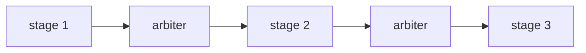
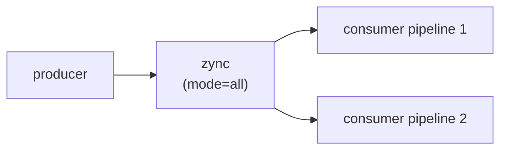
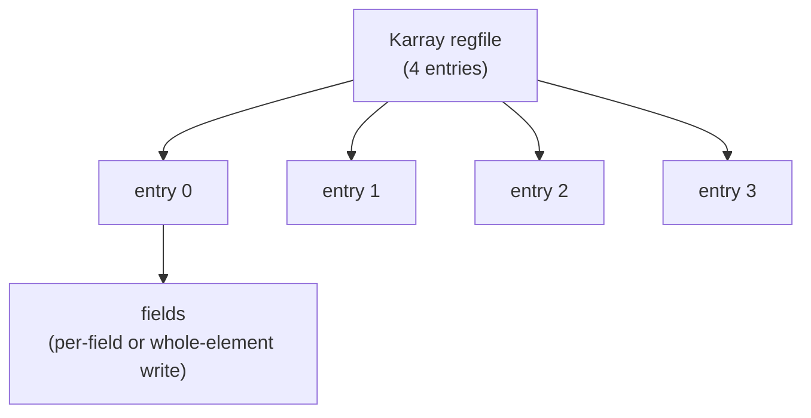

Kathryn ships 39 worked examples under `test/model/`, numbered `tc1` … `tc39`
with no gaps. Every file is **self-contained**: it describes the model, provides
a `build()` function that emits Verilog, and carries its own
**cocotb simulation** that asserts the intended behaviour end-to-end through a
real simulator. They are the ground truth for how each feature behaves — when a
tutorial page and your intuition disagree, run the example.

Each entry links to the tutorial page that covers its feature.

## Basics & core concepts

| # | Example | What it shows | Tutorial |
| --- | --- | --- | --- |
| 1 | `tc1_seq_simple` | A single sequential block: `x <= simple_val`, then `y <= x`. | [Seq & Par](/userbook/flow/seq-and-par/) |
| 2 | `tc2_par` | Parallel auto-sync: x and y assigned in two branches, both settle the same cycle. | [Seq & Par](/userbook/flow/seq-and-par/) |
| 17 | `tc17_reset_default` | Reg reset values and wire defaults, fed as direct int literals (one wider than 64 bits). | [Reset & Defaults](/userbook/core/reset-and-defaults/) |
| 18 | `tc18_int_operand_autowrap` | Int literals as operands/sources auto-wrap into width-matched vals; every overloaded operator exercised. | [Expressions](/userbook/core/expressions/) |
| 19 | `tc19_asm_resize` | Assignment-source auto-resize: narrower sources zero-extend, wider sources drop MSBs (with warnings). | [Conversion & Resize](/userbook/karray/conversion-and-resize/) |
| 28 | `tc28_mem_blk` | `mem_blk` + `mem_ele`: gated clocked write port, same-cycle combinational read, and hierarchical preload of the memory array from the testbench. | [Signals](/userbook/core/signals/) |

## Flow control

| # | Example | What it shows | Tutorial |
| --- | --- | --- | --- |
| 3 | `tc3_sif` | Sequential if: `x <= 42` only when `cond_in` is high (condition sampled sequentially). | [Conditionals](/userbook/flow/conditionals/) |
| 4 | `tc4_cif` | Combinational if: same as tc3 but the condition costs zero extra cycles, so x latches earlier. | [Conditionals](/userbook/flow/conditionals/) |
| 5 | `tc5_zif` | Zero-cycle if: wires driven combinationally; outputs reflect sources the very cycle conditions go high. | [Conditionals](/userbook/flow/conditionals/) |
| 6 | `tc6_cloop` | Counter loop: two explicit resets then x incremented 4 times via `cloop(3)`. | [Loops](/userbook/flow/loops/) |
| 7 | `tc7_cwhile` | Combinational while: x incremented each iteration while `x < 3`, zero-cycle condition checks. | [Loops](/userbook/flow/loops/) |
| 8 | `tc8_swhile` | Sequential while: like tc7 but the condition costs one extra clock per iteration. | [Loops](/userbook/flow/loops/) |
| 9 | `tc9_cdowhile` | Do-while: the body runs at least once, then repeats while `x < 3`. | [Loops](/userbook/flow/loops/) |
| 10 | `tc10_zswitch` | Zero-cycle switch: an out wire driven combinationally from `sel` across three cases. | [State Machines](/userbook/flow/state-machines/) |
| 11 | `tc11_wait` | Wait blocks: `sywait` (fixed cycles) and `scwait` (condition) delaying the next assignment. | [Waits](/userbook/flow/waits/) |
| 12 | `tc12_pick` | Pick block: a multi-way select that is NOT mutex-chained — every matching `pif` fires; `pidef` is the default. | [Pick](/userbook/flow/pick/) |
| 13 | `tc13_forever_scwait` | The "processor loop" pattern: an endless `cwhile` handshaking with the outside world through `scwait`, plus always-on bare comb logic beside the loop. | [Waits](/userbook/flow/waits/) |
| 16 | `tc16_zif_chain_same_reg` | zif/zelif/zelse chain writing one reg three values — lowers to a single clocked priority mux. | [Conditionals](/userbook/flow/conditionals/) |

## Write priority

| # | Example | What it shows | Tutorial |
| --- | --- | --- | --- |
| 14 | `tc14_par_same_priority` | Three parallel writes to the same reg at the SAME priority: stable sort keeps program order, the last wins. | [Write Priority](/userbook/priority/write-priority/) |
| 15 | `tc15_par_diff_priority` | Same three writes at three DIFFERENT priorities: the highest-priority write wins even when declared first. | [Write Priority](/userbook/priority/write-priority/) |

## Pipelines

| # | Example | What it shows | Tutorial |
| --- | --- | --- | --- |
| 20 | `tc20_pip_zync_baseline` | 3-stage pip/zync pipeline chained through shared arbiters, free-running with no stall, flush, or guard. | [Pipeline Basics](/userbook/pipelines/pip-zync-basics/) |
| 21 | `tc21_pip_zync_cond_stall` | A stage-2 conditional one-shot stall: a `cif` guard fires `sywait(5)` once, stalling the pipe 5 cycles. | [Stalls & Bubbles](/userbook/pipelines/stalls-and-bubbles/) |
| 22 | `tc22_pip_zync_stall_bubble` | A one-cycle stall bubble: `arb.stall()` pulsed once punches a single bubble into the pipeline. | [Stalls & Bubbles](/userbook/pipelines/stalls-and-bubbles/) |
| 23 | `tc23_pip_zync_flush_deadlock` | A one-shot `arb.flush()` holds the arbiter's reset high, jamming the pipe permanently at (5, 4, 4). | [Flush & Hazards](/userbook/pipelines/flush-and-hazards/) |
| 24 | `tc24_pip_zync_multi_assign_order` | The same register assigned twice in one clocked block — probes which write wins (last-write override). | [Assignment Ordering](/userbook/pipelines/multi-assign-ordering/) |
| 25 | `tc25_pip_zync_multi_assign_priority` | tc24's double write wrapped in `priority(...)` — the higher-priority (first-declared) write wins instead. | [Assignment Ordering](/userbook/pipelines/multi-assign-ordering/) |
| 26 | `tc26_zync_fanout` | One producer fires TWO consumer pipelines in lockstep via a multi-arb zync with `mode="all"`. | [Fanout](/userbook/pipelines/fanout/) |
| 27 | `tc27_zync_parity_fanout` | Conditional fan-out: per-bind conditions route the producer to a different consumer by parity (`mode="any"`). | [Fanout](/userbook/pipelines/fanout/) |

The `tc20` baseline: three stages chained through shared arbiters, free-running:



And the `tc26` fanout: one producer driving two consumer pipelines in lockstep
via a multi-arb zync with `mode="all"`:



:::caution
The headers of `tc20`, `tc26`, and `tc27` flag a known limitation: a one-cycle
handshake bootstrap race can keep downstream stages from arming, so these
testbenches encode the *intended* behaviour and stay red until the fix lands.
:::

## Karray

| # | Example | What it shows | Tutorial |
| --- | --- | --- | --- |
| 29 | `tc29_karray_regfile` | A 4-entry Karray as a tiny register file: field-wise writes and whole-element `{field: source}` writes. | [Conversion & Resize](/userbook/karray/conversion-and-resize/) |
| 30 | `tc30_karray_dynamic_index` | Dynamic element reads: binary addresses at all four indices, plus a read-side custom-fn (reduce) index. | [Indexing](/userbook/karray/indexing/) |
| 31 | `tc31_karray_dynamic_assign` | Dynamic element writes: binary address, one-hot custom fn, and a whole-element map — each landing on exactly one element. | [Dynamic Writes](/userbook/karray/dynamic-writes/) |
| 32 | `tc32_karray_cus_index` | The custom-fn index in depth: per-element compare enables, element map writes, an int-literal source, and a reduce read on the same array. | [Dynamic Writes](/userbook/karray/dynamic-writes/) |
| 33 | `tc33_karray_reduce_read` | Reduce reads: a max-by-data fold, an extras fold that carries a running sum, and a 2-D pin-and-fold. | [Reduce](/userbook/karray/reduce/) |
| 34 | `tc34_karray_to_karray` | Karray-to-karray element copy: fields paired by exact name+width; non-matching fields skipped with a warning. | [Conversion & Resize](/userbook/karray/conversion-and-resize/) |
| 35 | `tc35_karray_mixed_k2k` | All three index kinds (static / dynamic / custom fn) in ONE k2k statement, on BOTH sides, on 4-D and 3-D arrays. | [Conversion & Resize](/userbook/karray/conversion-and-resize/) |
| 36 | `tc36_karray_bundle` | Nested `kaf(KBundle)` records end to end: nested-dict writes, bundle-field maps, attribute-chain leaf writes, and structural k2k pairing. | [Element Records](/userbook/karray/records/) |

The `tc29` register file: a 4-entry Karray (Hardware Aggregator, Table and
Slot) addressed by index, each entry holding named fields:



## Complex hardware

| # | Example | What it shows | Tutorial |
| --- | --- | --- | --- |
| 39 | `tc39_dyn_counter` | The DynCounter CCP: two chained conditional adds committed once per cycle, a `.now` probe read before the commit, and a second enable-less free-running counter. | [Counter](/userbook/lib/counter/) |

## Modules & hierarchy

| # | Example | What it shows | Tutorial |
| --- | --- | --- | --- |
| 37 | `tc37_hier_basic` | Top + one child: cross-module routing both ways, plus implicit `clk`/`mrst` forwarding into the child's clocked flow. | [Modules](/userbook/modules/modules/) |
| 38 | `tc38_hier_deep_sibling` | Deep hierarchy `Top { ChildA { GrandChild }, ChildB }`: 2-level input/output chains, sibling routing through the LCA, and IoWire reuse. | [Modules](/userbook/modules/modules/) |

## Running the examples

Each file registers itself into a shared cocotb pool at import time, and one
entry point discovers and runs them all — there is no per-test Makefile:

```bash
PYTHONPATH=py python test/run_cocotb.py                    # all cases, icarus
PYTHONPATH=py python test/run_cocotb.py verilator          # all cases, verilator
PYTHONPATH=py python test/run_cocotb.py icarus tc2_par     # one case
```

The simulator argument defaults to `icarus` (iverilog); `verilator` is also
supported and needs verilator ≥ 5.036. Each `build()` follows the standard
pipeline — `reset()`, construct the module, `build_model(...)`,
`emit_verilog(...)` — described in
[Building & Emitting](/userbook/modules/building-and-emitting/), and each
case's emitted Verilog plus one VCD per testbench coroutine lands in
`test/.model_output/<tcname>/`.

The Python DSL also has its own simulator-free suite,
`py/tests/test_smoke.py` (~70 tests), which pins the API surface itself:
operator guards, priority scoping, the full Karray index/record/bundle
behaviour, and end-to-end build+emit runs.
