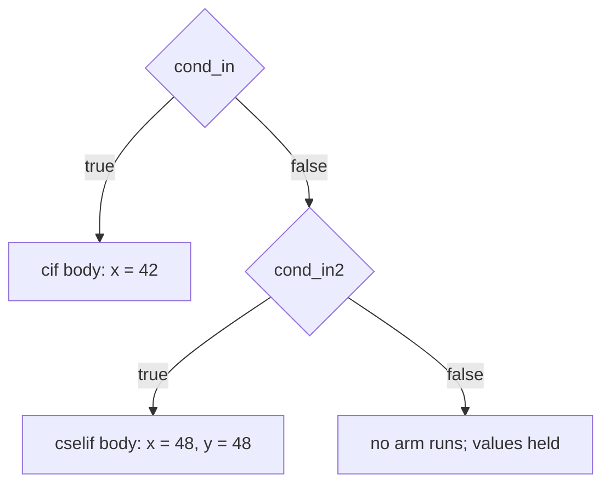
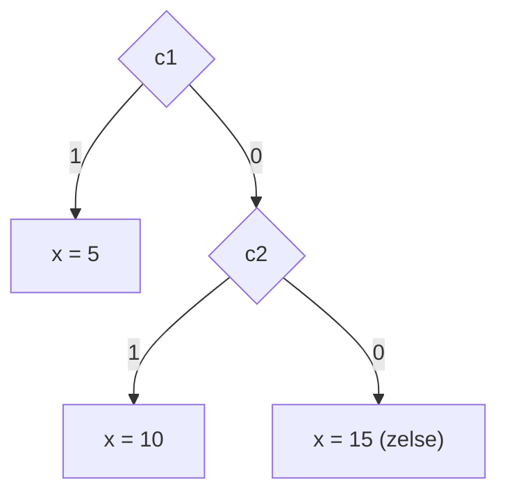

Kathryn has three families of conditional blocks, distinguished by how much
clock time the *condition check* costs:

| Family | Check | Cycle cost of the check | Typical use |
| ------ | ----- | ----------------------- | ----------- |
| `cif` / `cselif` / `cselse` | combinational | 0 cycles (body still takes its own cycles) | branch inside a sequence without paying for the test |
| `sif` (+ `cselif` / `cselse`) | sampled sequentially | 1 extra cycle to register the condition | pipeline the test off the critical path |
| `zif` / `zelif` / `zelse` | pure gating logic | 0 cycles — the whole construct is combinational gating | drive wires or gate a single register write |

The condition argument is any 1-bit `SignalRef` — an input wire, a comparison
expression such as `self.x < self.limit`, or a bit-slice like `cond[0]`.

You can write assignments directly inside any branch. For the `cif`/`sif`
family an inner skeleton block is opened for you automatically — a `seq` when
nested in a `seq` (one statement per cycle), a parallel skeleton when nested in
a `par` — and you can also open an explicit `seq()`/`par()` inside a branch,
as the examples below do. The `z-` conditionals hold their assignments
directly: they are pure gating with no inner schedule at all.

## `cif` — combinational-condition if

`cif` evaluates its condition with pure logic in the cycle the sequence reaches
it, then runs the taken branch. Adapted from `tc4_cif`:

```python
@flow
def my_flow(self):
    with seq():
        with cif(self.cond_in):
            self.x |= self.val_42          # taken when cond_in == 1
        with cselif(self.cond_in2):
            with par():
                self.x |= self.val_48      # taken when cond_in == 0
                self.y |= self.val_48      # and cond_in2 == 1
```

Cycle by cycle (after reset release, `cond_in = 1`):

1. **Edge 1** — the sequence state arms; the `cif` condition is checked
   combinationally in the same cycle, so the taken branch's body is already
   active.
2. **Edge 2** — `x <= 42` latches.

If neither condition is high, no branch body runs and `x`/`y` keep their
values.

`cselif` and `cselse` chain onto a preceding `cif` (or `sif`): a `cselif` arm
runs only when every earlier arm's condition was false and its own is true;
`cselse` runs when none matched. Write them as sibling `with` blocks
immediately after the `cif`, as above.

The priority chain of a `cif` / `cselif` / `cselse`:



## `sif` — sequential-condition if

`sif` is the same construct, but the condition is **sampled into a register
first**, costing one extra clock. Adapted from `tc3_sif`:

```python
with seq():
    with sif(self.cond_in):
        self.x |= self.val_42
    with cselif(self.cond_in2):
        with par():
            self.x |= self.val_48
            self.y |= self.val_48
```

Cycle by cycle with `cond_in = 1`:

1. **Edge 1** — sequence state arms; the condition starts being sampled.
2. **Edge 2** — the sampled condition result is captured; the branch body
   becomes active.
3. **Edge 3** — `x <= 42` latches — one cycle later than the `cif` version.

:::tip
Prefer `cif` unless the condition expression is long enough to hurt your clock
period; `sif` buys timing slack at the price of one cycle of latency.
:::

## `zif` / `zelif` / `zelse` — zero-cycle if

A `zif` chain consumes **no cycles at all**: it is compiled into gating logic
around the assignments in its arms. It holds no state — outputs respond the
very cycle the conditions change.

### Driving wires

Adapted from `tc5_zif` (note `*=`, the combinational assignment):

```python
with seq():
    with zif(self.cond_in):
        self.x *= self.src_val       # x reflects 24 while cond_in is high
    with zelif(self.cond_in2):
        self.x *= self.src_val2      # x, y reflect 48 while !cond_in & cond_in2
        self.y *= self.src_val2
```

While `cond_in` is high, `my_x` reads 24 in that same cycle; drop the
condition and the wire falls back to its default. Nothing is latched.

### Writing the same register in every arm

A `zif`/`zelif`/`zelse` chain may write the *same* register a different value
in each arm. The chain lowers to a single clocked **priority mux** on that
register. Adapted from `tc16_zif_chain_same_reg`:

```python
with seq():
    with zif(self.c1):
        self.x |= self.val_5        # x <= 5   when c1
    with zelif(self.c2):
        self.x |= self.val_10       # x <= 10  when !c1 & c2
    with zelse():
        self.x |= self.val_15       # x <= 15  otherwise
```

The emitted Verilog is exactly the `if / else if / else` you would write by
hand, guarded by the enclosing sequence state:

```verilog
always @(posedge WIRE_clk) begin
    if (SR_ST_seq_state_0_ST) begin
        if (WIRE_c1) begin
            REG_x[7:0] <= VAL_val_5[7:0];
        end else if (WIRE_c2) begin
            REG_x[7:0] <= VAL_val_10[7:0];
        end else begin
            REG_x[7:0] <= VAL_val_15[7:0];
        end
    end
end
```

Resolution rules, verified by the `tc16` testbench:

- Exactly **one arm wins per cycle** — the arms are mutually exclusive by
  construction.
- The chain is a **priority** mux: with `c1 = 1` and `c2 = 1` both high, the
  `zif` arm still wins (`x` latches 5, not 10).
- Once latched, `x` holds its value — nothing else drives it when the
  conditions change back.

The chain lowers to a single priority mux — exactly one arm wins per cycle:



## Choosing a conditional

- Need a decision *inside a timed sequence* → `cif` (or `sif` for timing
  slack), chained with `cselif`/`cselse`.
- Need pure selection logic — a mux on wires or a guarded register write, with
  no effect on the schedule → `zif`/`zelif`/`zelse`.
- Need a multi-way select on an encoded value → see
  [State Machines](/userbook/flow/state-machines/) (`zstate`/`zcase`).
- Need independent, non-chained gated branches → see
  [Pick](/userbook/flow/pick/).
