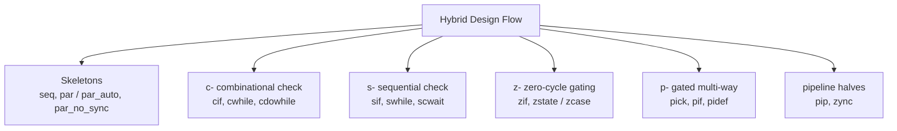

Kathryn's flow blocks are the concrete, in-Python form of the **Hybrid Design
Flow (HDF)** — one of the [three abstractions Kathryn is built
around](/userbook/getting-started/introduction/#where-kathryn-fits). HDF is
Kathryn's headline feature: it expresses cycle-accurate control through
high-level syntax — no hand-built state machines, no manual synchronization
logic — without giving cycle accuracy up. Every flow block below still
compiles to an explicit, cycle-by-cycle state machine; you simply stop writing
that state machine by hand.

## Naming convention

Every flow block follows one of a few naming prefixes that tell you how the
construct treats the clock:

| Prefix | Meaning | Examples |
| ------ | ------- | -------- |
| `c-` | condition checked **combinationally** — the check itself costs no extra cycle (the body still takes its own cycles) | `cif`, `cselif`, `cselse`, `cwhile`, `cdowhile` |
| `s-` | condition sampled **sequentially** — one extra clock is spent registering the check | `sif`, `swhile`, `scwait` |
| `z-` | **zero-cycle** — the whole construct is pure gating logic and consumes no cycles at all | `zif`, `zelif`, `zelse`, `zstate`, `zcase` |
| `p-` | **pick** family — gated multi-way selection, no chaining | `pick`, `pif`, `pidef` |

Two names sit slightly outside the pattern: `cloop` is a **counter** loop, and
`sywait` is a fixed **cycle** wait rather than a condition check. `pip` and
`zync`, the pipeline halves, follow their own convention — see
[Pipelines](/userbook/pipelines/pip-zync-basics/).

Once you know the prefix, you can usually guess a construct's cycle cost
before reading its page.

## Every flow block, at a glance

| Construct | Family | Example | Cycle cost | What it does |
| --- | --- | --- | --- | --- |
| `seq` | skeleton | `with seq(): ...` | 1 cycle per direct statement | Runs its contents in order, one step per clock edge |
| `par` / `par_auto` | skeleton | `with par(): ...` | max of its branches; exit auto-synchronized | Runs its contents concurrently, all on the same edge |
| `par_no_sync` | skeleton | `with par_no_sync(): ...` | branches independent; exit is the OR of branch exits | Concurrent, but doesn't wait for the slowest branch |
| `cif` / `cselif` / `cselse` | `c-` | `with cif(cond): ...` | 0 extra (body still takes its own cycles) | Combinational-condition if — the branch is chosen the cycle it's reached |
| `sif` (+ `cselif`/`cselse`) | `s-` | `with sif(cond): ...` | +1 cycle to sample the condition | Sequential-condition if — trades a cycle for timing slack |
| `zif` / `zelif` / `zelse` | `z-` | `with zif(cond): ...` | 0 — pure gating, no state | Zero-cycle priority mux on wires or a guarded register write |
| `pick` / `pif` / `pidef` | `p-` | `with pick(): with pif(cond): ...` | same as whichever arm fires | Independent gated branches — no chaining, no priority order |
| `zstate` / `zcase` | `z-` | `with zstate(sig): with zcase(v): ...` | 0 | Zero-cycle switch on an encoded value — compiles to a Verilog `case` |
| `cloop(n)` | counter | `with cloop(n): ...` | `n ×` body cycles | Fixed, build-time-known iteration count via a hardware counter |
| `cwhile(cond)` | `c-` | `with cwhile(cond): ...` | 1 cycle per iteration | Combinational-condition while loop |
| `swhile(cond)` | `s-` | `with swhile(cond): ...` | 2 cycles per iteration | Sequential-condition while loop |
| `cdowhile(cond)` | `c-` | `with cdowhile(cond): ...` | 1 cycle per iteration, runs at least once | Combinational do-while loop |
| `sywait(n)` | cycle wait | `sywait(n)` | `n` cycles | Leaf block: stalls a fixed number of cycles |
| `scwait(cond)` | `s-` | `scwait(cond)` | until `cond` reads high | Leaf block: stalls until a condition is met |
| `pip` | pipeline | `with pip(meta): ...` | 1 cycle per grant | Granter half of a handshaked pipeline stage; its body may hold any flow block — `seq`, `par`, `zync`, conditionals, loops (see [Pipeline Basics](/userbook/pipelines/pip-zync-basics/)) |
| `zync` | pipeline | `with zync(meta): ...` | 1 cycle per acknowledge | Requester half of a handshaked pipeline stage |

## Where to go next

- [Sequential & Parallel](/userbook/flow/seq-and-par/) — the two skeleton
  blocks everything else nests inside.
- [Conditionals](/userbook/flow/conditionals/) — `cif`/`sif`/`zif` families.
- [State Machines](/userbook/flow/state-machines/) — `zstate`/`zcase`.
- [Pick](/userbook/flow/pick/) — `pick`/`pif`/`pidef`.
- [Loops](/userbook/flow/loops/) — `cloop`, `cwhile`, `swhile`, `cdowhile`.
- [Waits](/userbook/flow/waits/) — `sywait`, `scwait`.
- [Pipeline Basics](/userbook/pipelines/pip-zync-basics/) — `pip`/`zync`.
