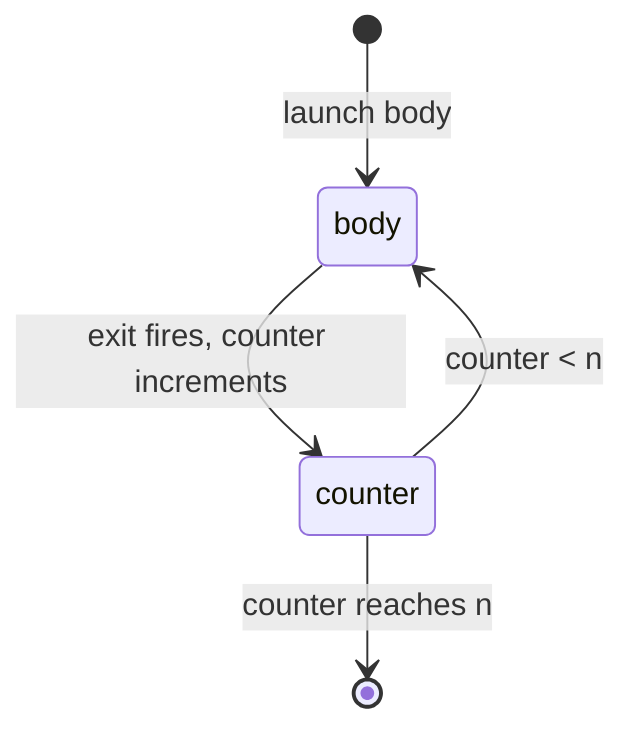
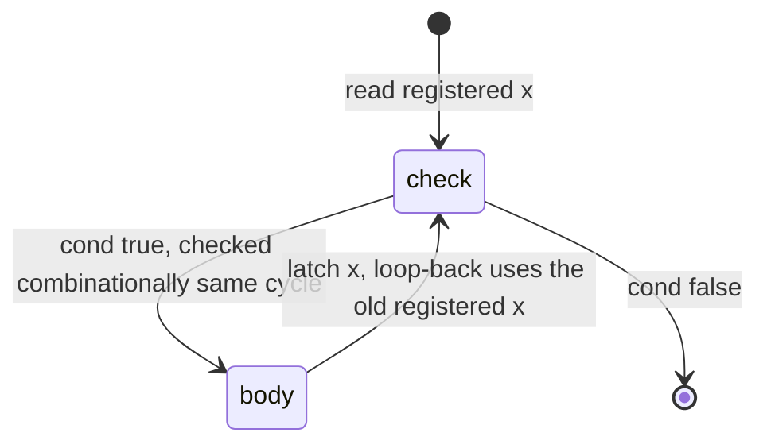

Kathryn has four loop blocks. All of them are *complex* blocks: the body
automatically opens an inner skeleton (a `seq` in a sequential context), and
the loop hardware re-launches that body until the exit condition is met.

| Block | Repeats | Condition check | Cost per iteration (one-statement body) |
| ----- | ------- | --------------- | --------------------------------------- |
| `cloop(n)` | exactly `n` times | hardware counter | body cycles |
| `cwhile(cond)` | while `cond` | combinational, before each iteration | 1 cycle |
| `swhile(cond)` | while `cond` | sampled sequentially | 2 cycles |
| `cdowhile(cond)` | at least once, then while `cond` | combinational, after each iteration | 1 cycle |

These loops are real hardware: the "loop variable" is a register or counter in
your design, and each iteration takes clock cycles. (A Python `for` loop in
your `@flow` method is different — it runs at *build* time and simply stamps
out more hardware.)

## `cloop` — fixed-count loop

`cloop(n)` runs its body exactly `n` times, using a generated hardware counter
that increments each time the body's exit fires; when the counter reaches `n`
the loop exits. `n` must be a positive Python `int`, fixed at build time.

Adapted from `tc6_cloop`:

```python
@flow
def my_flow(self):
    with seq():
        self.x |= self.zero
        self.x |= self.zero
        with cloop(3):                     # body runs 3 times
            self.x |= self.x + self.one
```

The two explicit `x <= 0` steps each take one cycle, then the loop body runs
three back-to-back iterations, leaving `x == 3`. Total loop time is
`n × body cycles` — the counter and loop-back are combinational, so a
one-statement body costs one cycle per iteration in steady state.

The counter re-launches the body until it reaches `n`:



## `cwhile` — combinational while

`cwhile(cond)` checks its condition with pure logic before each iteration —
the check itself costs no cycles, so a one-statement body iterates once per
clock. Adapted from `tc7_cwhile`:

```python
with seq():
    self.x |= self.zero
    self.x |= self.zero
    with cwhile(self.x < self.limit):      # limit == 3
        self.x |= self.x + self.one
```

Cycle by cycle once the loop is reached (`x = 0`):

1. **Edge 1** — condition sees `x = 0` (< 3): body latches `x <= 1`.
2. **Edge 2** — sees `x = 1`: latches `x <= 2`.
3. **Edge 3** — sees `x = 2`: latches `x <= 3`.
4. **Edge 4** — sees `x = 3` (the write from edge 3 is now visible), but the
   loop-back decision *at edge 3* was made while `x` still read 2 — so one
   more iteration is already in flight: latches `x <= 4`, then the loop exits.

So per the `tc7` testbench, `x` settles at **4**, not 3.

:::caution
The combinational condition reads the *registered* value of the signals it
mentions. A write performed by the body only becomes visible on the next
edge, so the same-edge loop-back decision still sees the old value and the
body runs once more than a software reading of `while x < limit` suggests.
If you need the loop to stop exactly at the limit, use `swhile`, or adjust the
bound.
:::

The loop-back decision reads the *registered* value, so it lags the body write
by one edge:



## `swhile` — sequential while

`swhile(cond)` samples the condition into a register first, spending one extra
clock per iteration: a one-statement body costs two cycles per iteration.
Adapted from `tc8_swhile`:

```python
with seq():
    self.x |= self.zero
    self.x |= self.zero
    with swhile(self.x < self.limit):      # limit == 3
        self.x |= self.x + self.one
```

Each iteration is now *check cycle* then *body cycle*. Because the check
happens a full cycle after the previous body write, it sees the settled value
— per the `tc8` testbench, `x` increments once every two clocks and the loop
exits with `x == 3`, exactly at the limit.

:::tip
`swhile` trades speed for predictability: half the iteration rate of
`cwhile`, but the exit test always sees the value the body just produced, and
the registered condition keeps long comparison logic off your critical path.
:::

## `cdowhile` — do-while

`cdowhile(cond)` runs the body first and checks the (combinational) condition
after each iteration — so the body always runs **at least once**, even when
the condition is false on entry. Adapted from `tc9_cdowhile`:

```python
with seq():
    self.x |= self.zero
    with cdowhile(self.x < self.limit):    # limit == 3
        self.x |= self.x + self.one
```

Like `cwhile`, the post-iteration check reads the pre-update register value,
so per the `tc9` testbench `x` advances once per cycle — 1, 2, 3, 4 — and the
loop exits with `x == 4`.

## Choosing a loop

- Fixed, build-time-known iteration count → `cloop(n)`. No condition signal
  to get wrong, and the compiler knows the total cycle count statically.
- Data-dependent count, speed matters → `cwhile`, minding the one-extra-
  iteration behavior above.
- Data-dependent count, exact exit value matters or the condition logic is
  slow → `swhile`.
- Body must run at least once → `cdowhile`.

Loop bodies follow the usual nesting rules: they may contain `par` blocks,
conditionals, waits, or further loops — see
[Sequential & Parallel](/userbook/flow/seq-and-par/) and
[Waits](/userbook/flow/waits/).
