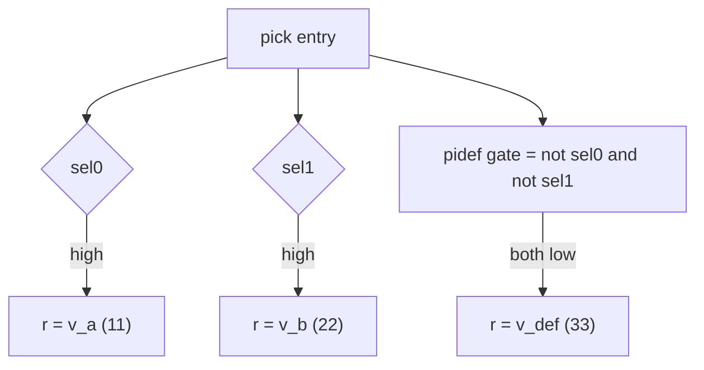

`pick` is a multi-way gated selection that — unlike a `cif`/`cselif` chain —
does **not** chain its branches. Every `pif` whose raw condition is high runs;
keeping the conditions mutually exclusive is your responsibility. The optional
`pidef` default runs only when *no* `pif` matched.

| Block | Role |
| ----- | ---- |
| `pick()` | container; holds only `pif`/`pidef` branches |
| `pif(cond)` | branch, gated on its **raw** condition — no "and not the previous ones" |
| `pidef()` | optional default; fires when every `pif` condition is low (at most one per `pick`) |

## Example

Adapted from `tc12_pick` — a three-way select into a shared register:

```python
class tc12_pick(Module):
    @init
    def com_declare(self):
        self.r     = reg (8, "r")       # shared output
        self.sel0  = wire(1, "sel0")
        self.sel1  = wire(1, "sel1")
        self.v_a   = val (8, 11, "v_a")
        self.v_b   = val (8, 22, "v_b")
        self.v_def = val (8, 33, "v_def")

        self.sel0.mark_input("sel0")
        self.sel1.mark_input("sel1")
        self.r.mark_output("my_r")

    @flow
    def my_flow(self):
        self.r.reset(0)

        with pick():
            with pif(self.sel0):
                self.r |= self.v_a       # runs whenever sel0 is high
            with pif(self.sel1):
                self.r |= self.v_b       # runs whenever sel1 is high
            with pidef():
                self.r |= self.v_def     # runs when neither sel is high
```

With `sel0`/`sel1` kept mutually exclusive this is a clean 3-way mux into `r`,
verified by the `tc12` testbench:

- `sel0 = 1, sel1 = 0` → `r == 11`
- `sel0 = 0, sel1 = 1` → `r == 22`
- `sel0 = 0, sel1 = 0` → `r == 33` (default)

The default's gate is built for you: in the emitted Verilog the `pidef` branch
launches on the AND of the inverted `pif` conditions:

```verilog
assign EXPR_pick_not_0 = ~WIRE_sel0;
assign EXPR_pick_not_1 = ~WIRE_sel1;
assign EXPR_node_logic_expr = EXPR_pick_not_0 & EXPR_pick_not_1;  // pidef gate
```

Each `pif` is gated on its raw condition — no chaining — and `pidef` fires only
when every `pif` is low:



## Branch bodies

`pif` and `pidef` are *complex* blocks: they cannot hold assignments directly,
so an inner skeleton block is opened for you automatically (a `seq` in a
sequential context, a parallel skeleton in a parallel one). You can also open
one explicitly, which reads well when the branch does several steps:

```python
with pick():
    with pif(a < b):
        with seq():
            r |= a
    with pif(a > b):
        with seq():
            r |= b
    with pidef():
        with seq():
            r |= a + b
```

Conditions are ordinary 1-bit `SignalRef`s — input wires, comparisons like
`a < b`, or bit-slices.

## Rules and pitfalls

### Conditions are not chained

`pick` gates each `pif` on its **raw** condition. If two conditions are high
in the same cycle, *both* branches run. When they write the same register,
the winner is decided by [write priority](/userbook/priority/write-priority/),
not by branch order — so overlapping conditions are almost always a bug.
If you want priority-ordered arms, use a `zif`/`zelif` chain or a
`cif`/`cselif` chain instead ([Conditionals](/userbook/flow/conditionals/)).

### At most one default

A `pick` may contain at most one `pidef`. A second one is rejected when the
model is built (`build_flow` raises — covered by
`test_pick_rejects_two_defaults`):

```python
with pick():
    with pif(a < b):
        r |= a
    with pidef():
        r |= b
    with pidef():        # error: second default — build_flow fails
        r |= a
```

### The exit is not synchronized

Unlike `par_auto`, the exit of a `pick` is **not** auto-synchronized: whichever
branch fires drives the exit signal, and Kathryn prints a warning to stderr at
build time to remind you.

:::caution
If the branches take different numbers of cycles, whatever follows the `pick`
in an enclosing `seq` resumes as soon as the *taken* branch finishes — there is
no built-in join across branches. Keep branch conditions mutually exclusive,
and keep branch lengths in mind when sequencing after a `pick`.
:::

## When to reach for `pick`

- Independent, one-hot style dispatch: each branch owns its own enable signal
  (command decoders, request handlers).
- You want the default arm derived automatically from "none of the enables".
- You do *not* want the priority chaining that `cif`/`zif` chains impose.
