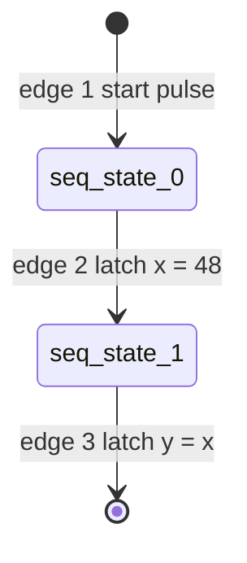
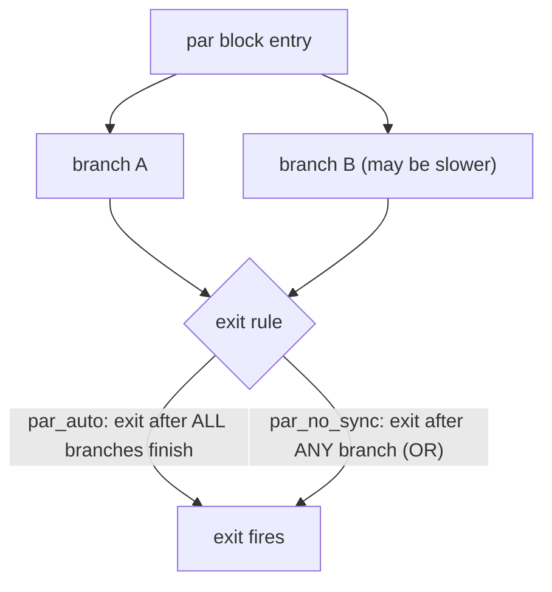

Flow blocks are the scheduling primitives of Kathryn. You write them as Python
context managers inside a `@flow` method; every assignment placed inside a block
attaches to that block, and the block decides **when** — on which clock
cycles — those assignments fire. This page covers the two skeleton blocks that
everything else nests inside: `seq` and `par`.

See the [Flow Control introduction](/userbook/flow/introduction/) for the
`c-`/`s-`/`z-`/`p-` naming convention that applies to every block on this page
and beyond, plus a summary table of every flow block Kathryn has.

## `seq` — one operation per cycle

A `seq` block runs its contents in order, one step per clock cycle. Each direct
assignment (or nested sub-block) gets its own state in a chain; when a state's
bit is high, its assignment latches on that clock edge, and the bit hands off to
the next state.

Adapted from `tc1_seq_simple`:

```python
class tc1_seq_simple(Module):
    @init
    def com_declare(self):
        self.x          = reg(8, "x")
        self.y          = reg(8, "y")
        self.simple_val = val(8, 48, "simple_val")

        self.x.mark_output("my_x")
        self.y.mark_output("my_y")

    @flow
    def my_flow(self):
        with seq():
            self.x |= self.simple_val   # cycle 1: x <= 48
            self.y |= self.x            # cycle 2: y <= x
```

`|=` is the **clocked** assignment operator (`*=` is the combinational one —
see [Assignment](/userbook/core/assignment/)). Cycle by cycle, after the
master reset `mrst` is released:

1. **Edge 1** — the internal `start` pulse sets the first sequence state bit
   `seq_state_0`.
2. **Edge 2** — `seq_state_0` is high, so `x <= 48` latches; the chain advances
   (`seq_state_1 <= seq_state_0`).
3. **Edge 3** — `seq_state_1` is high, so `y <= x` latches. Because `x` already
   latched on the previous edge, `y` receives 48.

The emitted Verilog makes the state chain explicit. Each assignment is guarded
by its own one-bit state register, and each state register is set from the one
before it:

```verilog
always @(posedge WIRE_clk) begin
    if (SR_ST_seq_state_4_0_ST) begin
        REG_x[7:0] <= VAL_simple_val[7:0];      // step 1
    end
end

always @(posedge WIRE_clk) begin
    if (SR_ST_seq_state_4_1_ST) begin
        REG_y[7:0] <= REG_x[7:0];               // step 2
    end
end

always @(posedge WIRE_clk) begin
    SR_ST_seq_state_4_1_ST <= 1'b0;
    if (SR_ST_seq_state_4_0_ST) begin
        SR_ST_seq_state_4_1_ST <= 1'b1;         // chain: state 0 -> state 1
    end
end
```

The state chain, one step per cycle:



:::note
Registers with no `reset(...)` read as `X` in simulation until their first
latch. Give a register a reset value if downstream logic reads it before the
flow writes it — see [Reset & Defaults](/userbook/core/reset-and-defaults/).
:::

## `par` / `par_auto` — concurrent operations

A `par_auto` block runs its contents **at the same time**. All direct
assignments inside it are merged under one shared state, so they all latch on
the same clock edge. `par` is simply an alias for `par_auto` — both build the
same auto-synchronized parallel block.

Adapted from `tc2_par`:

```python
@flow
def my_flow(self):
    with seq():
        with par_auto():
            self.x |= self.val_5     # both latch
            self.y |= self.val_10    # on the same edge
```

Cycle by cycle: edge 1 arms the sequence state; edge 2 latches `x <= 5` **and**
`y <= 10` together. Contrast with `seq`, where the same two statements would
take two edges.

### Exit synchronization

When a `par` block contains nested sub-blocks, its branches may take different
numbers of cycles. The variants differ in how the block decides it is finished
(which matters when the `par` sits inside a `seq` that must continue
afterwards):

- **`par_auto`** — the exit is auto-synchronized. If the branches take the same
  statically known number of cycles, the block exits with them and no extra
  hardware is needed; if their lengths differ, the compiler inserts a
  synchronizer node so the block's exit fires only after **every** branch has
  finished.
- **`par_no_sync`** — no synchronizer is inserted. With branches of differing
  length the exit is the OR of the branch exits, so the enclosing flow moves on
  as soon as **any** branch completes.

:::caution
Use `par_no_sync` only when you know the branches finish together, or when the
downstream flow genuinely must not wait for the slower branches. With
`par_auto` you never have to think about it.
:::

How the two variants decide the block's exit:



## Writes to the same register in `par`

Two branches of a `par` may write the *same* register in the same cycle. The
result is not a race: Kathryn resolves the writes by **priority**, and ties are
broken by program order (the later statement wins under non-blocking
semantics). Adapted from `tc14`/`tc15`:

```python
with seq():
    with par_auto():
        with priority(100):
            self.x |= hi_src     # higher priority: emitted last, dominates
        with priority(50):
            self.x |= lo_src
```

See [Write Priority](/userbook/priority/write-priority/) for the full rules.

## Nesting

Skeleton blocks nest freely: a `seq` step may be a whole `par` block (which
counts as one step lasting as long as its slowest branch), and a `par` branch
may be a whole `seq` chain. The `cif`/`sif` conditionals and the loop blocks
([Conditionals](/userbook/flow/conditionals/), [Loops](/userbook/flow/loops/))
automatically open an inner skeleton for you — a `seq` when nested in a `seq`,
a parallel skeleton when nested in a `par` — so their bodies behave like the
enclosing context.
