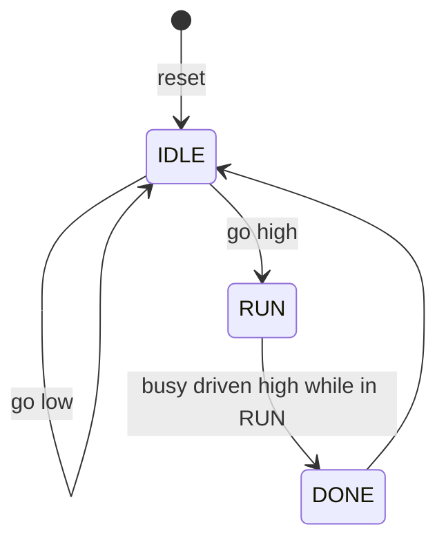

`zstate` / `zcase` is Kathryn's zero-cycle switch: a multi-way select on an
encoded signal, compiled straight into a Verilog `case` statement. Like the
`z-` conditionals, it consumes **no clock cycles** — it is pure gating logic
around the assignments in its arms. Combined with a state register, it is the
natural way to write a classic FSM.

## The zero-cycle switch

`zstate(sig)` opens the switch on `sig`; each `zcase(value)` arm matches one
integer value of that signal. Adapted from `tc10_zswitch`:

```python
class tc10_zswitch(Module):
    @init
    def com_declare(self):
        self.sel   = wire(2, "sel")
        self.out   = wire(8, "out")
        self.val_a = val(8, 10, "val_a")
        self.val_b = val(8, 20, "val_b")
        self.val_c = val(8, 30, "val_c")

        self.sel.mark_input ("my_sel")
        self.out.mark_output("my_out")

    @flow
    def my_flow(self):
        with seq():
            with zstate(self.sel):
                with zcase(0):
                    self.out *= self.val_a
                with zcase(1):
                    self.out *= self.val_b
                with zcase(2):
                    self.out *= self.val_c
```

Because the arms use `*=` (combinational assignment) on a wire, `my_out`
changes in the **same cycle** `my_sel` changes: drive `sel = 1` and `out`
reads 20 after a delta, no clock edge needed. When no case matches (`sel = 3`
here), the wire falls back to its default value.

The emitted Verilog is a plain `case`, gated by the enclosing sequence state:

```verilog
always @(*) begin
    WIRE_out[7:0] <= VAL_WIRE_out_DEFAULT_ZERO[7:0];
    if (SR_ST_seq_state_0_ST) begin
        case (WIRE_sel)
            0: begin WIRE_out[7:0] <= VAL_val_a[7:0]; end
            1: begin WIRE_out[7:0] <= VAL_val_b[7:0]; end
            2: begin WIRE_out[7:0] <= VAL_val_c[7:0]; end
        endcase
    end
end
```

A few rules:

- `zcase` takes a plain Python `int` as its match value.
- `zcase` arms are only valid directly inside a `zstate`.
- Arms may hold several assignments; all of them are gated by the same match.

## Building an FSM

An FSM is a state register plus a `zstate` over it. Each `zcase` arm describes
one state: what to drive while in it, and — using the clocked `|=`
assignment — which state to go to next. This combines the `zstate` switch of
`tc10` with the clocked-write gating shown for `zif` chains in
[Conditionals](/userbook/flow/conditionals/) (`tc16`).

```python
IDLE, RUN, DONE = 0, 1, 2

class stepper(Module):
    @init
    def com_declare(self):
        self.state = reg (2, "state")
        self.go    = wire(1, "go")
        self.busy  = wire(1, "busy")

        self.st_idle = val(2, IDLE, "st_idle")
        self.st_run  = val(2, RUN,  "st_run")
        self.st_done = val(2, DONE, "st_done")
        self.hi      = val(1, 1,    "hi")

        self.go  .mark_input ("go")
        self.busy.mark_output("busy")

    @flow
    def my_flow(self):
        self.state.reset(IDLE)              # start in IDLE after mrst

        with seq():
            with zstate(self.state):
                with zcase(IDLE):
                    with zif(self.go):
                        self.state |= self.st_run    # IDLE -> RUN when go
                with zcase(RUN):
                    self.busy  *= self.hi            # Moore output in RUN
                    self.state |= self.st_done       # RUN -> DONE
                with zcase(DONE):
                    self.state |= self.st_idle       # DONE -> IDLE
```

How it behaves, edge by edge:

1. After the master reset, `state` holds `IDLE` (its reset value) and the
   enclosing sequence state arms the switch.
2. While `state == IDLE` and `go` is low, the `zif` gate keeps the write to
   `state` off — the FSM idles.
3. The edge after `go` rises, `state <= RUN` latches. From that cycle `busy`
   is driven high combinationally (it drops the moment the state leaves
   `RUN` — a Moore-style output).
4. The next edge latches `state <= DONE`, then the one after returns to
   `IDLE`.

Because the whole `zstate` is zero-cycle, the FSM changes state on **every**
clock edge according to the current state — there is no hidden schedule; the
only sequencing element is the `state` register you declared.

The transitions this FSM encodes:



:::tip
Give the state register a `reset(...)` value. Without it, `state` reads `X`
after power-up and no `zcase` arm matches, so the FSM never starts. See
[Reset & Defaults](/userbook/core/reset-and-defaults/).
:::

:::note
`zstate`/`zcase` selects on a value you *encode yourself* in a register. If
what you want is "step 1, then step 2, then step 3", you do not need an FSM at
all — a plain `seq` block already generates that state chain for you
([Sequential & Parallel](/userbook/flow/seq-and-par/)). Reach for
`zstate` when transitions are data-dependent and non-linear.
:::

## When to use which multi-way construct

- **`zstate`/`zcase`** — select on an encoded value; exactly the arm whose
  value matches is active; compiles to a `case`.
- **`zif`/`zelif`/`zelse`** — select on arbitrary 1-bit conditions with
  priority order; compiles to an `if/else if` chain.
- **`pick`/`pif`/`pidef`** — independent gated branches with no chaining; see
  [Pick](/userbook/flow/pick/).
