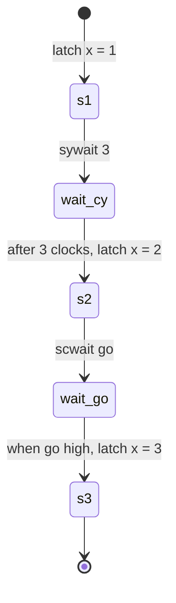

Wait blocks stall a sequence: the flow reaches the wait, holds there, and only
hands off to the next step once the wait releases. Kathryn has two of them:

| Call | Waits for |
| ---- | --------- |
| `sywait(n)` | a fixed number of clock cycles (`n` is a build-time `int`) |
| `scwait(cond)` | a 1-bit condition signal to be high |

Unlike the other flow blocks, waits are **leaf** blocks: they have no body, so
they are plain function calls, not `with` context managers. Written between
two statements of a `seq`, a wait becomes one (multi-cycle) step of the chain.

## Example

Adapted from `tc11_wait` — both waits in one sequence:

```python
class tc11_wait(Module):
    @init
    def com_declare(self):
        self.x     = reg (8, "x")
        self.go    = wire(1, "go")        # 1-bit input for scwait
        self.one   = val (8, 1, "one")
        self.two   = val (8, 2, "two")
        self.three = val (8, 3, "three")

        self.go.mark_input("go_in")
        self.x.mark_output("my_x")

    @flow
    def my_flow(self):
        with seq():
            self.x |= self.one          # x <= 1
            sywait(3)                   # stall 3 clocks (no input needed)
            self.x |= self.two          # x <= 2, only after the stall
            scwait(self.go)             # stall until go == 1
            self.x |= self.three        # x <= 3, only after go rises
```

With `go` held low, the flow latches `x <= 1`, sits in the `sywait` for its
fixed stall, latches `x <= 2`, then parks in the `scwait` indefinitely — the
`tc11` testbench confirms `x` is still 2 after many extra clocks. The moment
`go` goes high, the wait releases and `x <= 3` latches on a following edge.

Each wait becomes one multi-cycle step in the `seq` chain:



## `sywait` — fixed cycle wait

`sywait(n)` inserts an `n`-cycle stall between the previous and next step. It
needs no signals: the compiler generates a small down-counting shift/count
register (`SR_CYWT_*` in the emitted Verilog) that loads when the flow arrives,
counts through `n` cycles, and fires the exit when it reaches the end:

```verilog
always @(posedge WIRE_clk) begin
    if (EXPR_..._IS_END) begin
        SR_CYWT_sywait_CY[2:0] <= VAL_..._IDLE_CNT[2:0];   // done -> idle
    end
    ...
    // flow arrival loads the counter; it then steps until IS_END
end
```

The `tc11` testbench pins the behavior down: after `x` latches 1, it must hold
that value across the whole stall before it is allowed to become 2 — the wait
genuinely delays the next assignment rather than just delaying its enable.

Use it for fixed-latency alignment: waiting out a known memory or DSP latency,
or padding one `seq` so it lines up with a sibling branch.

## `scwait` — condition wait

`scwait(cond)` stalls until `cond` reads 1. The condition is any 1-bit
`SignalRef` — an input wire, a comparison such as `self.cnt == self.limit`, or
a bit-slice like `flags[0]`. Following the naming convention, the `sc-` check
is sequential: the flow holds in the wait state and moves on via a clock edge
once the condition is seen high, as in `sif`/`swhile`.

```python
with seq():
    self.req |= self.hi
    scwait(self.ack)            # park here until ack == 1
    self.data |= self.bus_in    # safe: ack has been seen high
```

If the condition never rises, the flow stays parked forever — there is no
timeout. Combine an `scwait` with surrounding logic (or bound the protocol at
the other end) if a hang would be unacceptable.

:::caution
`scwait` samples a level, not an edge. If the condition is already high when
the flow arrives, the wait releases immediately on the next check; if you need
edge semantics, derive an edge-detect signal first and wait on that.
:::

## Rules

- Waits accept **no body**: no sub-blocks, no assignments inside. Trying to
  nest anything in them is a build error — they are statements, not scopes.
- `sywait(n)` takes a plain Python `int`, fixed at build time. For a
  data-dependent delay, use `scwait` on a comparison against a counter
  register instead.
- Like every flow block, a wait can take an optional `name` argument
  (`sywait(3, "settle")`) to make the generated signals easier to find in the
  emitted Verilog.

## Related pages

- [Sequential & Parallel](/userbook/flow/seq-and-par/) — how a wait slots into
  the `seq` state chain.
- [Loops](/userbook/flow/loops/) — `swhile`/`cwhile` when you need to *do*
  something while waiting.
- [Pipelines](/userbook/pipelines/pip-zync-basics/) — handshake-style
  synchronization between concurrent flows, which is usually a better fit than
  `scwait` for producer/consumer coupling.
