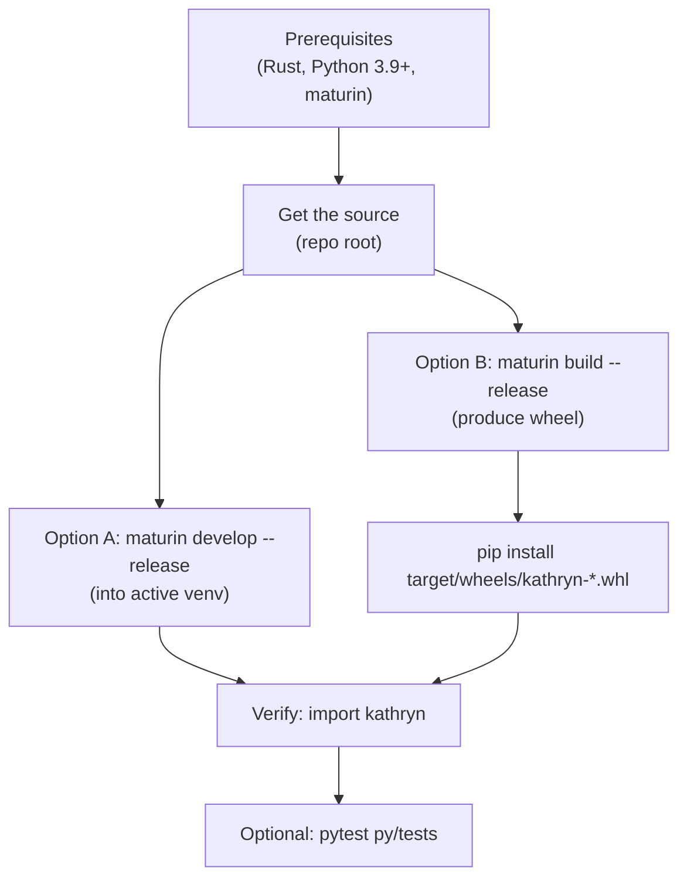

Kathryn is a mixed Rust/Python project: the compiler core is a Rust crate, and
the Python DSL is a thin package that loads the compiled core as a native
extension (`kathryn._kathryn`). Kathryn is currently installed by **building
from source** with [maturin](https://www.maturin.rs/); there is no prebuilt
package to download.

:::caution[Rewrite status]
This book documents the **Rust + Python rewrite** of Kathryn. The rewrite is
under active development — some subsystems of the C++ original are not yet
ported, and it has not yet been verified to the standard of the paper's
evaluation. The paper-evaluated, verified implementation is the C++ version —
see the [Kathryn C++ book](/cppbook/getting-started/introduction/).
:::

## Prerequisites

You need three things on your machine:

- **A Rust toolchain.** The crate uses the Rust 2024 edition, so install a
  recent stable Rust via [rustup](https://rustup.rs/):

  ```bash
  curl --proto '=https' --tlsv1.2 -sSf https://sh.rustup.rs | sh
  rustup update stable
  ```

- **Python 3.9 or newer** (the package declares `requires-python = ">=3.9"`).

- **maturin 1.7 or newer** (`maturin>=1.7,<2.0`), the build backend that
  compiles the Rust extension and packages it together with the pure-Python
  layer:

  ```bash
  pip install "maturin>=1.7,<2.0"
  ```

## Get the source

Clone (or otherwise obtain) the Kathryn repository and work from its root —
the directory containing `Cargo.toml` and `pyproject.toml`. Note that the
Rust *crate* is named `Kathryn2`, but the Python *package* you import is
plain `kathryn`.

At a glance, the install path from prerequisites to a working import:



## Option A: develop install (recommended)

`maturin develop` compiles the extension and installs the `kathryn` package
directly into the **currently active virtual environment**, so create and
activate one first:

```bash
python -m venv .venv
source .venv/bin/activate

maturin develop --release
```

This builds the Rust core with the `python` Cargo feature (configured in
`pyproject.toml`, so you don't pass it yourself), drops the compiled extension
inside the pure-Python package, and installs it. `--release` is optional; it
builds the Rust core with optimizations turned on.

Re-run `maturin develop` after changing the Rust source; pure-Python changes
under `py/kathryn/` are picked up without a rebuild in a develop install.

## Option B: build a wheel

To produce an installable wheel (for example to install into another
environment or machine):

```bash
maturin build --release
pip install target/wheels/kathryn-*.whl
```

The wheel lands under `target/wheels/` and contains both the compiled
extension and the Python DSL.

## Verify the install

A successful install means `import kathryn` loads the native core and the DSL
surface. Quick check:

```bash
python -c "import kathryn; print('kathryn OK:', kathryn.LogicOp)"
```

Then a slightly more end-to-end check that actually touches the model arena:

```python
from kathryn import Module, init, reg, reset

reset()                      # fresh model arena

class hello(Module):
    @init
    def declare(self):
        self.r = reg(8, "r")

m = hello()
print(m.r.hw_type)           # -> REG
```

If this prints `REG`, the Rust core and the Python frontend are talking to
each other correctly.

## Run the test suite (optional)

The repository ships a smoke-test suite for the Python DSL. After
`maturin develop`:

```bash
pip install pytest
pytest py/tests
```

The end-to-end model tests under `test/model/` additionally simulate the
emitted Verilog with [cocotb](https://www.cocotb.org/) and a Verilog
simulator. They are driven by one entry point, with no Makefile:

```bash
PYTHONPATH=py python test/run_cocotb.py                    # all cases, icarus
PYTHONPATH=py python test/run_cocotb.py verilator          # all cases, verilator
PYTHONPATH=py python test/run_cocotb.py icarus tc2_par     # one case
```

The simulator argument defaults to `icarus` (iverilog); `verilator` is also
supported and needs verilator ≥ 5.036. Each case writes its Verilog and one
VCD per testbench coroutine to `test/.model_output/<case>/`.

:::note
You do not need the model tests to *use* Kathryn — they are the project's
verification harness. `pytest py/tests` alone needs no Verilog simulator.
:::

## Troubleshooting

- **`maturin develop` complains about a missing virtualenv** — it refuses to
  install into a system Python. Activate a venv (or conda env) first.
- **`import kathryn` fails with an extension import error** — the native
  module `kathryn._kathryn` was not built for your current interpreter.
  Re-run `maturin develop` inside the environment you are importing from.
- **Stale behavior after a Rust change** — rebuild with `maturin develop`;
  the compiled extension is only refreshed by a build.

## Where next

With the package installed, continue to the
[Quickstart](/userbook/getting-started/quickstart/) and compile your first
module to Verilog.
