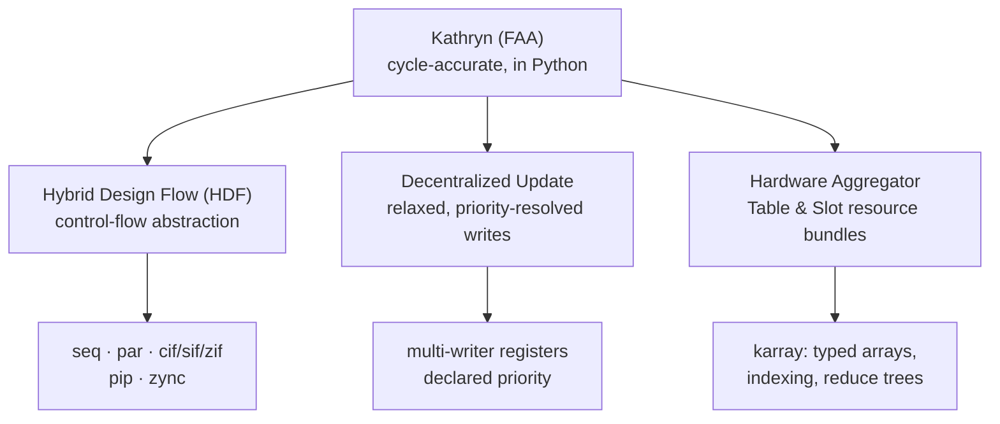

Kathryn's headline feature is refusing a trade-off every other hardware-design
tool asks you to make: it bridges **control-flow abstraction** and
**cycle-accurate control** instead of picking one. High-level synthesis (HLS)
abstracts control flow away — and takes cycle accuracy with it. Hardware
description languages (HDLs) and other framework-assisted approaches (FAA)
like Chisel keep cycle accuracy, but leave you hand-building every state
machine, mux, and wire. Kathryn gives you both: you describe hardware at the
register-transfer level (RTL) through a Python API, and every statement you
execute constructs a concrete piece of hardware — a register, a wire, an
expression, a clocked assignment, a state machine step — while three built-in
abstractions (below) remove the manual control-flow and routing burden HDLs
impose. When you emit Verilog, you get exactly the structure you declared.

:::caution[Rewrite status]
This book documents the **Rust + Python rewrite** of Kathryn. The rewrite is
under active development — some subsystems of the C++ original are not yet
ported, and it has not yet been verified to the standard of the paper's
evaluation. The paper-evaluated, verified implementation is the C++ version —
see the [Kathryn C++ book](/cppbook/getting-started/introduction/).
:::

```python
from kathryn import *

class blinker(Module):
    @init
    def declare(self):
        self.count = reg(8, "count")
        self.count.mark_output("count_out")

    @flow
    def run(self):
        with seq():
            self.count |= self.count + 1
```

That snippet does not *simulate* a counter, and no tool guesses a
micro-architecture from it. It **builds** an 8-bit register, an adder
expression, and a clocked assignment in Kathryn's internal model — and the
emitted Verilog contains precisely those parts.

## Kathryn is not HLS

High-level synthesis tools take algorithmic code and *infer* hardware from it:
scheduling, register allocation, and datapath structure are decided by the
tool. Kathryn deliberately does the opposite. It does not infer
micro-architecture from algorithmic code. You explicitly construct the
hardware model — registers, wires, state machines, update events, modules, and
control-flow graphs — and Kathryn synthesizes that model into clean,
simulatable Verilog.

The practical consequences:

- **Every register exists because you declared it.** `reg(8)` is one 8-bit
  register, not a hint.
- **Timing is explicit.** A clocked assignment (`|=`) is a flip-flop update; a
  combinational assignment (`*=`) is same-cycle logic. You choose, per
  assignment.
- **Control flow describes hardware, not execution.** A `with seq():` block
  builds a sequencer out of real state registers; a conditional block builds
  real enable logic.

Think of Python as a *construction script* for your circuit, with the full
power of a general-purpose language available: parameterization, loops that
stamp out repeated structure, classes that package reusable components, and
tests that drive the whole thing.

## Where Kathryn fits

Kathryn is a **Framework-Assisted Approach (FAA)**: hardware construction
embedded in a general-purpose language, like Chisel. What sets it apart is that
it bridges the usual gap between *control-flow abstraction* and *cycle-accurate
control* — you get high-level control-flow and resource abstractions **without**
giving up the precise, per-cycle behavior that HDLs provide. Three abstractions
carry that promise, and the userbook is organized around them:



- **Hybrid Design Flow (HDF)** — an abstract model for hardware control flow.
  In the DSL this is the flow blocks: `seq`, `par`, conditionals, and pipelines.
- **Decentralized Update** — any block may update a resource; multiple writers
  to one register resolve deterministically by declared priority.
- **Hardware Aggregator** — the Table & Slot abstraction, exposed as `karray`,
  for managing bundles of hardware resources as one entity.

## Python frontend, Rust core

Kathryn is split into two layers:

- **A Rust core** owns the entire hardware model. All long-lived objects live
  in a centralized generational arena; the model build, the control-flow
  elaboration, and the Verilog backend are all Rust.
- **A thin Python DSL** (`import kathryn`) provides the user-facing surface:
  signal factories, operator overloading, flow-block context managers, and the
  `Module` class. Python objects hold only lightweight *ident handles* into
  the Rust arena — every operation routes back through Rust, which remains the
  sole owner of all model objects.

This split gives you the ergonomics of Python for describing hardware and the
memory safety and determinism of Rust for building and emitting it.
The Verilog emitter is fully isolated from the core model, so alternative
backends can be added without touching the model itself.

:::note[Looking for the C++ Kathryn?]
This userbook (and the Devbook) document the Rust + Python rewrite. The
original **C++ implementation** — the version evaluated in the Kathryn paper — has
its own [Kathryn C++](/cppbook/getting-started/introduction/) book.
:::

## The basic workflow

1. **Declare** hardware in a `Module` subclass: registers, wires, constants,
   memories, and I/O markings go in `@init` methods.
2. **Describe behavior** in `@flow` methods using flow blocks (`seq`, `par`,
   conditionals, pipelines) and the assignment operators `|=` (clocked) and
   `*=` (combinational).
3. **Build and emit**: `build_model(top)` elaborates the whole design, then
   `emit_verilog(out_dir)` writes one `.v` file per module.

The [Quickstart](/userbook/getting-started/quickstart/) walks through this
end-to-end with a real example and its emitted Verilog.

## What the userbook covers

**Getting started**

- [Installation](/userbook/getting-started/installation/) — building the
  Rust extension and installing the Python package.
- [Quickstart](/userbook/getting-started/quickstart/) — a complete module,
  from Python source to emitted Verilog.

**Core concepts**

- [Signals](/userbook/core/signals/) — `reg`, `wire`, `val`, `mem_blk`, and
  `mem_ele`: the primitive hardware components.
- [Expressions](/userbook/core/expressions/) — operator overloading,
  inclusive bit-slicing, and automatic wrapping of integer literals.
- [Assignment](/userbook/core/assignment/) — clocked `|=` versus
  combinational `*=`, and sliced writes.
- [Reset & Defaults](/userbook/core/reset-and-defaults/) — register reset
  values and wire fallback values.

**Behavior and structure**

- [Flow Control introduction](/userbook/flow/introduction/) — the naming
  convention and a summary table of every flow block, then
  [Seq & Par](/userbook/flow/seq-and-par/) and the rest of the flow-control
  chapters: sequencers, [conditionals](/userbook/flow/conditionals/),
  [state machines](/userbook/flow/state-machines/), and
  [loops](/userbook/flow/loops/).
- [Pipelines](/userbook/pipelines/pip-zync-basics/) — the `pip`/`zync`
  pipeline system, stalls, flushes, and arbitration.
- [Write Priority](/userbook/priority/write-priority/) — how multiple writes
  to the same register are ordered.
- [Karray](/userbook/karray/basics/) — typed multi-dimensional arrays of
  hardware, their [element records](/userbook/karray/records/), and static,
  runtime, and reduce [indexing](/userbook/karray/indexing/).
- [Helpers](/userbook/lib/combinational/) — the combinational combinators
  (`mux`, `any_of`, `sum_cnt`, `rotate_left`) and the
  [counter](/userbook/lib/counter/) CCP.
- [Modules & Build](/userbook/modules/modules/) — module composition and
  [building & emitting](/userbook/modules/building-and-emitting/) Verilog.
- [Examples](/userbook/examples/gallery/) — a gallery of complete designs.

If you are curious about how the compiler itself works — the arena, the ident
pattern, the flow-block build pipeline, the Verilog backend — see the Devbook
section of this site.

## Where next

Head to [Installation](/userbook/getting-started/installation/) to build
Kathryn, then the [Quickstart](/userbook/getting-started/quickstart/) to
compile your first module.
