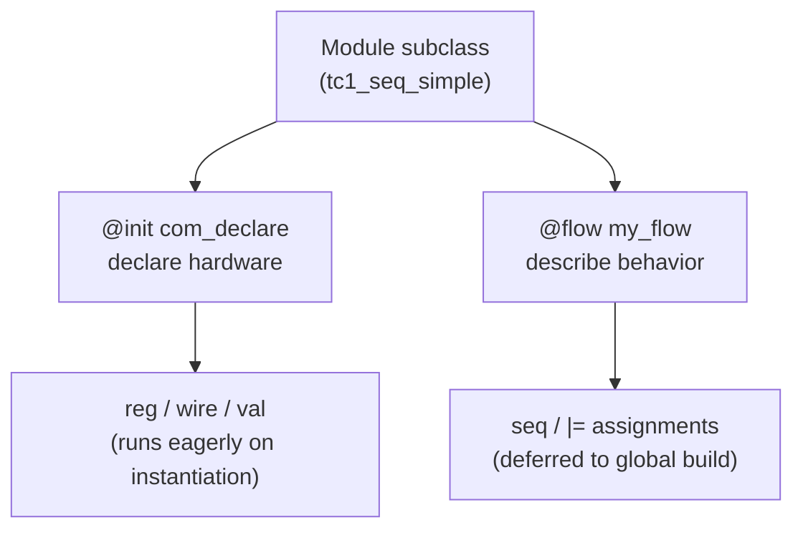
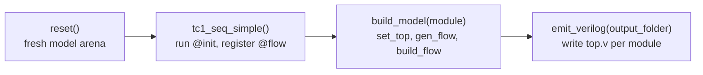

This page walks through a complete, minimal design: two registers updated in
sequence, compiled to Verilog. It is the `tc1_seq_simple` test case from the
Kathryn repository, trimmed down to the model and the build call.

The whole program:

```python
from kathryn import *

class tc1_seq_simple(Module):
    @init
    def com_declare(self):
        self.x          = reg(8, "x")
        self.y          = reg(8, "y")
        self.simple_val = val(8, 48, "simple_val")

        self.x.mark_output("my_x")
        self.y.mark_output("my_y")

    @flow
    def my_flow(self):
        with seq():
            self.x |= self.simple_val
            self.y |= self.x


def build(output_folder: str) -> None:
    reset()
    module = tc1_seq_simple()
    build_model(module)
    emit_verilog(output_folder)
```

Let's take it apart.

## 1. A design is a `Module` subclass

```python
class tc1_seq_simple(Module):
```

Every piece of hardware in Kathryn lives inside a module. You describe one by
subclassing `Module` and tagging methods with two decorators:

- `@init` methods **declare hardware**. They run eagerly, when the module is
  instantiated, inside the module's scope — so every `reg(...)`, `wire(...)`,
  or `val(...)` you create there is attached to this module.
- `@flow` methods **describe behavior**. They are *deferred*: instantiating
  the module only registers them, and they run later during the global build.

The two decorators split a module into a declare phase and a behavior phase:



## 2. `@init`: declare the hardware

```python
@init
def com_declare(self):
    self.x          = reg(8, "x")
    self.y          = reg(8, "y")
    self.simple_val = val(8, 48, "simple_val")

    self.x.mark_output("my_x")
    self.y.mark_output("my_y")
```

Three components are declared:

- `reg(8, "x")` and `reg(8, "y")` — two 8-bit clocked registers.
- `val(8, 48, "simple_val")` — an 8-bit **constant** with value 48.

The name argument is optional everywhere; Kathryn auto-generates names
(`reg0`, `reg1`, …) if you omit it. Explicit names just make the emitted
Verilog easier to read.

`mark_output("my_x")` promotes a signal to a module output port named `my_x`.
Without it, `x` would remain an internal register. See
[Signals](/userbook/core/signals/) for the full catalog of components and I/O
marking.

## 3. `@flow`: describe behavior with a `seq` block

```python
@flow
def my_flow(self):
    with seq():
        self.x |= self.simple_val
        self.y |= self.x
```

Two things are happening here:

- `with seq():` opens a **sequential flow block**. Statements inside it
  execute as consecutive steps, one per clock cycle — a small sequencer is
  built out of real state registers.
- `|=` is Kathryn's **clocked assignment** operator: "on this step's clock
  edge, load the right-hand side into the register." (Wires use `*=` for
  combinational assignment instead — see
  [Assignment](/userbook/core/assignment/).)

So the behavior is: on step 1, `x` latches 48; on step 2, `y` latches `x`.

:::note
`|=` and `*=` are ordinary Python augmented-assignment operators that Kathryn
overloads. Executing `self.x |= self.simple_val` builds an assignment node in
the model; nothing is "run" in the software sense.
:::

## 4. Build and emit

```python
def build(output_folder: str) -> None:
    reset()
    module = tc1_seq_simple()
    build_model(module)
    emit_verilog(output_folder)
```

- `reset()` gives you a fresh model arena (useful in scripts and tests that
  build more than once per process).
- Instantiating `tc1_seq_simple()` runs its `@init` methods and registers its
  `@flow` methods.
- `build_model(module)` is the one-shot build: it sets `module` as the top of
  the design, constructs every registered flow block, then runs the host build
  pass (sequencer state, update events, clock and master-reset wiring) over
  the whole module tree. It is equivalent to
  `set_top(module); gen_flow(); build_flow()`.
- `emit_verilog(output_folder)` runs the Verilog backend. The output directory
  must already exist; one `<name>.v` is written per module, with the top
  module written to `top.v` (the file name is the optional second argument).

The four calls form the build pipeline, from a fresh arena to emitted Verilog:



:::caution
`emit_verilog` *consumes* the model — the arena is moved into the backend, and
the session is left empty afterwards. To build again in the same process,
start over with `reset()` and re-instantiate your modules.
:::

## 5. The emitted Verilog

Here is the actual `top.v` Kathryn emits for this design (abbreviated):

```verilog
////////////////////////////////////////////////////////////////////////////////
// Phase 1 : module header & IO ports
module MODULE_tc1_seq_simple0_0(
    output reg  [7:0] my_x,
    output reg  [7:0] my_y,
    input wire clk,
    input wire mrst
);

    // ---- Phase 2 : signal declarations (reg / wire / localparam / mem) ----
    // ---- REG declarations ----
reg  [7:0]  REG_x_1;
reg  [7:0]  REG_y_2;
    // ---- SR_ST declarations ----
reg   SR_ST_start_ST_16;
reg   SR_ST_seq_state_4_0_ST_36;
reg   SR_ST_seq_state_4_1_ST_40;
    // ---- VAL declarations ----
wire [7:0]  VAL_simple_val_3 = 8'h30;

    // ---- Phase 3 : always blocks & continuous assignments ----
always @(posedge WIRE_clk_12) begin
    if (SR_ST_seq_state_4_0_ST_36) begin
        REG_x_1[7:0] <= VAL_simple_val_3[7:0];
    end
end

always @(posedge WIRE_clk_12) begin
    if (SR_ST_seq_state_4_1_ST_40) begin
        REG_y_2[7:0] <= REG_x_1[7:0];
    end
end

always @(posedge WIRE_clk_12) begin
    SR_ST_seq_state_4_1_ST_40 <= VAL_seq_state_4_1_ST_UNSET_39;
    if (SR_ST_seq_state_4_0_ST_36) begin
        SR_ST_seq_state_4_1_ST_40 <= VAL_seq_state_4_1_ST_SET_38;
    end
    if (WIRE_mrst_13) begin
        SR_ST_seq_state_4_1_ST_40 <= VAL_seq_state_4_1_ST_UNSET_39;
    end
end

always @(*) begin
    my_x[7:0] <= REG_x_1[7:0];
end
```

What to notice:

- **Your components are there, by name.** `REG_x_1`, `REG_y_2`, and
  `VAL_simple_val_3 = 8'h30` (48 in hex) are exactly the `reg` and `val`
  objects you declared — nothing was inferred or optimized away.
- **The `seq` block became state registers.** The `SR_ST_seq_state_*`
  registers are the sequencer: one state bit per step, each enabling its
  step's assignment for one cycle and then handing off to the next. This is
  the "control flow is hardware" principle made visible.
- **Each `|=` became a guarded always block.** `x`'s update fires only while
  `seq_state_4_0` is high; `y`'s only while `seq_state_4_1` is high.
- **`clk` and `mrst` ports appeared automatically.** Kathryn wires a clock
  and a master reset into every module. Asserting `mrst` sets the sequencer's
  `start` state and holds the step states cleared; when `mrst` deasserts, the
  sequence launches and advances one step per clock.
- **Outputs are driven from the internals.** `my_x` and `my_y` are
  combinationally driven from `REG_x_1` and `REG_y_2` (in `always @(*)`
  blocks further down the file).

## 6. Simulating it (optional)

In the Kathryn repository, each `test/model/tc*.py` file pairs a model like
this one with a [cocotb](https://www.cocotb.org/) testbench that drives `clk`
and `mrst` and checks the outputs cycle by cycle. For this design the
testbench asserts `mrst` for two cycles, releases it, and then observes
`my_x` latch 48 one step before `my_y` does — matching the two-step `seq`
exactly.

## Where next

- [Signals](/userbook/core/signals/) — everything you can declare in `@init`.
- [Expressions](/userbook/core/expressions/) — building logic with operators
  and slices.
- [Assignment](/userbook/core/assignment/) — the `|=` / `*=` rules in full.
- [Seq & Par](/userbook/flow/seq-and-par/) — sequential and parallel flow
  blocks in depth.
- [Building & Emitting](/userbook/modules/building-and-emitting/) — the build
  pipeline beyond `build_model`.
