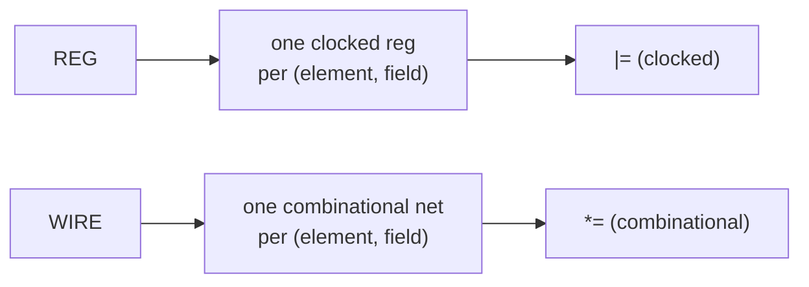

A Karray's first constructor argument is its **backing** — the kind of hardware
each (element, field) pair becomes. There are two:

| Backing | `HwComponentType` | Hardware per field | Assign with |
| --- | --- | --- | --- |
| Register | `REG` | one clocked `reg` per (element, field) | `\|=` (clocked) |
| Wire | `WIRE` | one combinational net per (element, field) | `*=` (combinational) |



The backing is fixed at construction:

```python
class RobEntry(Karray):
    valid   = kaf(1)
    reg_idx = kaf(5)

self.rob = RobEntry(HwComponentType.REG,  (5, 3), "rob")   # registers
self.bus = RobEntry(HwComponentType.WIRE, (2, 2), "bus")   # wires
```

:::caution[MEM_BLOCK backing was removed]
Earlier versions accepted `HwComponentType.MEM_BLOCK` as a third backing, which
folded the array onto one addressable memory per field. It is gone — the Rust
core now asserts `backing must be Reg or Wire`, and
`RobEntry(HwComponentType.MEM_BLOCK, …)` raises a `ValueError`. For large
single-port storage, declare a [`mem_blk` + `mem_ele`](/userbook/core/signals/)
directly instead.
:::

## Register backing (`REG`)

Reg backing materializes **one register per (element, field)**. A 5×3 array of
`{valid:1, reg_idx:5}` yields 15 × 2 = 30 registers, each written by its own
clocked always-block. Assign with `|=`, whether field-wise or whole-element:

```python
with seq():
    self.rob[2][1] |= {"valid": self.vsrc, "reg_idx": self.isrc}   # whole element
    self.rob[0][0].valid |= self.vbit                              # single field
```

Reg backing is the more capable of the two: it is the only backing that
supports [dynamic writes](/userbook/karray/dynamic-writes/) (non-selected
elements need a register to *hold* their value), and it supports whole-array
[reset](/userbook/karray/basics/#resetting-a-whole-array),
[dynamic reads](/userbook/karray/indexing/) and
[reduce](/userbook/karray/reduce/).

## Wire backing (`WIRE`)

Wire backing is combinational — each field is a net with no storage. Assign
with `*=`:

```python
class BusEntry(Karray):
    data = kaf(8)

self.bus = BusEntry(HwComponentType.WIRE, (2, 2), "bus")

with seq():
    self.bus[1][0] *= {"data": self.s}     # combinational drive of element (1,0)
```

Wire-backed Karrays can be read statically, read dynamically, and reduced —
but they cannot be the target of a dynamic or custom-fn write, and they have no
`reset()`. Each element field carries the same implicit zero fallback an
ordinary [wire](/userbook/core/reset-and-defaults/) does, so an undriven
element reads 0.

## Operator enforcement

Kathryn checks the operator against the backing *before* mutating the model,
and raises a `TypeError` from Python on a mismatch:

```python
self.rk = VEntry(HwComponentType.REG,  (2,), "rk")
self.wk = VEntry(HwComponentType.WIRE, (2,), "wk")

self.wk[0] |= {"v": self.s}   # TypeError: `|=` (clocked assign) requires a reg-backed Karray
self.rk[0] *= {"v": self.s}   # TypeError: *= needs a wire backing
```

The rules match plain signals: `|=` declares *clocked* intent and requires the
reg backing; `*=` declares *combinational* intent and requires the wire
backing.

A bare `=` is **rejected outright** on a Karray — it carries no
clocked/combinational intent of its own, so there is nothing to check against
the backing:

```python
self.rf[0]      = {"data": self.s}   # TypeError: requires `|=` or `*=`, not a bare `=`
self.rf[0].data = self.s             # TypeError: same
```

(This differs from plain signals, where a *sliced* `a[3, 0] = b` is a legal
assignment resolved from the destination's kind — see
[Assignment](/userbook/core/assignment/).)

:::tip
Both operators are explicit on purpose. The operator documents the intent at
the call site and fails loudly if the backing does not match, which is exactly
what you want when a table's backing changes during a refactor.
:::

## Choosing a backing

- **`REG`** — the default choice. Random access, per-element writes, dynamic
  reads/writes, reduce, whole-array reset. Costs one register per
  (element, field), so it scales to small and medium tables (register files,
  ROB-style structures, scoreboards).
- **`WIRE`** — combinational interconnect shaped like an array; useful for
  fan-in/fan-out buses and decoded views where every value is recomputed each
  cycle.
