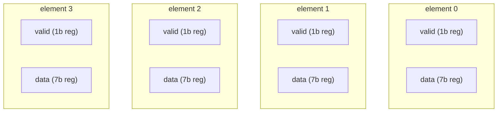

A **Karray** is Kathryn's typed multi-dimensional array. Think of it as an array
of *records*: you declare the element layout once (a set of named, sized fields),
give the array a shape and a backing, and Kathryn materializes the hardware for
you. It is the natural building block for register files, reorder buffers,
scoreboards, and any other "table of structs" you would otherwise wire by hand.

The defining property of a Karray is that **each field of each element is its own
hardware component**. A 4-entry array whose element is `{valid: 1, data: 7}`
materializes eight independent registers — not four packed 8-bit vectors that get
bit-sliced. A field reference drives (or reads) exactly that field's hardware,
full-width, with no bit-level splitting.

This is the **Hardware Aggregator** — a Table of Slots, where every slot (an
element's field) is its own independent component:



## Declaring a Karray

Declare the element layout by subclassing `Karray` and listing fields with
`kaf(width)` (short for *Karray field*). Then construct the subclass with a
backing, a shape, and an optional name:

```python
from kathryn import *

class RfEntry(Karray):
    valid = kaf(1)
    data  = kaf(7)

class my_module(Module):
    @init
    def com_declare(self):
        # 4 entries, each a {valid:1, data:7} record, register-backed
        self.rf = RfEntry(HwComponentType.REG, (4,), "rf")
```

The constructor signature is
`Karray(backing, shape=(1,), name=None, **fields)`:

- **`backing`** — a `HwComponentType` member: `REG` (clocked, assign with `|=`)
  or `WIRE` (combinational, assign with `*=`). See
  [Backings](/userbook/karray/backings/).
- **`shape`** — an iterable of dimension extents. `(4,)` is a 1-D array of 4
  elements; `(5, 3)` is a 5×3 grid. Every dimension must be positive, and the
  shape must have at least one dimension.
- **`name`** — optional; auto-generated if omitted. The name shows up in the
  emitted Verilog as a prefix (e.g. `REG_rf_E0_valid_6184`).
- **`**fields`** — per-instantiation field widths and extra fields. Covered in
  [Element Records](/userbook/karray/records/); you can ignore it until you
  need one record class at more than one width.

The field name defaults to the attribute name; `kaf(width, name)` lets you
override it (the only way to reach a field name that is not a Python
identifier). Duplicate field names raise a `TypeError` at class-definition
time, as does a field named after one of the constructor's own parameters
(`backing`, `shape`, `name`).

Field declarations are **inherited**: a subclass of a Karray subclass collects
the base class's fields first (oldest ancestor first), then adds its own. A
subclass may not re-declare a name it already inherited.

:::note
Declare Karrays inside a `Module`'s `@init` method (like any other hardware), so
they attach to the module scope. See [Modules](/userbook/modules/modules/).
:::

## Static access: `rf[i][j].field`

Indexing a Karray with plain integers selects an element; a trailing attribute
selects a field of that element:

```python
self.rob = RobEntry(HwComponentType.REG, (5, 3), "rob")

self.rob[2][1].valid        # the valid field of element (2, 1)
self.rob[2][1].reg_idx      # the reg_idx field — a DIFFERENT hardware component
```

Each hop of `[]` indexes one more dimension; the `.field` suffix narrows the
reference to a single field. A field reference behaves like a signal: use it as
an assignment source or destination.

Because every field is its own component, `rob[2][1].valid` resolves to a 1-bit
register and `rob[2][1].reg_idx` to a 5-bit register — two distinct pieces of
hardware, not two slices of one packed word. Referencing a field name that was
never declared raises a `ValueError` when the reference is resolved.

:::caution
**Every dimension must be indexed.** A selection always names exactly one
element, so `rob[0].valid` on a 2-D array is a `ValueError` ("a Karray selection
must index every dimension"), raised when the statement is built. There are also
no ranges: `rf[0:2]` and `rf[0, 1]` both raise a `TypeError` at the subscript
itself. See [Indexing](/userbook/karray/indexing/) for the three index kinds
that *are* supported.
:::

## Writing elements

There are two write styles (both shown here on a reg backing, so `|=`):

```python
with seq():
    # field-wise: drive each field's own component
    self.rf[0].valid |= self.c_valid
    self.rf[0].data  |= self.c_data

    # whole-element: a {field_name: source} map; each named source
    # is connected to the field of that name (full-width, no bit split)
    self.rf[1] |= {"valid": self.c_pvalid, "data": self.c_pdata}
```

A whole-element assignment takes a **dict keyed by field name** — never a packed
bit-vector. Sources may be signals or plain ints (an int is wrapped into a
field-width `val`, as everywhere else). Reading, on the other hand, always goes
through a specific field (`rf[0].data`); you cannot read a whole element as one
value.

A Karray with exactly **one** field accepts a bare scalar source, since the
field is unambiguous:

```python
class Cell(Karray):
    data = kaf(8)

self.cells = Cell(HwComponentType.REG, (4,), "cells")

with seq():
    self.cells[0] |= self.s      # bare signal -> the sole field
    self.cells[1] |= 5           # bare int    -> the sole field, width-matched
```

On a multi-field Karray the same statement is a `TypeError` — name the fields.

:::caution
A bare `=` is rejected on every Karray form (`rf[0] = {...}` and
`rf[0].data = s` both raise). The operator carries the clocked/combinational
intent, so it must be `|=` or `*=`, matching the backing.
:::

## Resetting a whole array

`Karray.reset(**fields)` records a reset value for **every element** of a
reg-backed array, one keyword per field:

```python
self.rat = RatEntry(HwComponentType.REG, (32,), "rat")
self.rat.reset(renamed=0, prf_idx=0)
```

It records the value on each element's own backing register and calls
`reg.reset`, so the reset event, its priority (`DEFAULT_UE_PRI_RST`) and its
clock are the register's own — a Karray adds no reset mechanism of its own. A
field left out of the call keeps no reset value and powers up undefined, the
same as a bare `reg`. It is whole-array only: one value per field, shared by
every element. Calling it on a wire-backed Karray raises a `TypeError`.

## What gets emitted

For the 4-entry `{valid:1, data:7}` register file above, the Verilog backend
emits one register per (element, field), named
`<KIND>_<array>_E<flat>_<field>_<id>` where `<flat>` is the row-major flattened
element index:

```verilog
reg   REG_rf_E0_valid_6184;
reg  [6:0]  REG_rf_E0_data_6185;
reg   REG_rf_E1_valid_6186;
reg  [6:0]  REG_rf_E1_data_6187;
// ... E2, E3 ...
```

and each write becomes an ordinary clocked assignment on that field's register.

## Where to next

- [Element Records](/userbook/karray/records/) — `kaf()` defaults, widths
  chosen at instantiation, added fields, and nested `KBundle` records.
- [Backings](/userbook/karray/backings/) — reg vs wire, and which assignment
  operator each allows.
- [Indexing](/userbook/karray/indexing/) — the three index kinds: static,
  runtime binary address, and custom function.
- [Dynamic Writes](/userbook/karray/dynamic-writes/) — runtime-selected writes
  and custom write-enable logic.
- [Reduce](/userbook/karray/reduce/) — fold a dimension down to a single winner.
