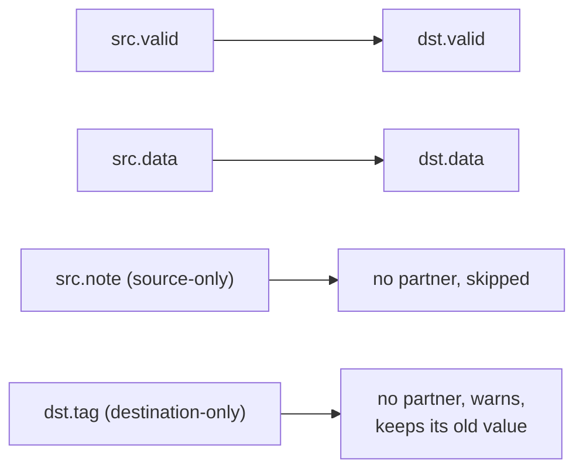
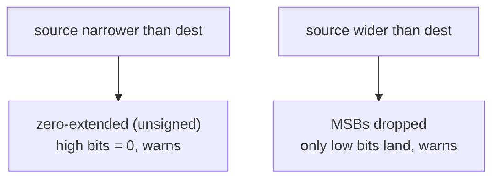

This page covers moving data *between* structures: copying one Karray element
into another, what happens when an assignment source's width does not match its
destination, and — as the running worked example — the register-file pattern
from `tc29_karray_regfile`.

## Karray-to-karray assignment

Assigning one Karray element to another copies **field by field, paired by
exact name and width**:

```python
class SrcArray(Karray):
    valid = kaf(1)
    data  = kaf(8)
    note  = kaf(4)

class DstArray(Karray):
    valid = kaf(1)
    data  = kaf(8)
    tag   = kaf(4)

self.src = SrcArray(HwComponentType.REG, (4,), "src")
self.dst = DstArray(HwComponentType.REG, (4,), "dst")

with seq():
    self.dst[0] |= self.src[1]     # element copy: valid + data cross, tag/note skipped
    self.dst[3] |= self.src[0]
```

The rules:

- **Both sides name exactly one element.** Every dimension is indexed on both
  sides, using any of the [three index kinds](/userbook/karray/indexing/).
  There are no ranges, so there is no shape matching to get wrong.
- **Fields pair by name + width.** Here `valid` and `data` copy across.
  `note` (source-only) and `tag` (destination-only) have no partner, so they
  are **skipped — and a Python warning fires** naming the skipped destination
  fields. A skipped destination field keeps whatever value it already had.
  If *no* field pairs at all, the assignment is a `ValueError`.
- **Bundle fields pair structurally.** A bundle is already flat by the time
  pairing runs, so `pos_x`/`pos_y` pair like any other leaf and neither side
  needs to know the fields came from a `kaf(Vec2)`
  ([Element Records](/userbook/karray/records/)).
- **The operator follows the destination's backing**: `|=` for reg-backed,
  `*=` for wire-backed — a runtime-selected destination must be reg-backed, as
  always ([Dynamic Writes](/userbook/karray/dynamic-writes/)).

Fields pair by name and width; unpaired fields on either side are skipped:



### Runtime selections on either side

Both sides may collapse dimensions at runtime, and the two sides do different
things with them: the source side builds mux and reduce trees, the destination
side builds write enables.

```python
# a dynamically-selected SOURCE element into a static destination
self.dst[0] |= self.src[self.sel]

# all three kinds, both sides, in one statement
self.a[1][en_fn][1][self.aw] |= self.b[pick_max][self.br][1]
```

The second form is `tc35_karray_mixed_k2k`: the write side guards with a custom
enable on one dimension and a dynamic address on another, while the read side
folds one dimension with a max-by-data reduce and muxes another. Exactly one
destination element takes the value; the guarded neighbours keep theirs.

Whole-array shorthand also works when the shapes are the same rank and every
dimension is meant to be taken as one element — but in practice you index both
sides explicitly, which is what the examples above do.

## Assignment-source auto-resize

Whenever any assignment's source width differs from its destination — plain
signals and Karray fields alike — the connector sanitizes the source rather
than erroring:

| Mismatch | Behaviour |
| --- | --- |
| source **narrower** than destination | zero-extended (unsigned) through an extend expression; high bits become 0 |
| source **wider** than destination | the source slice is narrowed; MSBs dropped, only the low bits land |

```python
self.wide   = reg(8)      # 0xAB
self.narrow = reg(4)      # 0xD

self.trunc  = reg(4)
self.extend = reg(8)

with seq():
    self.trunc  |= self.wide      # 8 -> 4 : low nibble lands (0xB), warns
    self.extend |= self.narrow    # 4 -> 8 : zero-extended (0x0D),  warns
```



:::caution
Each implicit resize raises a **Python warning** naming both widths and the
destination — `"assignment source (8 bits) is wider than destination
'REG_trunc_…' (4 bits); MSBs dropped to fit"`, or the matching
`"zero-extended (unsigned) to fit"`. The design still builds and the masked
semantics are well defined, but treat the warnings as a prompt to check your
widths — silent truncation is the classic RTL bug. `tc19_asm_resize` pins down
both behaviours in simulation and asserts the warnings fire exactly once each.
:::

Note that k2k field pairing is **exact on width**, so it never resizes: a
same-named field of a different width simply does not pair and is reported as
skipped. Resizing only happens on scalar sources — a signal, an int, or a
`{field: source}` map entry.

## Worked example: a tiny register file

The register-file pattern brings the pieces together: a 1-D reg-backed Karray
as storage, static writes in both styles, and read-back through ordinary
output registers. This is `tc29_karray_regfile`:

```python
class RfEntry(Karray):
    valid = kaf(1)
    data  = kaf(7)

class tc29_karray_regfile(Module):
    @init
    def com_declare(self):
        # 4-entry register file; each field its own reg
        self.rf = RfEntry(HwComponentType.REG, (4,), "rf")

        self.c_valid = val(1, 1,  "c_valid")
        self.c_data  = val(7, 42, "c_data")

        # outputs mirroring the read-back fields
        self.o_valid = reg(1, "o_valid"); self.o_valid.mark_output("my_v")
        self.o_data  = reg(7, "o_data");  self.o_data.mark_output("my_d")

    @flow
    def my_flow(self):
        self.o_valid.reset(0)
        self.o_data.reset(0)

        with seq():
            # entry 0 — field-wise writes into the per-field regs
            self.rf[0].valid |= self.c_valid
            self.rf[0].data  |= self.c_data

            # entry 1 — whole-element write; each named source lands on its field
            self.rf[1] |= {"valid": self.c_valid, "data": self.c_data}

            # read entry 0 back out through the output regs
            self.o_valid |= self.rf[0].valid
            self.o_data  |= self.rf[0].data
```

Emitted per (element, field) — one register and one guarded clocked write each:

```verilog
reg   REG_rf_E0_valid_6184;
reg  [6:0]  REG_rf_E0_data_6185;

always @(posedge WIRE_clk_6240) begin
    if (SR_ST_seq_state_6206_0_ST_6274) begin
        REG_rf_E0_valid_6184 <= VAL_c_valid_6194;
    end
end
```

From here the pattern grows naturally:

- swap the constant indices for signals to get a real read/write port
  ([Indexing](/userbook/karray/indexing/),
  [Dynamic Writes](/userbook/karray/dynamic-writes/));
- add a [reduce](/userbook/karray/reduce/) to pick an entry by priority;
- give the record a `reset(...)` so the whole table powers up clean
  ([Karray Basics](/userbook/karray/basics/#resetting-a-whole-array)).

The full, simulated versions are `tc29_karray_regfile` (register file),
`tc19_asm_resize` (resize), `tc34_karray_to_karray` (field pairing and skips)
and `tc35_karray_mixed_k2k` (all three index kinds on both sides) in the
[Examples Gallery](/userbook/examples/gallery/).
