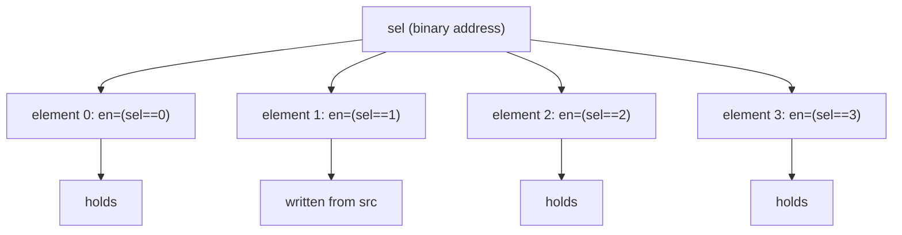
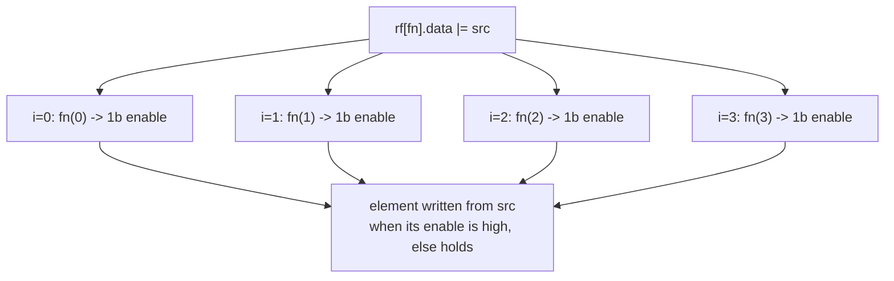

A **dynamic write** stores into an element chosen at runtime: the selected
element takes the new value, every other element **holds**. Kathryn builds the
per-element write-enable decode for you — a guarded clocked assign on each
element's register.

Dynamic writes require a **reg backing** and the clocked operator `|=`. There
is no combinational variant: a wire cannot "hold" the non-selected elements.

Two of the [three index kinds](/userbook/karray/indexing/) collapse a dimension
at runtime, and on a write destination each becomes a per-element enable:

| Index | Enable for element `k` |
| --- | --- |
| `d[sig]` (binary address) | `sig == k`, built for you |
| `d[fn]` (custom fn) | whatever `fn(k)` returns — a 1-bit signal you build |

## Binary-address write

Index with a signal and assign the field:

```python
class RfEntry(Karray):
    valid = kaf(1)
    data  = kaf(8)

class worker(Module):
    @init
    def decl(self):
        self.rf  = RfEntry(HwComponentType.REG, (4,), "rf")
        self.sel = reg(2)       # binary address
        self.src = reg(8)

    @flow
    def f(self):
        with seq():
            self.rf[self.sel].data |= self.src   # enable for element k is (sel == k)
```

For each element `k` the emitted register write is guarded by that element's
enable, nested inside whatever gates the enclosing flow step:

```verilog
always @(posedge WIRE_clk_6943) begin
    if (SR_ST_seq_state_6856_0_ST_7001) begin        // the seq step
        if (EXPR_VAL_bsel0_6842_EQ1_C_6863) begin    // sel == 1
            REG_rf_E1_data_6830[7:0] <= VAL_c_d0_6837[7:0];
        end
    end
end
```

The decode enables exactly the selected element; every other element holds:



## Whole-element write map

A runtime index also accepts the `{field_name: source}` map form — each named
source lands on the field of that name, on the selected element:

```python
self.rf[self.sel] |= {"valid": self.v, "data": self.d}
```

Bundle fields nest, and int literals wrap to the field width:

```python
self.rf[self.sel] |= {"valid": 1, "pos": {"x": self.sx, "y": self.sy}}
```

A single-field Karray also takes a bare scalar or int source
(`self.rh[self.msel] |= 7`), since the field is unambiguous.

## Custom write enables: a callable index

The binary decode covers "exactly one element, selected by an address". For
anything else — a one-hot grant vector, a comparison, a mask you compute
yourself, or a write that lands on *several* elements — pass a **function** as
the index. On a write destination it is called once per index of that
dimension and must return a **1-bit enable**:

```python
d[lambda i: <1-bit signal>] |= source
```

The index `i` is a plain Python `int` known at build time; the signal you build
from it is real hardware. Three common shapes:

```python
# one-hot: element i is written when the grant line's bit i is high
self.rf[lambda i: self.oh[i]].data |= self.src

# compare: the same decode the binary form builds, written out by hand
self.rf[lambda i: self.sel == i].data |= self.src

# threshold: a MULTI-element write the binary decode cannot express —
# every element below thr takes the sentinel
self.rg[lambda i: self.thr > i].data |= self.c_sn
```

The callable fans out over the dimension's extent — one enable per element,
each built from that element's build-time index:



:::tip
When a loop variable feeds the closure, bind it as a default argument —
`lambda j, i=i: self.seli[i] == j` — the classic Python
late-binding-in-loops fix. `tc32_karray_cus_index` uses exactly this shape.
:::

The function must return a **1-bit** signal per index; anything wider is a
`TypeError` ("custom write index fn for dim N must return a 1-bit enable").

## Pitfalls

:::caution
**Combinational dynamic writes are rejected.** `rf[sel].data *= src` raises a
`TypeError` on a wire-backed Karray — the non-selected elements would need to
hold their value, which a wire cannot do.

**A bare `=` is always rejected.** Every Karray assignment must state its
intent with `|=` or `*=`; there is no backing-resolved form. See
[Backings](/userbook/karray/backings/).

**Narrow selectors are rejected.** A binary selector must be wide enough to
address the dimension (4 elements need at least 2 bits); resolution fails with
a `ValueError` otherwise.

**Every dimension must be indexed.** A runtime index collapses one dimension
like any other kind — it does not stand in for the ones you left out.
:::

## Worked examples

- **`tc31_karray_dynamic_assign`** — the write-side mirror of the dynamic read:
  binary-address writes at two addresses, a one-hot custom-fn write, and a
  whole-element map write, each landing on exactly one element while the others
  hold. Every element is written by exactly one statement with a distinct
  value, so the final state is deterministic.
- **`tc32_karray_cus_index`** — the custom-fn index in depth: per-element
  compare enables built in a loop, element map writes over a seeded array, a
  dynamic write whose source is a raw int, and a reduce read on the same array.

Both are listed in the [Examples Gallery](/userbook/examples/gallery/).
