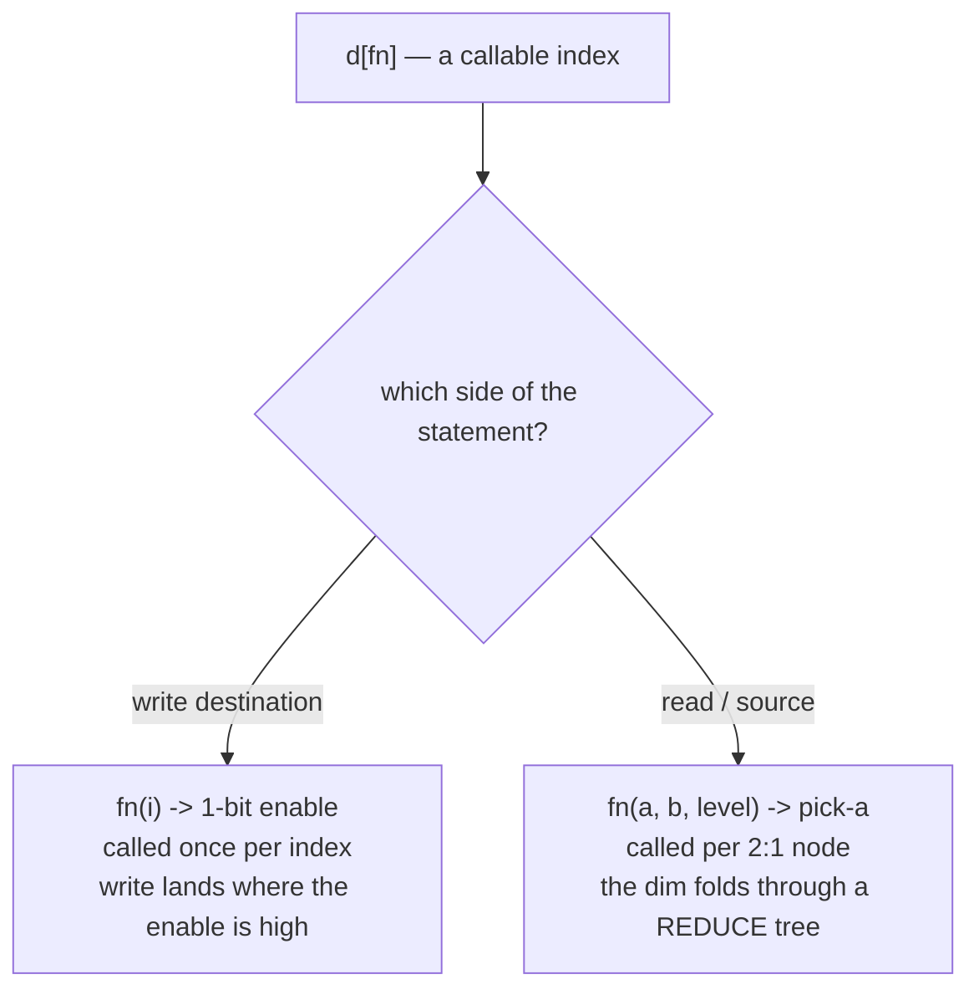
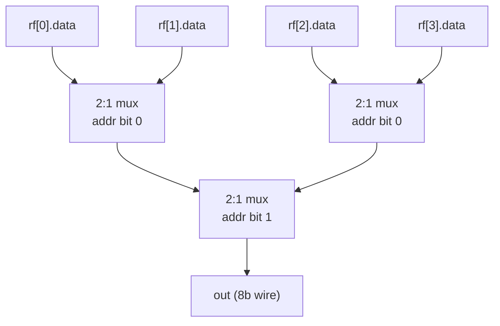

Kathryn has **one** Karray index type, and every access — read, write, and
karray-to-karray copy — uses it. Each `[]` hop selects **one** dimension, and
every kind **collapses that dimension to a single element**: a selection always
names exactly one element, and every dimension must be indexed.

| Index | Kind | Meaning |
| --- | --- | --- |
| `d[3]` | static | picks one element of the dimension at build time |
| `d[sig]` | dynamic | a runtime **binary-encoded** address |
| `d[fn]` | custom fn | a user function; **splits by direction** — see below |

The custom-fn kind is the same syntax on both sides of an assignment, but it
means different hardware depending on which side it lands on:



Write enables are covered in
[Dynamic Writes](/userbook/karray/dynamic-writes/); the read-side fold has its
own page, [Reduce](/userbook/karray/reduce/). This page covers static indexing,
the dynamic binary address, and how the kinds mix.

:::caution[There are no ranges]
Every subscript names exactly one element. Both range forms raise a
`TypeError` at the subscript itself:

```python
self.rf[0:2]     # TypeError: use inclusive comma form ... — ranges are not supported
self.rf[0, 1]    # TypeError: Karray ranges are not supported —
                 #            index exactly one element per dimension
```

Under-indexing is caught too: on a 2-D Karray, `rf[0].data |= s` raises a
`ValueError` ("a Karray selection must index every dimension") when the
statement is built. Over-indexing raises the same way.
:::

## Static indexing

Plain `int` keys pin an element at build time. This is the form
[Karray Basics](/userbook/karray/basics/) uses throughout, and it costs no
hardware at all — the selection resolves straight to the backing components:

```python
self.grid = Cell(HwComponentType.REG, (3, 4), "grid")

self.grid[2][1].d          # element (2, 1)'s d field — a plain register
self.grid[2][1] |= {"v": self.a, "d": self.b}
```

Static indices are bounds-checked against the shape; `grid[3][0]` on a 3-row
array is a `ValueError`. A `bool` is never accepted as an index, even though
Python treats it as an `int`.

## Dynamic binary read

Index with a bare signal and Kathryn treats it as a binary-encoded address.
Reading a field of the dynamically-selected element builds a balanced 2:1 mux
tree over all candidate elements and returns a fresh wire of the field width:

```python
class RfEntry(Karray):
    valid = kaf(1)
    data  = kaf(8)

class worker(Module):
    @init
    def decl(self):
        self.rf  = RfEntry(HwComponentType.REG, (4,), "rf")
        self.sel = reg(2)          # 2-bit binary address for 4 elements
        self.out = reg(8)

    @flow
    def f(self):
        with seq():
            self.out |= self.rf[self.sel].data    # mux over rf[0..3].data
```

The read result is an 8-bit combinational wire (the mux output), regardless of
the array's backing. Every element's `data` is wired into the tree, and each
layer switches on **one** bit of the address — the inverted bit picks the left
child:

```verilog
reg  [7:0]  WIRE_KARRAY_rf_6389_D0L0N0F0_DMUX_6454;

always @(*) begin
    WIRE_KARRAY_rf_6389_D0L0N0F0_DMUX_6454[7:0] <= VAL_..._DEFAULT_ZERO_6776[7:0];
    if (EXPR_VAL_bsel0_6396_B0_N_6453) begin              // address bit 0 low
        WIRE_KARRAY_rf_6389_D0L0N0F0_DMUX_6454[7:0] <= REG_rf_E0_data_6382[7:0];
    end else begin
        WIRE_KARRAY_rf_6389_D0L0N0F0_DMUX_6454[7:0] <= REG_rf_E1_data_6384[7:0];
    end
end
```

The mux wires are named `WIRE_KARRAY_<array>_D<dim>L<level>N<node>F<field>_DMUX_<id>`
— dimension, tree level, node within the level, and field index — so a tree is
easy to follow in a waveform.

Every element's field feeds a balanced 2:1 mux tree, one address bit per layer:



:::caution
The selector must be **wide enough to address the dimension**. Indexing a
4-element dimension with a 1-bit signal is a `ValueError` when the reference is
resolved. A *sliced* signal (`sig[3, 0]`) is materialised into a real expression
first, so no bits are silently dropped — but it is clearer to assign the slice
to a wire and index with the wire.
:::

## Mixing kinds across dimensions

Every dimension gets its own kind, and they combine freely. Pinning a dimension
with an int shrinks the tree to just that row or column:

```python
class Cell(Karray):
    v = kaf(1)
    d = kaf(6)

self.grid = Cell(HwComponentType.REG, (3, 4), "grid")
self.sel  = reg(2)

got = self.grid[2][self.sel].d      # row 2 static, column dynamic -> 4:1 mux
```

The result is a single 6-bit wire selecting among `grid[2][0..3].d` only.

A single statement may mix all three kinds, on both sides — the destination's
runtime dimensions become write enables while the source's become mux and
reduce trees:

```python
# a: shape (2, 3, 2, 3);  b: shape (2, 3, 2);  element {data: 8}
self.a[1][en_fn][1][self.aw] |= self.b[max_fn][self.br][1]
#      ^   ^     ^   ^              ^        ^        ^
#  static  |  static |            reduce     |      static
#      custom enable dyn (binary)          dyn (binary)
```

This is `tc35_karray_mixed_k2k`, which verifies exactly one destination element
takes the value and that the guarded neighbours keep theirs.

## A dynamic read must land on a field

A dynamic read resolves to *one field's* hardware:

```python
self.rf[self.sel].data        # OK — a field of the selected element
self.rf[self.sel]             # not a readable value on its own
```

Reading a whole element raises a `TypeError` ("read a specific field
(`d[i][j].field`), not a whole Karray element"). The one place a whole element
*is* a legal source is a karray-to-karray assignment, where the destination
supplies the field names — see
[Conversion & Resize](/userbook/karray/conversion-and-resize/).

## Dynamic reads build hardware — do them in scope

A dynamic read *materializes* mux hardware the moment the reference is
resolved, so it must happen inside a module scope — an `@init` or `@flow`
method — like any other hardware construction. Using the result as an
assignment source inside a flow block (as in the examples above) is the
normal pattern.

## Worked example: tc30

`tc30_karray_dynamic_index` fills a 4-entry register file with known data, then
reads it back through both runtime forms:

```python
with seq():
    # fill every element with its known (valid, data)
    for i in range(4):
        self.rf[i].valid |= self.c_v
        self.rf[i].data  |= self.c_d[i]

    # binary dynamic read of each address (rf[bsel_i].data == DATA[i])
    for i in range(4):
        self.o_d[i] |= self.rf[self.bsel[i]].data

    # read-side custom fn -> reduce fold: the max element's data
    self.o_max |= self.rf[lambda a, b, l: a.fields["data"] >= b.fields["data"]].data
```

Every address, including `bsel = 2` (a non-zero MSB), is verified end to end in
simulation. See the [Examples Gallery](/userbook/examples/gallery/) for the
full file.

Writing through a runtime index is covered next, in
[Dynamic Writes](/userbook/karray/dynamic-writes/).
