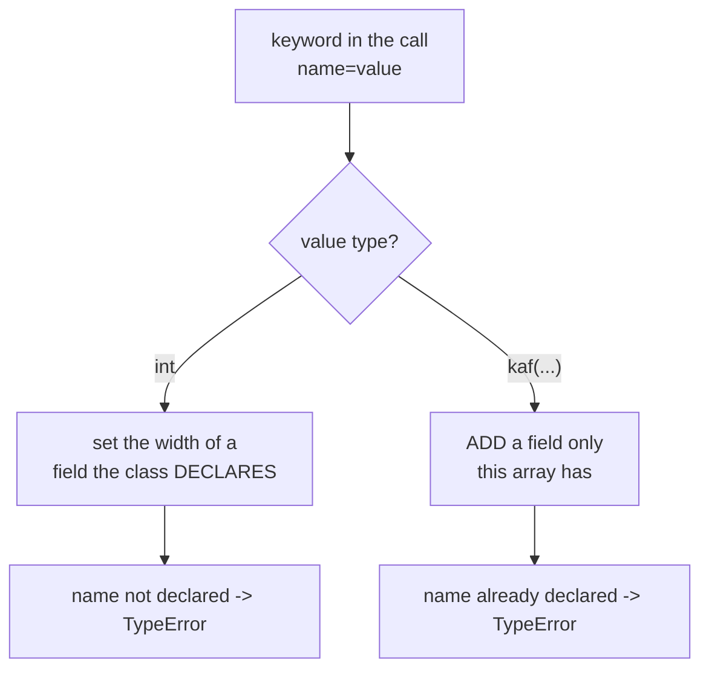
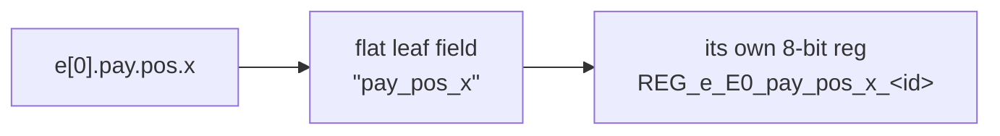

A Karray's element is a **record**: a flat list of `(name, width)` fields. The
class body states the shape a record *usually* has; the call that builds one
array settles it. This page covers the whole declaration surface —
`kaf()` defaults, widths supplied at instantiation, fields added to a single
array, and reusable `KBundle` records that nest.

Everything here is declaration-time Python. The Rust core only ever sees a
**flat** `(name, width)` list; nesting and defaults are resolved before the
array is built.

## `kaf()` — three ways to declare a field

```python
from kathryn import *

class Entry(Karray):
    valid = kaf(1)          # leaf, width 1 — a DEFAULT the call may override
    tag   = kaf(8)          # leaf, width 8 — likewise
    data  = kaf()           # leaf, NO default: every instantiation must size it
    pos   = kaf(Vec2)       # nested bundle — flattens to pos_x, pos_y
```

| Form | Meaning |
| --- | --- |
| `kaf(width)` | A leaf field. The width is a **default**; an instantiation may override it. |
| `kaf()` | A leaf field with **no** default — every instantiation must give it a width. This is how a record says "this number is the caller's to choose". |
| `kaf(BundleType)` | Nests that bundle's fields under this field's name, flattened with `_`. |
| `kaf(width, "name")` | Any of the above with an explicit field name, overriding the attribute name. The only route to a name that is not a Python identifier. |

A `kaf()` with no width that is never sized raises at instantiation:

```python
Entry(HwComponentType.REG, (2,), "bad")
# TypeError: ... field 'data' was declared with kaf() and no width,
#            so the instantiation must give it one (e.g. data=32)
```

## Widths at instantiation

Pass a field name as a keyword with an **int** value to set that field's width
for this array only. The class is never mutated, so two arrays of one class can
differ:

```python
class Entry(Karray):
    pc    = kaf(32)
    instr = kaf(32)

class worker(Module):
    @init
    def decl(self):
        self.wide = Entry(HwComponentType.REG, (2,), "wide", pc=64, instr=16)
        self.dflt = Entry(HwComponentType.REG, (1,), "dflt")   # 32 / 32
```

`wide[0].pc` is 64 bits and `wide[1].instr` is 16; `dflt[0].pc` is still 32.
`Entry.__karray_fields__` remains `(("pc", 32), ("instr", 32))`.

This is what a generator sizing its arrays from a description needs — a CPU's
PC width, an ISA's instruction length. Without it, one record shape at two
widths meant two classes.

The override is checked, so a typo cannot silently do nothing:

```python
Entry(HwComponentType.REG, (2,), "e", dat=16)    # TypeError: no field named 'dat'
Entry(HwComponentType.REG, (2,), "e", data="16") # TypeError: width must be an int
Entry(HwComponentType.REG, (2,), "e", data=0)    # ValueError: width must be >= 1
```

## Adding a field to one array

The keyword's **value** is what picks between the two operations: an `int`
sets a declared field's width, a `kaf()` **adds** a field this array has and the
class does not.

```python
self.spec  = Entry(HwComponentType.REG, (2,), "spec",
                   pc=64,             # width for a DECLARED field
                   spectag=kaf(8))    # a field only THIS array carries
self.plain = Entry(HwComponentType.REG, (1,), "plain")
```

`spec[1].spectag` is an 8-bit field; `plain[0].spectag` raises a `ValueError` —
the sibling array never got it. Added fields land **after** the declared ones,
in keyword order, and flatten through the same walk a class-body bundle takes.

Two guards keep the two operations from blurring:

```python
Entry(HwComponentType.REG, (2,), "e", pc=kaf(16))
# TypeError: field 'pc' is already declared on the class ... pass a width instead (pc=<bits>)

Entry(HwComponentType.REG, (2,), "e", spectag=kaf())
# TypeError: an added field must state one (e.g. spectag=kaf(8))
```

The keyword's value decides which operation runs:



## `KBundle` — reusable nested records

`KBundle` is a pure declaration type: subclass it, list `kaf()` fields, and
nest it into a Karray (or another bundle) with `kaf(TheBundle)`. It is never
instantiated — it only carries a flattened field list.

```python
class Vec2(KBundle):
    x = kaf(8)
    y = kaf(8)

class Payload(KBundle):
    pos = kaf(Vec2)          # bundle inside bundle
    tag = kaf(4)

class Entry(Karray):
    valid = kaf(1)
    pay   = kaf(Payload)

Entry.__karray_fields__
# (("valid", 1), ("pay_pos_x", 8), ("pay_pos_y", 8), ("pay_tag", 4))
```

Nesting flattens with an underscore-joined prefix, and attribute access
rebuilds exactly the same flat name:



Deeper nesting is flattened when each bundle class is *defined*, so one prefix
level is all that is ever applied at the next level up. A literal leaf that
collides with a bundle's flattened name is rejected when the class is written:

```python
class Bad(Karray):
    pos   = kaf(Vec2)        # -> pos_x, pos_y
    pos_x = kaf(8)           # TypeError: duplicate Karray field name: pos_x
```

## Reading and writing bundle fields

Attribute hops chain into the flat leaf name, and dict sources nest to match:

```python
class Entry(Karray):
    valid = kaf(1)
    pos   = kaf(Vec2)

with seq():
    # whole element via nested dicts
    self.a[0] |= {"valid": self.v, "pos": {"x": self.sx, "y": self.sy}}

    # a bundle FIELD target takes a sub-field map (ints allowed)
    self.a[1].pos |= {"x": self.sx, "y": 7}

    # a leaf write through the attribute chain
    self.a[1].pos.y |= self.sy

    # read-back through the same chain
    self.out |= self.a[0].pos.x
```

Karray-to-karray copies pair bundles **structurally** — by flat name and
width — so `b[0] |= a[0]` copies `pos_x`/`pos_y` across without either side
knowing they came from a bundle. See
[Conversion & Resize](/userbook/karray/conversion-and-resize/).

The worked example is `tc36_karray_bundle`, which exercises the nested-dict
write, the bundle-field map, the leaf write through the chain, and a bundle
k2k copy end to end.

## Reserved names

Field arguments ride in as keywords, so a field may not be named after one of
`Karray.__init__`'s own parameters — `backing`, `shape`, or `name`. Declaring
one raises when the class is written, not at a confusing call site later:

```python
class Bad(Karray):
    name = kaf(8)
# TypeError: Bad: field name(s) name collide with Karray.__init__ parameters
```

Use `kaf(8, "name")` on a differently-named attribute if you really need that
field name.

## Where to next

- [Backings](/userbook/karray/backings/) — reg vs wire and the operator rules.
- [Indexing](/userbook/karray/indexing/) — selecting elements at build time and
  at runtime.
- [Karray Basics](/userbook/karray/basics/) — the shape, the writes, and the
  emitted hardware.
