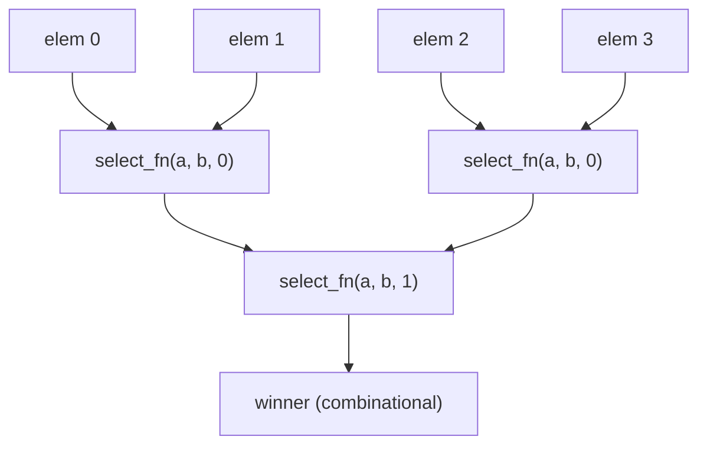

A **reduce** folds one dimension of a Karray down to a single winner using a
comparison you write in Python. Kathryn builds a balanced 2:1 tournament tree in
hardware: your select function is called once per compared pair, its return
value becomes the mux select, and the winner's fields ripple up the tree as
combinational wires. Use it for priority pickers, max/min finders,
oldest-entry selection — anything of the shape "scan the table, keep the best".

There is no separate `reduce` method. A reduce **is** the
[custom-fn index](/userbook/karray/indexing/) on the **read** side:

```python
winner_data = self.rf[select_fn].data
```

The same `d[fn]` syntax on a write destination means per-element write enables
instead ([Dynamic Writes](/userbook/karray/dynamic-writes/)); the direction of
the statement is what picks.

Each compared pair is resolved by your select function; winners ripple up:



## The select function

For every compared pair the function is called as `fn(a, b, level)`, where `a`
and `b` are `ReduceView`s and `level` is the tree layer (0 at the leaves). A
`ReduceView` has two attributes:

- **`.fields`** — a dict mapping each carried field name to its current signal:
  a leaf element's field at level 0, a prior layer's mux output above.
- **`.indices`** — the list of the folding dimension's indices this subtree
  covers (e.g. `[0, 1]` for the node that merged elements 0 and 1).

Return a **1-bit signal**; true picks `a`. The expression you build becomes
real combinational logic.

```python
class RegFile(Karray):
    valid = kaf(1)
    data  = kaf(8)

def pick_max(a, b, level):
    return a.fields["data"] >= b.fields["data"]

def pick_valid(a, b, level):
    av, bv = a.fields["valid"], b.fields["valid"]
    ad, bd = a.fields["data"],  b.fields["data"]
    # a wins if a is valid AND (b is invalid OR a.data >= b.data)
    return av & ((~bv) | (ad >= bd))

with seq():
    self.o_dm |= self.rf[pick_max].data      # data of the max-data element
    self.o_dv |= self.rf[pick_valid].data    # max data among VALID elements
    self.o_vv |= self.rf[pick_valid].valid   # the winner's other fields too
```

`pick_valid` shows why the callback style matters: the comparison consumes
*both* fields, so an invalid global maximum loses to the best valid element —
logic that a fixed "max by field" primitive could not express.

When a reduce dimension is present, the tree carries **every** field of the
element (the select fn may compare any of them), so reading a different field
of the same winner costs no extra tree.

Odd element counts are handled automatically: the unpaired node rides up to the
next layer and is compared there. For three elements the calls are
`([0], [1], level 0)` then `([0, 1], [2], level 1)` — exactly what `.indices`
reports.

## Pinning other dimensions

A reduce collapses **one** dimension. Every other dimension still needs its own
index, and pinning one with an int reduces only that row or column:

```python
self.grid = Cell(HwComponentType.REG, (2, 3), "grid")

# pin dim 0 to row 1, fold dim 1: reduce only row 1's three elements
self.o_r1 |= self.grid[1][pick_max_d].d
```

Nothing stops you from folding more than one dimension — give each its own
callable — and the other kinds mix in freely too, so a source side can pin one
dimension, mux a second with a runtime address, and fold a third:

```python
self.dst[0] |= self.src[pick_max][self.addr][1]
```

## Carrying extras between layers

A select function may return `(select, {name: signal})` instead of a bare
select. Each named extra **replaces** the same-named carried field on the
merged node, so the next layer — and the final result — see the extra rather
than the muxed original.

This example picks by *running sum*: each pair's winner carries the sum of the
subtree, so the top of the tree carries the sum of everything:

```python
def pick_sum(a, b, level):
    asum = a.fields["data"]
    bsum = b.fields["data"]
    return (asum >= bsum), {"data": asum + bsum}   # carried data = running sum

self.o_sm |= self.rf[pick_sum].data                # -> sum(DATA)
```

Because the extra replaces `data` at every level, the value read off the root
is the total, not the maximum — the select itself becomes incidental. Reading
the result of an extras fold gives you an `EXPR` handle (the final `a + b`)
rather than a mux-output wire.

## What gets built

The reduce *algorithm* — the pairing, the odd-node carry, the extras — runs in
the Rust core; the Python callback is invoked only to build each pair's select
expression, and the arena is handed back to it so the expression it builds
lands in the model. Everything it produces is combinational: the winner is
available in the same cycle its inputs settle. Reading `...field` yields a
wire, which you typically latch into an output register with `|=` inside a flow
block.

:::caution[No winner-index output]
The fold returns the winning element's *fields*, not its coordinate. There is
no `request_index` option. If you need the index, carry it yourself: add an
index field to the record, write each element's own index into it, and let the
fold carry that field up with the winner.
:::

## Worked examples

`tc33_karray_reduce_read` covers all three shapes on real hardware — a
max-by-data fold, an extras fold that sums, and a 2-D pin-and-fold — and
checks each against the expected value in simulation:

```python
self.o_mx |= self.rf[pick_max_data].data        # max(DATA)
self.o_sm |= self.rf[pick_sum_data].data        # sum(DATA), via extras
self.o_r1 |= self.grid[1][pick_max_d].d         # max of row 1
```

`tc32_karray_cus_index` shows a reduce read sitting alongside custom-fn writes
on the same array, and `tc35_karray_mixed_k2k` folds the source side of a
karray-to-karray copy. All are listed in the
[Examples Gallery](/userbook/examples/gallery/).
