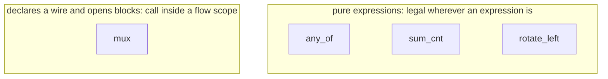
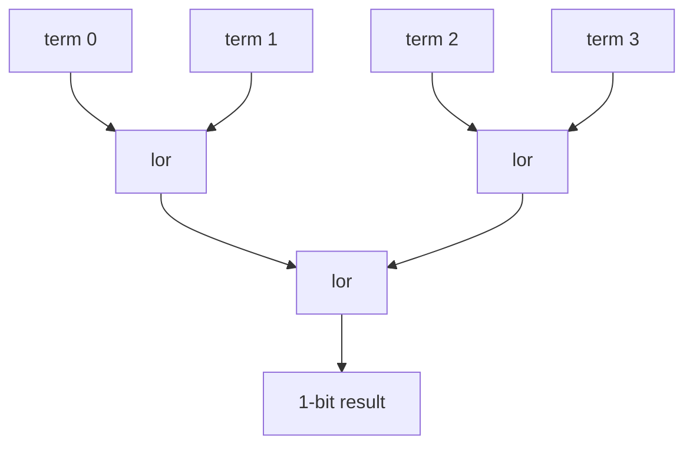

`kathryn.combinational` is a handful of combinational combinators built
**purely on the public DSL** — a select, an OR reduce, a population count, and
a rotation. Nothing in it adds a node type to the Rust core: each is a small
assembly of what signals, expressions and zero-cycle blocks already provide,
kept in one place so every caller writes the same one. All four are re-exported
from the top-level package:

```python
from kathryn import mux, any_of, sum_cnt, rotate_left
```

:::caution[The old `kathryn.lib` stdlib is gone]
Earlier versions shipped a `kathryn.lib` package with `zext`/`sext`, `cat`,
`replicate`, `or_reduce`/`and_reduce`, `Bundle` and `Decoupled`. It has been
removed along with its two test cases. `mux` and the reductions live on here;
for the others, use the primitives directly — `sig.extend(width)` for zero
extension ([Expressions](/userbook/core/expressions/)), sliced assignment for
concatenation ([Assignment](/userbook/core/assignment/)), and `KBundle`
records for grouped fields ([Element Records](/userbook/karray/records/)).
:::

The four split into two families, and the distinction decides *where* you may
call them:



## `mux(cond, if_true, if_false, width=None, name=None)`

`cond ? if_true : if_false`, as a combinational wire.

```python
self.next_pc *= mux(taken, target, self.pc + 4)
```

`mux` **declares hardware**: it creates a wire, then drives it from a
`zif`/`zelse` pair. That has two consequences worth internalising:

- It must be called inside an **open flow scope** — a `@flow` method. Calling
  it in `@init` puts the wire in the module but leaves the branches with
  nowhere to attach.
- It is a *statement that yields a value*, not a pure expression.

`width` defaults to the width of the first operand that is a signal; pass it
explicitly when both arms are int literals, or when the result should be wider
than its arms. Two int arms with no `width` raise a `TypeError`.

Because it returns the wire, muxes compose: `mux(c1, x, mux(c2, y, z))`. The
inner call runs before the outer `zif` opens, so its wire lands in the same
enclosing scope rather than nested inside a branch.

:::caution
A mux inherits the **scope** it was opened in, which matters inside `seq()`:
the emitted block is gated on that sequential step's state, so the wire reads
its default (0) on every other step. Read it in the same step that built it; a
value some later step needs belongs in a `reg`.
:::

Why a wire and a `zif`/`zelse` rather than a mask expression: Kathryn has no
ternary `LogicOp`, and the expression-only routes need a bit-replicated mask
that `extend` cannot make (it zero-fills). The `zif`/`zelse` chain is the
tested priority-mux path and emits a plain `if/else`.

## `any_of(terms, name=None)`

True when any of `terms` is — a **balanced** OR tree over 1-bit signals.

```python
self.over_use *= any_of([(free == 0).land(r) for r in self.req_port])
```

Pure expression: it builds no wire and opens no block, so it is legal wherever
an expression is. The fold is balanced (`log2(n)` gate depth, not `n`), and an
odd term rides to the next level unchanged.

An empty list is **false**, not an error: unlike a sum, an empty disjunction
has a defined value and a defined width. (It returns a 1-bit zero `val`.)



## `sum_cnt(bits, width=None, name=None)`

How many of `bits` are set — a **balanced adder tree**.

```python
freed = sum_cnt([e.valid for e in commit_entries])
```

Also a pure expression. The default result width is derived to be exactly wide
enough for the largest sum the inputs can make, so it can never overflow: for
1-bit inputs that is `len(bits).bit_length()` — four bits count 0..4 in three
bits — and the same formula stays correct for wider inputs. Every term is
extended to the result width first, so no intermediate add truncates.

Unlike `any_of`, an empty list is a `ValueError`: a sum over nothing has
neither a value nor a width.

`any_of` is a separate function rather than `sum_cnt(bits) != 0` because an OR
tree is the cheaper answer to "is any set" than an adder tree plus a
comparator.

## `rotate_left(signal, amount=1, width=None)`

`signal` rotated left by `amount`, as a pure expression.

```python
self.next_tag |= rotate_left(self.next_tag)     # one-hot tag, step one
```

`amount` is an **elaboration-time constant** taken mod `width`, so a full turn
is the identity and returns the signal unchanged. `width` defaults to the
signal's own width and is worth passing only to rotate *within* a narrower
field of a wider signal; it may not exceed the signal (`ValueError`).

The implementation is shifts and an OR, not a slice-and-concatenate: an
expression follows its **left** operand's width, so `x << k` and
`x >> (width - k)` are both `x`-wide, and what falls off one end is exactly
what the other end supplies. Verilog's `<<`/`>>` on unsigned regs are logical,
so nothing sign-fills.

Reading the signal's width is most of why this belongs in the package at all:
`SignalRef` exposes no public width, so a caller outside `kathryn` cannot write
this helper themselves.

## Where next

- [Expressions](/userbook/core/expressions/) — the operators and `extend`
  these combinators are built from.
- [Conditionals](/userbook/flow/conditionals/) — the `zif`/`zelse` pair `mux`
  emits.
- [Counter](/userbook/lib/counter/) — the accumulating counter CCP.
