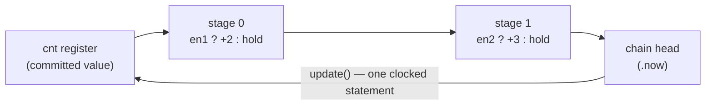

`counter` is a small complex component (CCP): a clocked register plus a
**chain of conditional adds** that is committed into it once per cycle. It is
the shape you reach for whenever several independent conditions each want to
bump the same count — a free list, an occupancy counter, a credit counter —
and you would otherwise hand-build a chain of adders and a mux per contributor.

```python
from kathryn import counter
```

## The shape

```python
class occupancy(Module):
    @init
    def com_declare(self):
        self.en1 = wire(1, "en1")
        self.en2 = wire(1, "en2")
        self.cnt = counter(3, "cnt")        # 3-bit, wraps mod 8

    @flow
    def my_flow(self):
        self.cnt.reset(0)

        self.cnt.add(2, self.en1)           # stage 0: en1 ? cnt + 2 : cnt
        self.cnt.add(3, self.en2)           # stage 1: en2 ? st0 + 3 : st0
        self.cnt.update()                   # cnt <= chain head
```

Each `add(amount, enable)` chains **one combinational stage** —
`enable ? prev + amount : prev` — onto the counter. `update()` commits the head
of the chain into the backing register as one clocked statement in the current
flow scope; the chain then restarts from the register. So the adds
**accumulate**: with both enables high, `cnt' = cnt + 5`.



## API

| Member | Meaning |
| --- | --- |
| `counter(bit_width, name=None)` | Construct. The value wraps mod `2**bit_width`. |
| `.add(amount, enable=None)` | Chain one stage. `amount` may be a signal or an int (wrapped to counter width). Without `enable` the add is unconditional. Returns the new chain head as a `SignalRef`. |
| `.update()` | Commit the chain head into the register — one clocked statement in the current scope. |
| `.value` | The **committed** register: what the counter reads after the clock edge. |
| `.now` | The **chain head**: the uncommitted combinational value (the register itself when nothing is pending). |
| `.reset(value)` | Reset value of the backing register — mirrors `reg.reset`. |
| `.width` | The declared bit width. |
| `.ident` | The underlying `CcpIdent`. |

`.value` is an ordinary signal handle, so it takes `mark_output(...)` and can
be read anywhere:

```python
self.cnt.value.mark_output("cnt_out")
```

`.now` is what you read when you need this cycle's *pending* total — for
example to decide, in the same cycle, whether the count will overflow:

```python
self.now_probe *= self.cnt.now       # sampled BEFORE the commit
```

## An enable-less counter

Omit the enable for a plain free-running count:

```python
self.free = counter(4, "free")
self.free.reset(0)
self.free.add(1)
self.free.update()                   # +1 every cycle, mod 16
```

## What gets emitted

The register is a plain `reg` named `REG_<name>_CNT_<id>`; each chained stage
is a combinational wire `WIRE_<name>_ST<n>_<id>` driven by a `zif`/`zelse` pair
over the stage's adder expression:

```verilog
reg  [2:0]  REG_cnt_CNT_9520;

always @(*) begin
    WIRE_cnt_ST0_9536[2:0] <= VAL_WIRE_cnt_ST0_9536_DEFAULT_ZERO_9587[2:0];
    if (WIRE_en1_9518) begin
        WIRE_cnt_ST0_9536[2:0] <= EXPR_cnt_ADD0_9535[2:0];   // cnt + 2
    end else begin
        WIRE_cnt_ST0_9536[2:0] <= REG_cnt_CNT_9520[2:0];     // hold
    end
end

always @(posedge WIRE_clk_9559) begin
    REG_cnt_CNT_9520[2:0] <= WIRE_cnt_ST1_9543[2:0];         // update()
    if (WIRE_mrst_9560) begin
        REG_cnt_CNT_9520[2:0] <= VAL_val0_9530[2:0];         // reset, wins
    end
end

assign EXPR_cnt_ADD0_9535 = REG_cnt_CNT_9520[2:0] + VAL_val2_9533[2:0];
```

An unconditional `add` skips the mux entirely — the commit reads the adder
expression directly (`REG_free_CNT <= EXPR_free_ADD0`).

Note the reset write is emitted **last** in the clocked block, at
`DEFAULT_UE_PRI_RST`, so a held master reset pins the counter at its reset
value regardless of what the chain says — the usual
[write-priority](/userbook/priority/write-priority/) rule.

:::note
`update()` in a bare flow scope (outside any `seq`/`par`) commits every cycle:
the module hands its clock straight to the node, so the statement lands in a
plain `always @(posedge clk)` with no state gating. Put the `update()` inside a
flow block if the commit should only happen on certain steps.
:::

## Worked example

`tc39_dyn_counter` is exactly the two counters above — a 3-bit counter with two
enabled adds plus a `now` probe, and a 4-bit enable-less counter — with a
cocotb testbench driving every enable combination and checking the modular
wrap. See the [Examples Gallery](/userbook/examples/gallery/).

## Where next

- [Combinational Helpers](/userbook/lib/combinational/) — `sum_cnt`, which
  pairs naturally with a counter when the increment is "how many of these
  fired".
- [Write Priority](/userbook/priority/write-priority/) — why the reset write
  wins.
- [Arbiters](/userbook/pipelines/arbiters/) — the other user-facing CCP.
