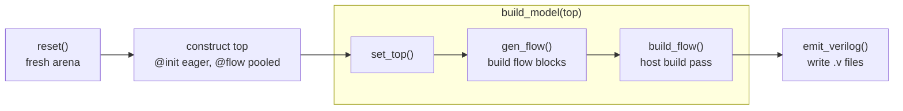

Everything you declare in Kathryn builds into one **model arena** — a
process-wide singleton owned by the Rust core. The Python session module wraps
it with a small set of functions that take a design from "classes defined" to
"Verilog on disk".

## The session model

The arena is created once at `import kathryn` and every DSL operation routes
through it. That has two practical consequences:

- **One design at a time.** All modules you construct land in the same arena.
- **`reset()` starts over.** It rebuilds an empty arena (no top module),
  clears the auto-name counters, and empties the deferred-flow pool. Call it
  at the start of every build function so repeated builds (tests, scripts,
  notebooks) do not bleed into each other.

```python
from kathryn import *

def build(output_folder: str) -> None:
    reset()                       # fresh arena, counters, flow pool
    module = my_top()             # @init runs; @flow methods pool up
    build_model(module)           # set_top + gen_flow + build_flow
    emit_verilog(output_folder)   # write one .v per module
```

## The build pipeline

`build_model(module)` is the one-shot convenience; under the hood it is
exactly these three steps, which you can also run individually:

### 1. `set_top(module)`

Registers a constructed `Module` as the design's **top** — the root the build
DFS starts from. Call once, after constructing the top module, before
`gen_flow`. (It only records the ident; it does not open a scope.)

### 2. `gen_flow()`

Runs every module's deferred `@flow` methods from the one global pool, in
registration order, each inside its own module's re-opened scope. This is the
step that actually *constructs* the flow blocks (`seq`, `cif`, pipelines, …)
declared in your classes.

`gen_flow` is non-consuming: the pool is kept, so calling it again would run
the flow methods again (and duplicate their contents). Call it once per build.

### 3. `build_flow()`

Runs the host build pass: starting from the top module, it builds the hardware
behind every flow block across the whole module tree — state-machine
schematics, update events, clock and master-reset wiring. Call once, after
`gen_flow`.

:::caution
`build_flow` is **not re-runnable** — the top-level build asserts a fresh
start. To build again, `reset()` and reconstruct the design. The same applies
to `build_model`, which ends in `build_flow`.
:::

## Emitting Verilog

```python
emit_verilog(output_dir, top_file_name="top")
```

Runs the Verilog backend over the built model and writes **one `.v` file per
module** into `output_dir`: `<output_dir>/<module_name>.v` for each submodule,
and the top module as `<output_dir>/<top_file_name>.v` (default `top.v`).
The output directory must already exist.

:::caution
Emission is **destructive**: constructing the backend *moves* the arena into
it, leaving the session arena empty. After `emit_verilog` you cannot inspect
or re-emit the model — call `reset()` and rebuild to go again. Emit once, at
the very end.
:::

Under the hood `emit_verilog` is a thin wrapper over the backend class, which
is also exported if you want to drive it directly:

```python
BackendVerilog(arena()).emit(output_dir, top_file_name)
```

The emitted top module exposes your `mark_output(...)` ports plus the implicit
`clk` and `mrst` (master reset) inputs:

```verilog
module MODULE_tc29_karray_regfile0_6183(
    output reg  my_v,
    output reg  [6:0] my_d,
    output reg  my_pv,
    output reg  [6:0] my_pd,
    input wire clk,
    input wire mrst
);
```

## Putting it together

The canonical end-to-end sequence, spelled out:

```python
reset()                # 1. fresh session
top = my_top()         # 2. construct modules (@init eager, @flow pooled)
set_top(top)           # 3. register the root
gen_flow()             # 4. construct every module's flow blocks (once)
build_flow()           # 5. host build pass (once)
emit_verilog("out")    # 6. write out/<module>.v files (arena is consumed)
```

The same sequence as a pipeline, with `build_model` covering steps 3 through 5:



Steps 3–5 collapse into `build_model(top)`. Every worked example in the
[Examples Gallery](/userbook/examples/gallery/) follows this exact shape in
its `build()` function.
