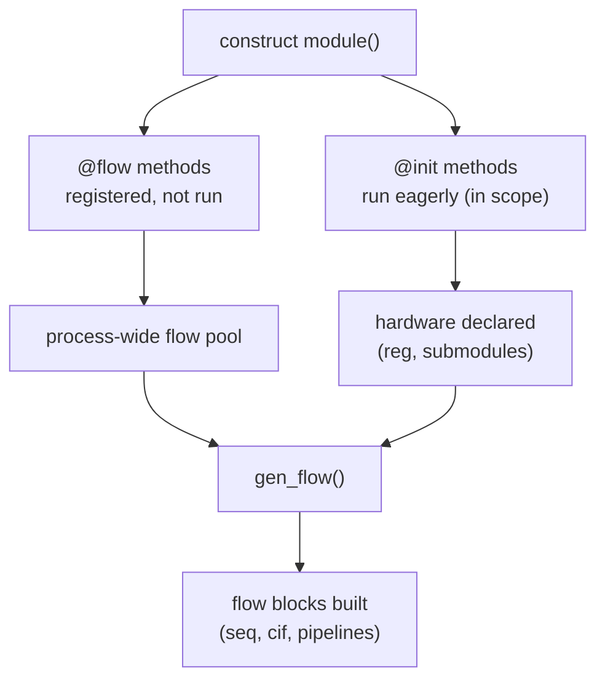
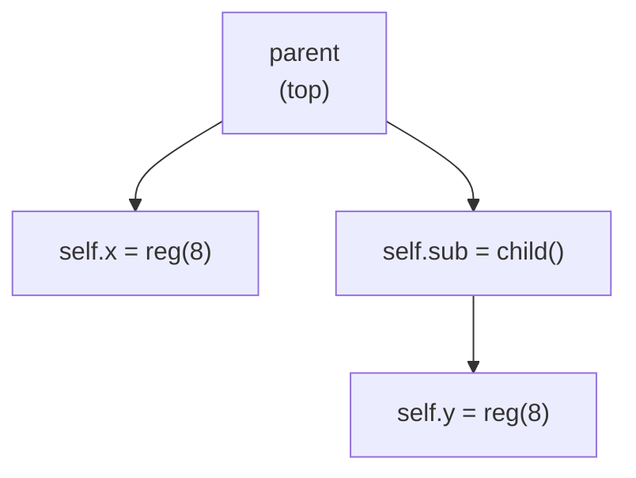

A Kathryn design is organized into **modules**. You define one by extending the
`Module` base class and tagging methods with two decorators:

- **`@init`** — hardware declaration. Runs **eagerly**, inside the module's
  scope, the moment you construct the instance.
- **`@flow`** — flow-block construction. Runs **deferred**: registered at
  construction, executed later by a single global `gen_flow()` pass.

```python
from kathryn import *

class counter(Module):
    @init
    def com_declare(self):
        self.x = reg(5, "x")          # declared into THIS module's scope

    @flow
    def my_flow(self):
        self.x.reset(0)
        with seq():                   # flow block attached to THIS module
            self.x |= self.x + 1

m = counter()                         # runs @init now; @flow is only registered
```

Constructing the subclass opens the module's scope, runs every `@init` method
inside it (so `self.x = reg(...)` attaches to *this* module), then registers
every `@flow` method into a process-wide pool keyed by the module. The
constructor takes an optional `name`; omitted names are auto-generated from
the class name.

## Why two phases?

Hardware must exist before flows can reference it, and *all* modules' hardware
should exist before *any* module's flows are built — flows routinely reach
across module boundaries (a child's flow reading a parent's register, or vice
versa). Splitting declaration (eager) from flow construction (deferred) makes
the whole design's hardware available by the time the first flow runs.

The two phases split across two moments in time — construction versus the
global pass:



The deferral is observable:

```python
order = []

class my_module(Module):
    @init
    def my_init(self):
        order.append("init")
        self.x = reg(5)

    @flow
    def my_flow(self):
        order.append("flow")
        with seq():
            self.x |= 0

m = my_module()
assert order == ["init"]              # @init eager; @flow deferred
gen_flow()                            # the global pass builds the flows
assert order == ["init", "flow"]
```

All modules share **one** flow pool: constructing several modules queues all
their `@flow` methods, and a single top-level `gen_flow()` builds every one of
them, in registration order. Each flow method runs with its own module's scope
re-opened, so `with seq(): ...` blocks attach to the right module. (The pool
is non-consuming — calling `gen_flow()` again re-runs the flow methods — so
call it once per build; see
[Building & Emitting](/userbook/modules/building-and-emitting/).)

## Nesting modules

Instantiate one module inside another's `@init` and the parent/child
relationship is tracked automatically — the child is constructed while the
parent's scope is open, so it attaches under the parent:

```python
class child(Module):
    @init
    def decl(self):
        self.y = reg(8)

    @flow
    def f(self):
        with seq():
            self.y |= self.y + 1

class parent(Module):
    @init
    def decl(self):
        self.sub = child()            # nested: child attaches under parent
        self.x   = reg(8)
```

The child's `@init` runs immediately (inside the nesting), and its `@flow`
methods land in the same global pool as everyone else's. No explicit
"add child" call is needed.

The parent/child tree the build pass walks:



## Inheritance: base phases run first

Phase methods are collected along the class's MRO, **oldest ancestor first**,
so an inherited `@init` runs before the subclass's own:

```python
class base(Module):
    @init
    def base_init(self):
        order.append("base")

class derived(base):
    @init
    def derived_init(self):
        order.append("derived")

derived()
assert order == ["base", "derived"]   # base-first, like normal construction
```

Within one class body, methods run in declaration order. Each method name is
collected once; if a subclass *overrides* a tagged method, the most-derived
version runs (in the base's position). The same ordering applies to `@flow`
methods.

## The top module

One module must be designated the **top** of the design — the root the build
pass starts from:

```python
top = counter()
set_top(top)          # register as the design's top; call once, after construction
```

`set_top` only records the module as top; it does not open a scope. All
hardware and flow must live inside `@init`/`@flow` methods — a bare top-level
`reg(...)` outside any module has no scope to attach to and is an error.

:::tip
The one-shot helper `build_model(module)` does `set_top` + `gen_flow` +
`build_flow` in one call — the usual way to finish a design. The full build
pipeline is the subject of the next page:
[Building & Emitting](/userbook/modules/building-and-emitting/).
:::
