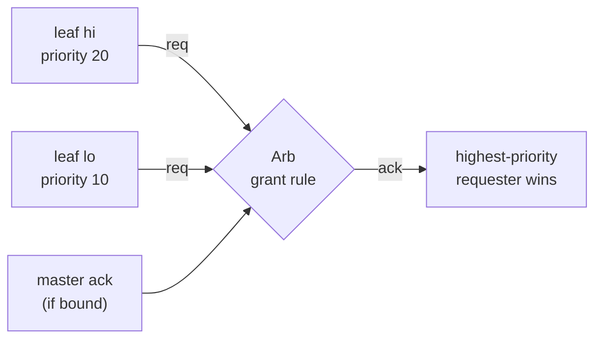
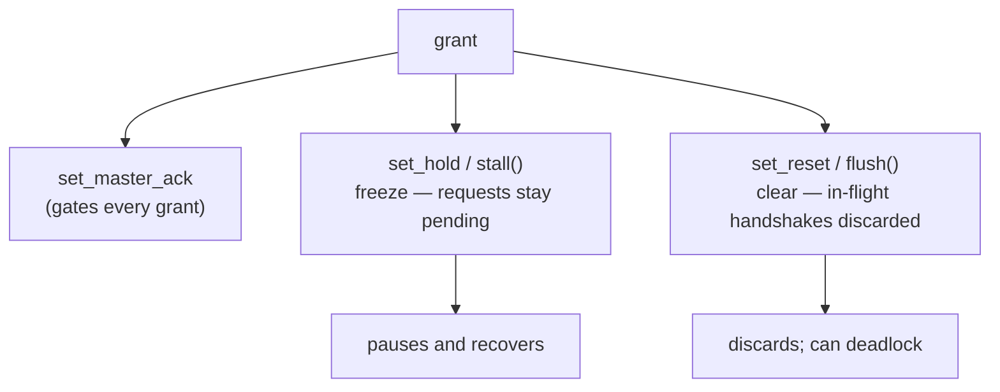

`Arb` is Kathryn's priority arbiter, and it is the machinery underneath every
pipeline boundary: `PipCon` — the object you hand to `pip`/`zync` — is a thin
`Arb` subclass. You can also instantiate and wire an `Arb` directly for
arbitration problems that have nothing to do with pipelines.

## The grant rule

An arbiter owns a set of **leaves**. Each leaf is one client with a 1-bit
`req`/`ack` wire pair and an integer priority. A leaf is granted (`ack` high)
when, combinationally:

1. it is requesting (`req` high),
2. the master ack is asserted (if one is bound), and
3. **no higher-priority leaf is also requesting** — larger priority value wins,
   on the same scale as
   [update-event priorities](/userbook/priority/write-priority/).



Ties between requesting leaves at equal priority are broken by the arbiter's
`ArbSamePriPolicy`:

| policy | behaviour |
| --- | --- |
| `ArbSamePriPolicy.AckOne` (default) | grant only the earliest tied leaf in add order |
| `ArbSamePriPolicy.AckAll` | grant every same-priority requester |
| `ArbSamePriPolicy.NotAck` | grant none while a same-priority conflict exists |

The arbitration graph is purely combinational; the build pass wires it
automatically once the enclosing module is built — an `Arb` is not stamped in
as a submodule.

## Creating an arbiter and adding leaves

```python
from kathryn import Arb, ArbSamePriPolicy, ArbLockedChannel

arb  = Arb(policy=ArbSamePriPolicy.AckOne, name="bus_arb")
hi   = arb.add_leaf(priority=20)     # returns an ArbLeaf
lo   = arb.add_leaf(priority=10)
```

`add_leaf(priority)` returns an `ArbLeaf` handle with three fields:

- `leaf.index` — the leaf's position (also its tie-break order under `AckOne`);
- `leaf.req` — a combinational wire **you drive** to contend:
  `leaf.req *= my_condition`;
- `leaf.ack` — the grant, driven by the build pass — **read it**, never drive it.

```python
hi.req *= want_bus_hi          # contend
lo.req *= want_bus_lo
grant_lo = lo.ack              # 1-bit: high when lo wins arbitration
```

### Locked leaves

`add_leaf_locked(priority, channel)` hard-ties one side of the leaf to
constant 1 instead of a wire:

| `ArbLockedChannel` | effect |
| --- | --- |
| `.Req` | leaf is *always requesting*; `ack` stays a normal wire you read |
| `.Ack` | leaf is *always granted*; `req` stays a normal wire you drive |

Don't drive the locked side — it is a constant, not a wire. These are exactly
the leaves that `pip(auto_req=True)` and `zync(auto_ack=True)` add at the two
ends of a pipeline chain.

## Control signals

Each of these binds a 1-bit source and may be set once per arbiter:

| call | effect |
| --- | --- |
| `set_master_ack(src)` | single source gating **every** grant — no leaf acks unless `src` is high |
| `set_hold(sig)` | freeze every grant while `sig` is asserted (requests stay pending) |
| `set_reset(sig)` | clear every grant while `sig` is asserted (in-flight handshakes are discarded) |

Two conveniences create a fresh wire, drive it to constant 1 at the current
position in the flow, and bind it:

```python
arb.stall()    # constant-1 drive bound as the hold gate
arb.flush()    # constant-1 drive bound as the reset gate
```

Placed inside a `seq` step, the drive is active only while that step is — which
is how pipelines pulse a one-cycle
[stall bubble](/userbook/pipelines/stalls-and-bubbles/) or fire a
[flush](/userbook/pipelines/flush-and-hazards/). Hold pauses and recovers;
reset discards and can deadlock an unprepared pipeline — read those pages
before using either on a live chain.



## Observability

- `arb.master_req` — a 1-bit wire that is the OR of every leaf request,
  readable once leaves are added. Useful as a "somebody wants this resource"
  flag.
- `arb.leaf_count` — number of leaves added so far.

## Relationship to `PipCon`

```python
from kathryn import PipCon

con = PipCon()          # an Arb in every respect
```

`PipCon` adds nothing beyond the arbiter identity — it exists so that
`pip(...)` and `zync(...)` can *require* it (they raise `TypeError` for a plain
`Arb`), guaranteeing the locked-leaf contract the pipeline host relies on. The
block-side leaf is added by the host when the block is created:

- `pip(con, priority=..., auto_req=...)` adds the granter leaf — normal by
  default, request-locked when `auto_req=True`;
- `zync(con, priority=..., auto_ack=...)` adds the requester leaf — normal by
  default, acknowledge-locked when `auto_ack=True`.

Because `PipCon` inherits the whole `Arb` surface, you can freely mix levels:
give a pipeline boundary extra manual leaves, gate it with `set_master_ack`,
or stall/flush it — everything on this page applies unchanged. Leaf priorities
on a shared boundary are how multiple producers contending for one consumer
get ordered; the `pip`/`zync` `priority` arguments set them per block (see
[Pipeline Basics](/userbook/pipelines/pip-zync-basics/)).
