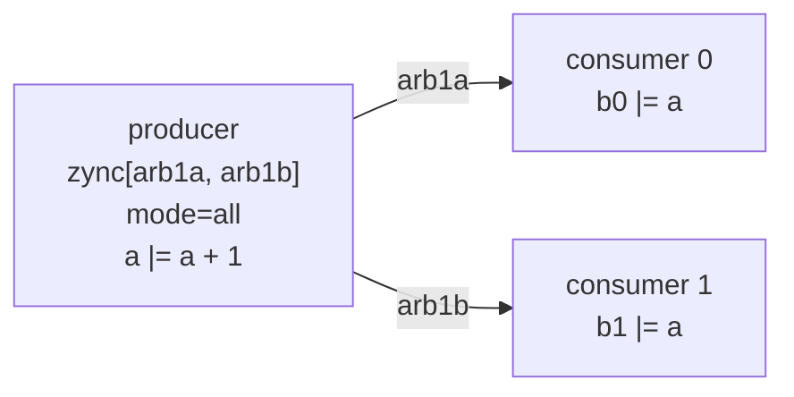
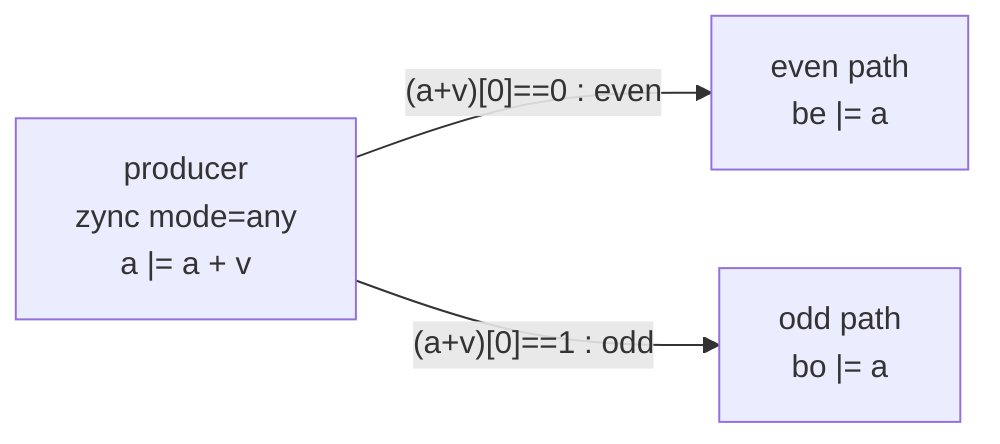

A `zync` can contend on **several arbiters at once**: pass a list of binds, and
the stage hands off to every consumer boundary in a single grant. Two knobs
shape the behaviour (full signature on
[Pipeline Basics](/userbook/pipelines/pip-zync-basics/)):

- `mode` — `"all"` requires **every** bind to acknowledge before the stage
  fires (lockstep broadcast); `"any"` fires as soon as **one** bind's
  `ack & cond` is high (routing).
- a per-bind `cond` — gates that bind's request *and* its grant term, so a
  bind whose condition is false simply doesn't participate.

## Lockstep fanout: `mode="all"`

Test model `tc26_zync_fanout`: one producer counter `a` feeds two independent
one-stage consumer pipelines, `b0` and `b1`, and must not advance until *both*
have accepted the hand-off.

```text
                        ┌──> arb1a ──> [ pip(arb1a) → zync(sink0) : b0 <= a ]
 [ pip(arb0, auto_req)  │
   zync([arb1a, arb1b], ┤
        mode="all")     │
   a <= a + 1 ]         └──> arb1b ──> [ pip(arb1b) → zync(sink1) : b1 <= a ]
```



```python
# five arbiters: source, two fan-out boundaries, two sinks
self.pip_cons = [PipCon() for _ in range(5)]

# producer — fires both downstream arbiters at once
with pip(self.pip_cons[0], auto_req=True):
    with zync([self.pip_cons[1], self.pip_cons[2]], mode="all"):
        self.a |= self.a + self.v

# consumer 0
with pip(self.pip_cons[1]):
    with zync(self.pip_cons[3], auto_ack=True):
        self.b0 |= self.a

# consumer 1
with pip(self.pip_cons[2]):
    with zync(self.pip_cons[4], auto_ack=True):
        self.b1 |= self.a
```

Because `mode="all"` ANDs the two grant terms, a single producer grant fires
both consumers together, and the intended invariants are:

- `a >= b0` and `a >= b1` at every sample (each consumer lags the producer);
- the fan-out is **symmetric**: `b0 == b1` at every sample — same producer,
  same latency, locked together by `mode="all"`. If either consumer stalled,
  the producer would stall with it, keeping the pair in lockstep.

:::caution
Two cautions here. First, with `mode="all"` the combined grant is the AND of
each bind's `ack & cond` — a bind whose *condition* is false contributes 0, so
mixing per-bind conditions with `mode="all"` can fire the stage on a partial
set of arbiters. Keep `mode="all"` binds unconditional unless that is what you
mean. Second, like the tc20 baseline, this model is currently pending the
handshake bootstrap fix — the tests encode the intended behaviour.
:::

## Routed fanout: per-bind conditions with `mode="any"`

Test model `tc27_zync_parity_fanout` routes each value to a *different*
consumer depending on its parity: even values of `a` go to `be`, odd values to
`bo`. Each bind carries a condition, and `mode="any"` lets whichever single
bind is satisfied fire the grant:

```python
# stage 1 — route by the parity of the value the consumers will latch
with pip(self.pip_cons[0], auto_req=True):
    with zync(
        [(self.pip_cons[1], ~(self.a + self.v)[0]),   # even bind: next a is even
         (self.pip_cons[2],  (self.a + self.v)[0])],  # odd  bind: next a is odd
        mode="any",
    ):
        self.a |= self.a + self.v

# even path — only granted when the delivered a is even
with pip(self.pip_cons[1]):
    with zync(self.pip_cons[3], auto_ack=True):
        self.be |= self.a

# odd path — only granted when the delivered a is odd
with pip(self.pip_cons[2]):
    with zync(self.pip_cons[4], auto_ack=True):
        self.bo |= self.a
```

Exactly one parity condition is true at any time, so exactly one bind fires per
grant and the producer free-runs at +1 per cycle. The intended behaviour: `be`
only ever captures even values, `bo` only odd ones, and both paths eventually
fire since `a` alternates parity.



:::tip
**Route on the delivered value, not the current one.** The consumers read `a`
*after* stage 1 has latched `a |= a + v`, so they capture the incremented
value. The routing condition must therefore test the parity of `a + v` (what
gets delivered) — `(a + v)[0]` — not of `a`. Testing `a[0]` instead silently
inverts the even/odd routing. Bit-selects like `expr[0]` give the 1-bit
condition directly.
:::

## Choosing a mode

| pattern | binds | mode | result |
| --- | --- | --- | --- |
| broadcast | unconditional | `"all"` | every consumer gets every item, in lockstep |
| route / demux | one `cond` per bind, mutually exclusive | `"any"` | each item goes to exactly one consumer |

Fan-*in* (several producers contending for one consumer boundary) needs no
special mode at all: attach several `pip`/`zync` leaves to one `PipCon` and let
leaf priorities plus the tie policy arbitrate — see
[Arbiters](/userbook/pipelines/arbiters/).
