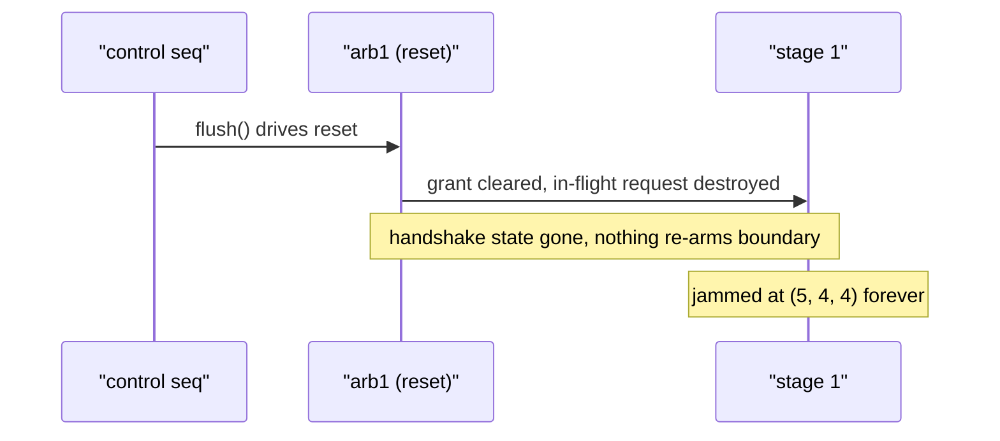
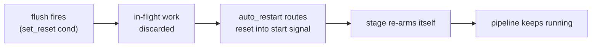

Every `PipCon` inherits the arbiter's *reset* input: while the bound reset
signal is asserted, **every grant on that boundary is cleared**
(`set_reset(sig)`, or the `flush()` convenience that binds a constant-1 drive
in flow context). Where a hold merely freezes the handshake (see
[Stalls & Bubbles](/userbook/pipelines/stalls-and-bubbles/)), a reset discards
it — and that is both the point of a flush and its hazard.

## The hazard, demonstrated

Test model `tc23_pip_zync_flush_deadlock` takes the baseline three-stage
pipeline from [Pipeline Basics](/userbook/pipelines/pip-zync-basics/) and adds
a parallel control thread that flushes the stage-1/stage-2 boundary five cycles
in:

```python
# stage 1: pip(arb0, auto_req) → zync(arb1):            a |= a + v
# stage 2: pip(arb1)           → zync(arb2):            b |= a
# stage 3: pip(arb2)           → zync(arb3, auto_ack):  c |= b

with seq():
    sywait(5)
    self.pip_cons[1].flush()      # drive arb1's reset
```

Compare this with `tc22`, which is byte-for-byte the same except it calls
`stall()` (hold) instead of `flush()` (reset). The stall costs one bubble and
the pipeline recovers. The flush does not recover:

| phase | a | b | c | note |
| --- | --- | --- | --- | --- |
| free-run | 1 … 5 | one behind | two behind | +1 per cycle |
| flush lands | **5** | **4** | **4** | arb1's grant is cleared |
| … forever | 5 | 4 | 4 | deadlock — no stage ever fires again |

The reset keeps clearing `arb1`'s grant, so stage 1 never completes another
hand-off. The in-flight request that would have advanced the chain was
destroyed rather than paused, and with the handshake state gone there is
nothing left to re-arm the boundary. The pipeline jams at `(5, 4, 4)` for good
— only the module's master reset gets it back to `(0, 0, 0)`.



:::caution
`tc23` is deliberately a *negative* example: it encodes the deadlock so the
behaviour is pinned down by tests. Treat a bare `flush()` on a mid-pipeline
boundary as destructive — flushing clears the grants, but nothing re-launches
the stages that were depending on them.
:::

## Avoiding the deadlock: `auto_restart`

The `pip` block has a knob designed exactly for this:

```python
pip(meta, auto_restart=True)
```

`auto_restart` routes the arbiter's user reset into the block's **start**
signal, so a flush *re-launches* the pipeline stage instead of merely clearing
it. The flush still discards the in-flight transaction (that is what a flush is
for — killing mispredicted or stale work), but the stage arms itself again
afterwards rather than waiting for a hand-off that can never come.



Use the pattern:

- flush the boundary with `set_reset(cond)` (a condition you control, not a
  constant), and
- mark the stage(s) downstream of the recovery point with
  `auto_restart=True` so they restart when the flush fires.

## Practical guidance

- **Prefer holds for flow control.** If you only need to pause — back-pressure,
  a slow consumer, a hazard window — use `set_hold`/`stall()`. Holds preserve
  the handshake and always recover.
- **Reserve resets for discarding work**, and pair them with `auto_restart` (or
  an explicit re-launch path) on every stage that must keep running afterwards.
- **Drive flushes from conditions, not constants.** `flush()` binds a
  constant-1 drive at its position in the flow; in a `seq` step it pulses when
  the step runs, but as tc23 shows, even a one-shot flush is enough to jam an
  unprepared chain. Binding your own 1-bit signal with
  `pip_con.set_reset(sig)` keeps the flush window explicit.
- **Master reset always wins.** Whatever state a flush leaves behind, holding
  the module's master reset returns every register to its `reset(...)` value —
  reset writes carry the maximum priority (see
  [Write Priority](/userbook/priority/write-priority/)).

## Related pages

- The hold-based alternative: [Stalls & Bubbles](/userbook/pipelines/stalls-and-bubbles/)
- `set_reset` / `set_hold` / `set_master_ack` in full: [Arbiters](/userbook/pipelines/arbiters/)
