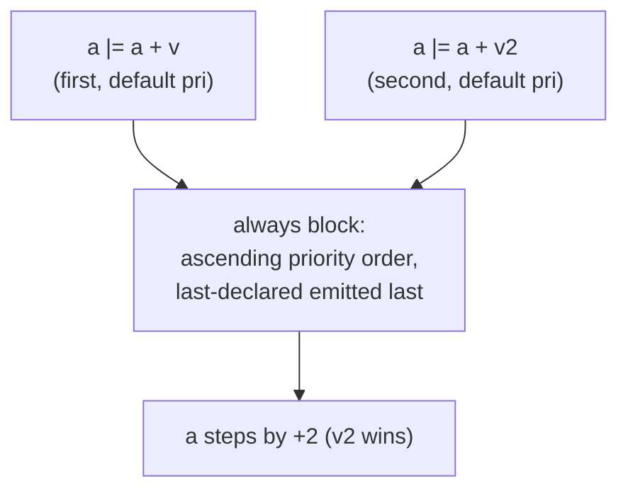
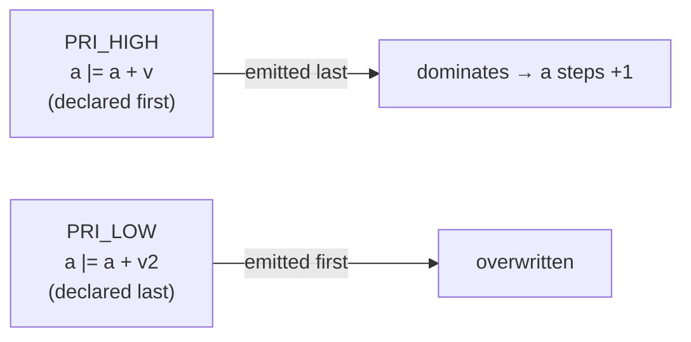

Nothing stops you from assigning the same register twice inside one pipeline
stage — both writes are built, both are emitted, and the
[write-priority system](/userbook/priority/write-priority/) decides which one
lands. The rule is:

1. **Higher priority wins.** Every assignment carries a priority; for one
   target, writes are emitted in ascending priority order inside the register's
   `always` block, so under non-blocking (`<=`) semantics the highest-priority
   write is emitted last and dominates.
2. **Ties fall back to program order.** Writes at the same priority keep their
   declaration order (the update pool sorts stably), so the *last-declared*
   write is emitted last and wins.

Both cases are pinned down by pipeline test models built on the three-stage
counter from [Pipeline Basics](/userbook/pipelines/pip-zync-basics/).

## Same priority: last write wins

Test model `tc24_pip_zync_multi_assign_order`. Stage 1 writes `a` twice in the
same clocked block, both at the default user priority:

```python
self.v  = val(8, 1, "v")     # first  write's addend
self.v2 = val(8, 2, "v2")    # second write's addend

with pip(self.pip_cons[0], auto_req=True):
    with zync(self.pip_cons[1]):
        self.a |= self.a + self.v       # first  write: a + 1
        self.a |= self.a + self.v2      # second write: a + 2  ← wins
```

The per-grant step of `a` reveals the winner unambiguously:

| observed step | meaning |
| --- | --- |
| **+2 per grant** | the **last** write overrides (`a + v2`) — this is what happens |
| +1 per grant | the first write would have won |
| +3 per grant | both writes would have accumulated |

The test bench asserts every non-stall delta of `a` equals 2: the second
`a |= ...` overrides the first, exactly like the last non-blocking assignment
winning in a hand-written Verilog `always` block. Note that the *losing* write
is not merged or accumulated — `a` steps by `v2`, not `v + v2`.



## Different priorities: priority overrides order

Test model `tc25_pip_zync_multi_assign_priority` is the same pipeline, but the
two writes are wrapped in `with priority(...)` at different levels — and the
**higher** priority is deliberately placed on the **first-declared** write:

```python
PRI_HIGH = DEFAULT_UE_PRI_USER + 3
PRI_LOW  = DEFAULT_UE_PRI_USER + 1

with pip(self.pip_cons[0], auto_req=True):
    with zync(self.pip_cons[1]):
        with priority(PRI_HIGH):
            self.a |= self.a + self.v       # +1, declared FIRST, highest → wins
        with priority(PRI_LOW):
            self.a |= self.a + self.v2      # +2, declared LAST, lowest → loses
```

Now `a` steps by **+1** per grant, not +2. If program order still decided, the
last-declared `+2` write would win as in tc24 — instead the high-priority write
dominates even though it appears first in the source. Priority, not
declaration order, picks the winner.



:::note
`priority(...)` is a scoped context manager: it sets a manual priority on
entry and restores whatever was active on exit, so only the assignments inside
the `with` body are affected. Priorities are plain integers; writing them
relative to `DEFAULT_UE_PRI_USER` (the auto default, 10) keeps the intent
explicit. Full API on the
[Write Priority](/userbook/priority/write-priority/) page.
:::

## Between stages

Writes in *different* stages of the same pipeline target different registers in
the idiomatic style (`a`, `b`, `c` …), so no conflict arises. When two stages —
or a stage and some parallel flow — do write the same register, the resolution
is exactly the same as above: each write is guarded by its own stage's grant
condition, and if both guards fire on the same clock edge, priority (then
program order) decides. The pipeline adds no extra ordering rule of its own.

The same mechanics apply outside pipelines too — the `par` variants of these
experiments (`tc14`/`tc15`) and the emitted-Verilog view are on the
[Write Priority](/userbook/priority/write-priority/) page.
