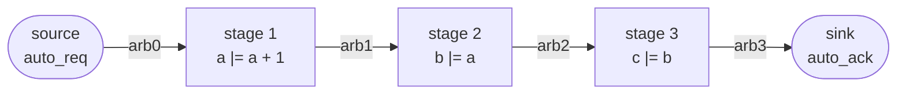
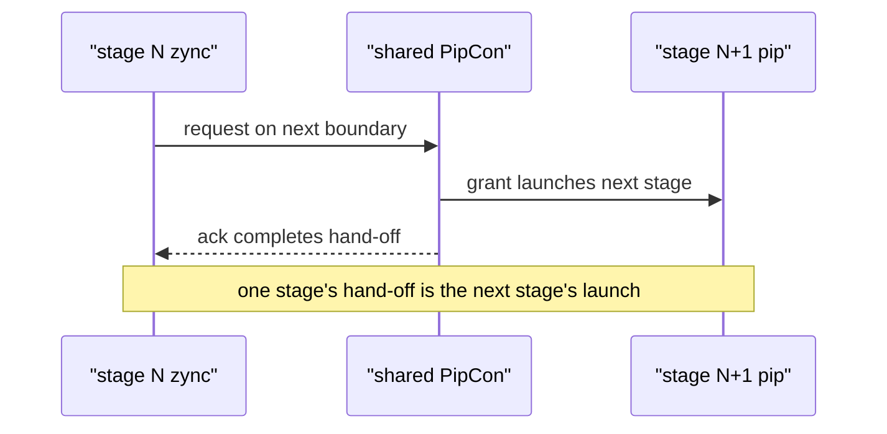

Kathryn pipelines are not inferred — you build them out of explicit handshakes.
Three pieces cooperate:

- **`PipCon`** — an arbiter shared by two adjacent stages. It carries the
  request/acknowledge wires of one stage boundary. `PipCon` is a thin subclass of
  the general-purpose `Arb` (see [Arbiters](/userbook/pipelines/arbiters/)), so
  everything an arbiter can do — hold, reset, extra leaves — a `PipCon` can do too.
- **`pip(...)`** — the *granter* half of a stage. A `pip` block's body runs when the
  stage's input arbiter grants it. Think of it as "this stage fires when work
  arrives".
- **`zync(...)`** — the *requester* half. A `zync` block raises a request on the
  *next* boundary's arbiter and completes when that arbiter acknowledges. Its body
  holds the stage's actual work (the register assignments).

A stage is written as a `pip` wrapping a `zync`, and adjacent stages **share** a
`PipCon`: stage N's `zync` and stage N+1's `pip` are attached to the same arbiter,
so one stage's hand-off *is* the next stage's launch.

```text
            arb0            arb1            arb2            arb3
  (source) ──┬──> [ stage 1 ] ──┬──> [ stage 2 ] ──┬──> [ stage 3 ] ──┬──> (sink)
  auto_req   │   pip(arb0)      │   pip(arb1)      │   pip(arb2)      │  auto_ack
  always     │   zync(arb1)     │   zync(arb2)     │   zync(arb3)     │  always
  requesting │   a <= a + 1     │   b <= a         │   c <= b         │  granted
```



The two ends of the chain are closed off with the `auto_req` / `auto_ack` flags:

- `pip(arb0, auto_req=True)` — the first stage has no upstream producer, so its
  leaf on `arb0` is *request-locked*: it is always requesting, and the stage fires
  whenever the arbiter grants.
- `zync(arb3, auto_ack=True)` — the last stage has no downstream consumer, so its
  leaf on `arb3` is *acknowledge-locked*: its hand-off is always granted
  immediately.

## The `pip` block

```python
pip(meta, name=None, *, auto_restart=False, priority=None, auto_req=False)
```

`meta` must be a `PipCon` — passing a plain `Arb` or anything else raises
`TypeError`. When the block is created, the host adds the block's leaf to that
arbiter:

| Option | Meaning |
| --- | --- |
| `priority` | Arbitration priority of this block's leaf on the arbiter (larger value wins; `None` uses the default). |
| `auto_req` | `False` (default) adds a normal leaf; `True` request-locks the leaf so the stage is always contending — use it on the source stage of a chain. |
| `auto_restart` | Routes the arbiter's user reset into the block's *start* signal, so a reset re-launches the pipeline instead of clearing it. See [Flush & Hazards](/userbook/pipelines/flush-and-hazards/). |

`pip` is a *complex* block: it cannot own assignments directly, so an inner
skeleton (`seq`/`par`) is opened automatically for its body. That is why you can
put a bare `zync`, a `seq`, or conditionals directly inside it.

### What a `pip` body can hold

A `pip`'s body is not limited to one bare `zync`. Because `pip` auto-opens a
skeleton, its body can hold **any** flow block nested however the stage's
logic needs — `seq`, `par`, conditionals (`cif`/`sif`/`zif`), loops, waits,
and one or more `zync` blocks. A stage that does local work before handing
off, or that routes to one of several downstream consumers, nests several
blocks inside one `pip`:

```python
with pip(self.pip_cons[0], auto_req=True):
    with seq():
        self.tmp |= self.a + self.b          # local work — still this one stage
        with zif(self.route_left):
            with zync(self.pip_cons[1]):
                self.x |= self.tmp           # hand off left
        with zelse():
            with zync(self.pip_cons[2]):
                self.x |= self.tmp           # hand off right
```

Every piece here — `seq`, `zif`/`zelse`, `zync` — is an ordinary flow block;
`pip` does not restrict which ones may nest inside it. See
[Conditionals](/userbook/flow/conditionals/) for `zif`/`zelse`, and
[Fanout](/userbook/pipelines/fanout/) for a fully worked multi-consumer example
using a single `zync` with several arbiter binds instead.

## The `zync` block

```python
zync(meta, name=None, *, mode="any", priority=None, auto_ack=False)
```

A `zync` contends on one or several arbiters. `meta` is a single bind or a list
of binds, where each bind is one of:

```python
PipCon                     # contend on it, no condition, default priority
(PipCon, cond)             # gate this arbiter on the 1-bit `cond` signal
(PipCon, cond, priority)   # also pin this arbiter's leaf priority
```

A bind's `cond` gates both its request (`state_exit & cond`) and its grant term
(`ack & cond`); pass `None` for an always-on bind. The remaining options:

| Option | Meaning |
| --- | --- |
| `mode` | How multiple binds' grants combine: `"any"` (default, also `"some"`) fires when **any** bind's `ack & cond` is high; `"all"` fires only when **every** bind's is high. For a single bind the two coincide. |
| `priority` | Default leaf priority for binds that don't pin their own. |
| `auto_ack` | `True` acknowledge-locks every bind's leaf (always granted) — use it on the sink end of a chain. |

Multi-arbiter binds are how one stage feeds several consumers — see
[Fanout](/userbook/pipelines/fanout/).

## A complete three-stage pipeline

This is the canonical example (test model `tc20_pip_zync_baseline`): a counter
stage feeding two follower stages through four shared arbiters.

```python
from kathryn import *

class three_stage(Module):
    @init
    def com_declare(self):
        # Four arbiters: one per stage boundary. Adjacent stages share one, so
        # each stage's zync hands off to the next stage's pip.
        # pip_cons[0] = source boundary, pip_cons[3] = sink boundary.
        self.pip_cons = [PipCon() for _ in range(4)]

        self.a = reg(8, "a")            # stage-1 counter (a += 1 per grant)
        self.b = reg(8, "b")            # stage-2 follows a
        self.c = reg(8, "c")            # stage-3 follows b
        self.v = val(8, 1, "v")

        self.a.mark_output("my_a")
        self.b.mark_output("my_b")
        self.c.mark_output("my_c")

    @flow
    def my_flow(self):
        self.a.reset(0)
        self.b.reset(0)
        self.c.reset(0)

        # stage 1 — source end: always requesting on arb0
        with pip(self.pip_cons[0], auto_req=True):
            with zync(self.pip_cons[1]):
                self.a |= self.a + self.v

        # stage 2 — granted by arb1, hands off on arb2
        with pip(self.pip_cons[1]):
            with zync(self.pip_cons[2]):
                self.b |= self.a

        # stage 3 — sink end: hand-off on arb3 is always granted
        with pip(self.pip_cons[2]):
            with zync(self.pip_cons[3], auto_ack=True):
                self.c |= self.b
```

Reading one stage aloud: *"when arb1 grants me (`pip`), request arb2, and on the
cycle arb2 acknowledges (`zync`), latch `b <= a`."* Because stage 1's `zync` and
stage 2's `pip` sit on the same `PipCon`, the grant of one stage feeds the
request of the next — no manual valid/ready wiring anywhere.

Adjacent stages sharing one `PipCon` means the hand-off and the launch are the same event:



### Intended cycle-by-cycle behaviour

With master reset released, the pipeline free-runs (no stall, no flush, no
back-pressure):

| phase | a | b | c | what happens |
| --- | --- | --- | --- | --- |
| out of reset | 0 | 0 | 0 | registers at their reset values |
| fill | 1, 2, … | 0, 1, … | 0, 0, … | each stage arms one boundary later |
| steady state | n | n−1 | n−2 | every stage fires every cycle |

The invariants the accompanying test bench asserts are worth internalising:

- `a` climbs monotonically once flowing (it latches `a + 1` on every grant).
- `b` tracks `a` and `c` tracks `b`, each one stage behind, so
  `a >= b >= c` holds at every sample.
- While master reset is held, every register is pinned at its reset value 0 —
  reset writes dominate all pipeline writes (see
  [Write Priority](/userbook/priority/write-priority/)).

:::caution
As of writing, this baseline model builds and emits Verilog but does not yet
*flow* in simulation — a one-cycle bootstrap race keeps stages 2 and 3 from
arming, so `a`/`b`/`c` stay at 0. The test suite encodes the **intended**
behaviour above and is expected to pass once the handshake bootstrap fix lands.
:::

## What gets emitted

Each register's work assignment is guarded by its stage's grant expression, and
the reset write is emitted last so it dominates:

```verilog
always @(posedge WIRE_clk) begin
    if (EXPR_node_logic_expr) begin          // stage grant fired this cycle
        REG_a[7:0] <= EXPR_expr0[7:0];       // a <= a + v
    end
    if (WIRE_mrst) begin
        REG_a[7:0] <= VAL_val0[7:0];         // reset value, highest priority
    end
end
```

The arbiter fabric itself appears as pairs of 1-bit `REQ`/`ACK` wires per leaf
plus a master-request wire per arbiter; the locked ends show up as constants:

```verilog
wire  VAL_arb0_REQ0 = 1'b1;   // stage 1's auto_req leaf: always requesting
wire  VAL_arb3_ACK0 = 1'b1;   // stage 3's auto_ack hand-off: always granted
```

## Where to go next

- Freeze the flow deliberately: [Stalls & Bubbles](/userbook/pipelines/stalls-and-bubbles/)
- Clear in-flight work (and survive it): [Flush & Hazards](/userbook/pipelines/flush-and-hazards/)
- Several writes to one register inside a stage: [Assignment Ordering](/userbook/pipelines/multi-assign-ordering/)
- One producer, many consumers: [Fanout](/userbook/pipelines/fanout/)
- The machinery underneath: [Arbiters](/userbook/pipelines/arbiters/)
