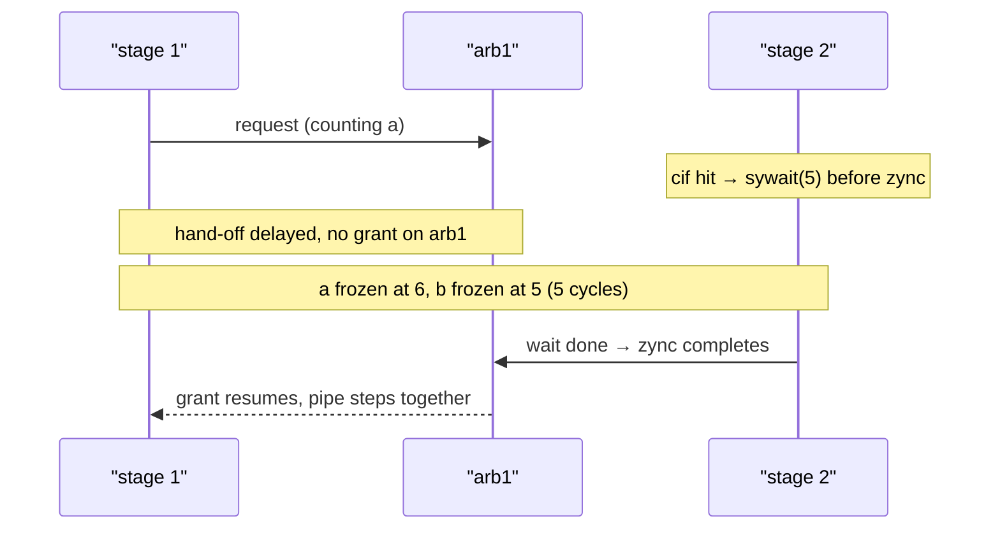
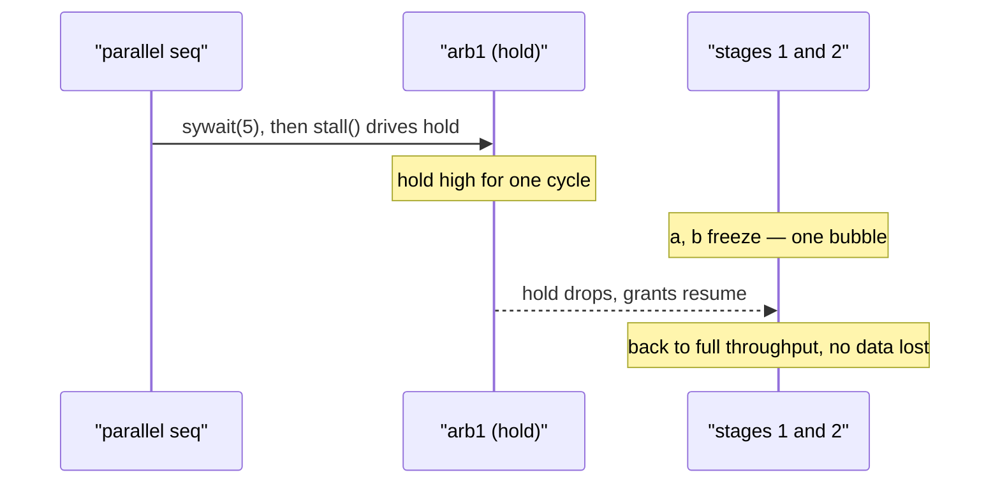

A handshaked pipeline stalls naturally: if a stage does not hand off, everything
upstream of it stops receiving grants and freezes in place. That gives you two
practical ways to stall a Kathryn pipeline on purpose:

1. **Stall inside a stage** — put a wait (or any multi-cycle work) between the
   stage's `pip` and its `zync`. The hand-off is delayed, and back-pressure does
   the rest.
2. **Stall at a boundary** — assert an arbiter's *hold* input
   (`PipCon.set_hold(...)`, or the `stall()` convenience). All grants on that
   boundary freeze while the hold is high.

Both examples below extend the three-stage pipeline from
[Pipeline Basics](/userbook/pipelines/pip-zync-basics/): stage 1 counts
`a <= a + 1`, stage 2 latches `b <= a`, stage 3 latches `c <= b`.

## Conditional stall inside a stage

From test model `tc21_pip_zync_cond_stall`. Stage 2 guards its hand-off with a
one-shot condition: when the value about to be delivered (`a + v`) reaches `v2`,
it inserts a `sywait(5)` before the `zync`, so the whole pipeline stalls for
five extra cycles and then resumes.

```python
self.v  = val(8, 1, "v")
self.v2 = val(8, 6, "v2")

# stage 1 — free-running counter
with pip(self.pip_cons[0], auto_req=True):
    with zync(self.pip_cons[1]):
        self.a |= self.a + self.v

# stage 2 — conditional one-shot stall before the hand-off
with pip(self.pip_cons[1]):
    with seq():
        with cif((self.a + self.v) == self.v2):
            sywait(5)                       # delay the hand-off by 5 cycles
        with zync(self.pip_cons[2]):
            self.b |= self.a

# stage 3
with pip(self.pip_cons[2]):
    with zync(self.pip_cons[3], auto_ack=True):
        self.c |= self.b
```

Because `pip` auto-opens an inner skeleton, the explicit `seq()` sequences the
guard and the hand-off: first evaluate the `cif`, possibly wait, then `zync`.

### Timing

With `v = 1` and `v2 = 6` the guard is true exactly once, when `a == 5`. The
observable trace (asserted cycle-accurately by the test bench):

| phase | a | b | c | note |
| --- | --- | --- | --- | --- |
| free-run | 1, 2, … 5, 6 | one behind | two behind | +1 per cycle |
| stall | **6** for 6 samples | frozen at 5 | frozen | entry cycle + the 5 `sywait` holds |
| release | 7 | 6 | 5 | whole pipe steps together |
| next | 8 | 7 | 6 | back to +1 per cycle |

Stage 1 is never told to stop — it simply stops receiving grants on `arb1`
because stage 2 is busy waiting. That is back-pressure working as designed.



## One-cycle bubble via an arbiter hold

From test model `tc22_pip_zync_stall_bubble`. Here the pipeline itself is
untouched; a *parallel* control thread pulses the stage-1/stage-2 arbiter's hold
once, five cycles in:

```python
# ... the same three stages as the baseline ...

with seq():
    sywait(5)
    self.pip_cons[1].stall()      # drive arb1's hold — active while this step is
```

`Arb.stall()` creates a fresh 1-bit wire, drives it to constant 1, and binds it
as the arbiter's hold gate (`set_hold`). Because the drive lives inside a `seq`
step, it is only active while that step is — after the 5-cycle wait the hold is
asserted for a single cycle, punching exactly one bubble into the flow.



### Timing

| phase | a | b | c | note |
| --- | --- | --- | --- | --- |
| free-run | 1 … 5 | one behind | two behind | +1 per cycle |
| bubble | **5** | **4** | **4** | arb1 held for one cycle; a, b freeze |
| release | 6 | 5 | 4 | grants resume |
| next | 7 | 6 | 5 | steady +1 per cycle again |

Every cycle-to-cycle step of `a` is either +1 (free run) or 0 (the hold) — the
counter never jumps or rewinds, and after the bubble the pipeline is back to
full throughput with no data lost.

:::tip
`stall()` is a convenience for a *constant* hold placed in flow context. For a
condition-driven hold, bind your own signal once with
`pip_con.set_hold(my_condition)` — the grants freeze whenever the signal is
high and thaw when it drops. See [Arbiters](/userbook/pipelines/arbiters/).
:::

## Hold vs. reset

A hold **freezes** grants: in-flight requests stay pending and continue as soon
as the hold drops — nothing is lost. An arbiter *reset* (`flush()` /
`set_reset`) **clears** grants, which discards the in-flight handshake and can
deadlock the chain if you don't re-launch it. That failure mode and its cure
are covered in [Flush & Hazards](/userbook/pipelines/flush-and-hazards/).
