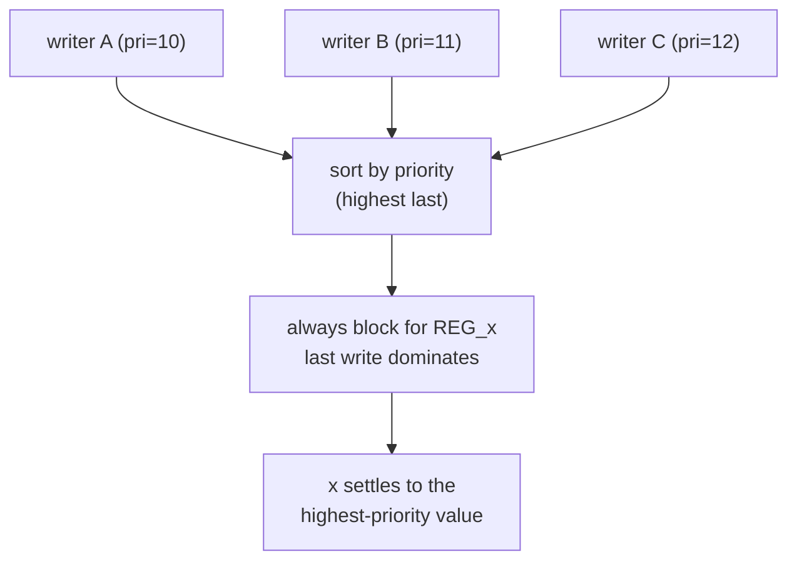
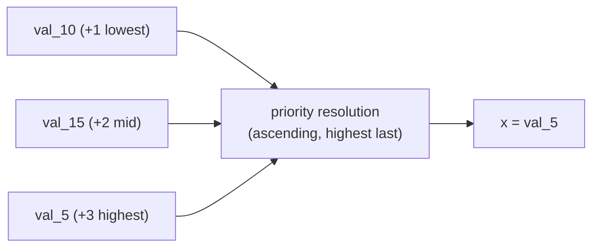

Every assignment in Kathryn — every update event — carries an integer
**priority**. When several writes target the same register, the emitter sorts
them by priority inside the register's `always` block, placing the
highest-priority write **last** so that under non-blocking (`<=`) semantics it
dominates. Larger value wins; ties keep program order (the update pool sorts
stably), so the last-declared write wins a tie.

The priority applied to an assignment is read **at the moment the assignment is
built** — set the priority *before* the assignment it should govern.

This is the **Decentralized Update** abstraction: many independent writers, one
register, resolved by declared priority (highest sorted last, wins):



## The exported constants

The `DEFAULT_UE_PRI_*` constants are sourced directly from the Rust host (the
authoritative name list is published as `kathryn.priority.PRIORITY_CONST_NAMES`,
so new host constants appear automatically):

| constant | value | meaning |
| --- | --- | --- |
| `DEFAULT_UE_PRI_MIN` | 0 | floor of the scale — the implicit zero every wire falls back to |
| `DEFAULT_UE_PRI_FALLBACK` | 1 | an explicit `wire.default(v)` — beats the implicit zero, loses to every real write |
| `DEFAULT_UE_PRI_USER` | 10 | default for user assignments in auto mode |
| `DEFAULT_UE_PRI_INTERNAL_MIN` | 50 | low end of the band reserved for internal events |
| `DEFAULT_UE_PRI_INTERNAL_MAX` | 100 | high end of the internal band |
| `DEFAULT_UE_PRI_RST` | 2147483647 (`i32::MAX`) | reset writes — maximum, dominates everything |
| `DEFAULT_UE_SUB_PRIORITY_USER` | 0 | default sub-priority, the tie-breaker below `priority` |

```python
from kathryn import DEFAULT_UE_PRI_USER, DEFAULT_UE_PRI_RST
```

Write your own priorities relative to `DEFAULT_UE_PRI_USER`
(e.g. `DEFAULT_UE_PRI_USER + 1`) so the relationship to ordinary writes stays
explicit.

:::caution
`DEFAULT_UE_PRI_USER` (10) sits **below** the internal band (50–100), which the
flow-block machinery uses for its own state registers. A manual priority above
50 competes with those internal events rather than with your other writes —
stay under it unless you know exactly which internal event you are overriding.
:::

## Setting the priority

```python
from kathryn import (priority, set_priority, set_priority_auto,
                     get_priority, get_priority_mode)
```

| call | effect |
| --- | --- |
| `set_priority(p)` | pin every subsequent assignment to manual priority `p` until changed |
| `set_priority_auto()` | return to auto mode — priority resets to `DEFAULT_UE_PRI_USER` |
| `get_priority()` | the value that will be applied to subsequently-built assignments |
| `get_priority_mode()` | `"Auto"` or `"Manual"` |
| `priority(p)` | context manager: manual `p` on enter, previous mode/value restored on exit |

The context manager is the idiomatic form — it governs exactly the assignments
in its body and restores whatever was active before, whether that was auto mode
or another manual value:

```python
set_priority_auto()
assert get_priority_mode() == "Auto"
assert get_priority()      == DEFAULT_UE_PRI_USER   # 10

set_priority(77)                 # manual from here on
with priority(123):
    r |= a                       # this write is built at priority 123
assert get_priority() == 77      # restored to the manual 77, not to auto
```

## Same-register conflicts, resolved

The two `par` test models `tc14`/`tc15` isolate the rule: three parallel
branches assign the same register on the same cycle.

### Same priority — program order breaks the tie (tc14)

```python
SAME_PRI = DEFAULT_UE_PRI_USER + 1

with seq():
    with par_auto():
        with priority(SAME_PRI):
            self.x |= self.val_5        # earliest
        with priority(SAME_PRI):
            self.x |= self.val_10
        with priority(SAME_PRI):
            self.x |= self.val_15       # latest → wins on tie
```

All three fire on the same edge; the stable sort keeps declaration order, so
`x <= 15` is emitted last and wins. The emitted `always` block:

```verilog
REG_x[7:0] <= VAL_val_5[7:0];
REG_x[7:0] <= VAL_val_10[7:0];
REG_x[7:0] <= VAL_val_15[7:0];   // last ⇒ x settles to 15
```

### Different priorities — priority overrides order (tc15)

```python
PRI_LOW, PRI_MID, PRI_HIGH = (DEFAULT_UE_PRI_USER + n for n in (1, 2, 3))

with seq():
    with par_auto():
        with priority(PRI_HIGH):
            self.x |= self.val_5        # declared FIRST, highest → wins
        with priority(PRI_LOW):
            self.x |= self.val_10       # lowest
        with priority(PRI_MID):
            self.x |= self.val_15       # declared LAST, but loses
```

Now the writes are emitted in ascending priority order regardless of where they
appear in the source:

```verilog
REG_x[7:0] <= VAL_val_10[7:0];   // +1 (lowest first)
REG_x[7:0] <= VAL_val_15[7:0];   // +2
REG_x[7:0] <= VAL_val_5[7:0];    // +3 last ⇒ x settles to 5
```

`x` settles to 5 even though `x <= 15` was declared last — priority, not
declaration order, decides.


 The same experiment inside a pipeline stage
(`tc24`/`tc25`) behaves identically; see
[Assignment Ordering](/userbook/pipelines/multi-assign-ordering/).

## Reset dominance

`reg.reset(v)` binds its write at `DEFAULT_UE_PRI_RST` — the maximum — so it
sorts last in the register's `always` block and dominates every user
assignment on any cycle where the reset condition holds:

```verilog
always @(posedge WIRE_clk) begin
    if (...) REG_r[7:0] <= WIRE_d[7:0];   // user write (priority 10)
    if (WIRE_mrst) REG_r[7:0] <= VAL_0;   // reset write (max priority, wins)
end
```

This is why a held master reset pins an entire pipeline at its reset values no
matter what the stages are doing. At the other end of the scale sit the two
wire fallbacks: the implicit zero at `DEFAULT_UE_PRI_MIN` (0) that every wire
carries, and an explicit `default(v)` at `DEFAULT_UE_PRI_FALLBACK` (1). Both
are below the user priority, so any real drive overrides them. See
[Reset & Defaults](/userbook/core/reset-and-defaults/).

:::note
Arbiter *leaf* priorities (who wins a shared pipeline boundary) live on the
same "larger wins" integer scale but arbitrate grants between hardware
requesters, not writes to a register. See
[Arbiters](/userbook/pipelines/arbiters/).
:::
